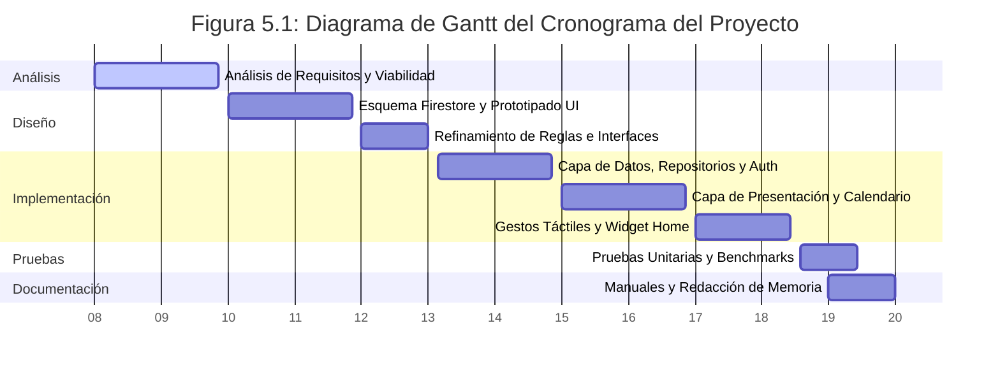

# CAPÍTULO 1: INTRODUCCIÓN Y OBJETIVOS

---

## 1.1 Contexto y Motivación del Proyecto
El desarrollo tecnológico experimentado en la última década ha transformado radicalmente la forma en que los seres humanos interactúan, trabajan y gestionan su vida cotidiana. Dentro de esta transformación, los dispositivos móviles inteligentes (smartphones) se han consolidado como una extensión del propio individuo, actuando como el canal principal para el consumo de información, la comunicación interpersonal y la gestión del tiempo.

En paralelo a la evolución del hardware, la psicología conductual aplicada al diseño de software ha cobrado un papel protagónico. Teorías contemporáneas sobre la formación de hábitos, tales como el modelo del "bucle de habituación" popularizado por James Clear en su obra *Hábitos Atómicos*, demuestran de manera empírica que la adopción y mantenimiento de conductas saludables a largo plazo está fuertemente vinculada a cuatro etapas fundamentales: la señal (señal para actuar), el anhelo (la motivación detrás de la acción), la respuesta (la ejecución de la acción) y la recompensa (la satisfacción obtenida). 

Sin embargo, en el ámbito de las aplicaciones móviles de productividad y seguimiento de metas (*habit trackers*), se observa una carencia fundamental. La gran mayoría de soluciones disponibles en los repositorios oficiales de software (como Google Play Store o Apple App Store) se centran de forma exclusiva en un modelo solitario y cuantitativo. Si bien registrar el progreso diario en forma de tablas o gráficos numéricos resulta útil para ciertos perfiles analíticos, para la mayoría de los usuarios este enfoque carece del motor motivacional más potente identificado por la psicología social: el **compromiso social** o *social accountability*.

La motivación que impulsa este Proyecto de Fin de Ciclo radica en cerrar esta brecha conceptual mediante el diseño y desarrollo de **Streaks**. Streaks se concibe no solo como un gestor de hábitos individual, sino como una red social reactiva de productividad. La hipótesis fundamental que sostiene este proyecto es que la visibilidad pública de las rachas de progreso (*streaks*), combinada con la validación de una comunidad que persigue metas similares (representada a través de interacciones sociales rápidas), actúa como un catalizador psicológico que reduce drásticamente las tasas de abandono. De este modo, la gamificación no se reduce a una puntuación solitaria, sino que se convierte en un mecanismo social donde el progreso de cada individuo sirve de inspiración y soporte para su red de contactos.

---

## 1.2 Planteamiento del Problema
A pesar de la alta disponibilidad de aplicaciones móviles de productividad en el mercado, se constata un problema generalizado de retención de usuarios y consistencia a largo plazo. Diversos estudios sobre el uso de tecnologías de autocuidado y habit tracking revelan que más del 70% de los usuarios abandonan el registro de sus actividades antes de cumplir el primer mes. Este fenómeno responde a tres factores críticos que limitan la eficacia de las herramientas tradicionales:

1. **Aislamiento Funcional**: Las herramientas tradicionales operan en silos de información cerrados. El usuario interactúa únicamente con una base de datos local y una representación gráfica estática. Al no existir una audiencia ni un mecanismo de retroalimentación externa, la falta de registro de un día no conlleva ninguna consecuencia social percibida, lo que facilita el abandono sistemático ante la aparición de fricciones cotidianas.
2. **Falta de Contexto Visual y Narrativo**: El registro clásico se basa en casillas de verificación (*checkboxes*) o entradas de texto plano. Este formato resulta monótono y frío. La capacidad de contar una historia diaria a través de una captura fotográfica del progreso (por ejemplo, una imagen del libro que se está leyendo, del espacio de trabajo tras estudiar, o del entrenamiento físico completado) humaniza la productividad y dota al progreso de un valor estético y narrativo que apetece compartir.
3. **El Vacío de las Redes Sociales Convencionales**: Si bien plataformas como Instagram o Twitter permiten compartir imágenes del día a día, carecen de las estructuras de datos necesarias para agrupar y visualizar de forma secuencial la consistencia. Un post en una red social generalista se pierde rápidamente en el feed cronológico de los seguidores, impidiendo trazar la racha acumulada del usuario y desvirtuando el esfuerzo continuado.

Por consiguiente, el problema técnico y conceptual abordado en este trabajo se sintetiza en la siguiente pregunta de investigación: *¿Cómo diseñar e implementar un sistema de software móvil multiplataforma que combine de forma cohesionada las mecánicas de gamificación del seguimiento de hábitos individuales con un modelo de interacción social robusto, reactivo en tiempo real y optimizado para dispositivos de pantalla táctil?*

---

## 1.3 Objetivos Generales y Específicos

### Objetivo General
El objetivo principal de este proyecto es diseñar, desarrollar e implementar un sistema móvil multiplataforma llamado **Streaks** que integre mecánicas de seguimiento de hábitos personales diarios con un feed social interactivo y reactivo en tiempo real, aplicando principios de arquitectura de software limpia y patrones de diseño ergonómicos orientados a la experiencia del usuario móvil.

### Objetivos Específicos
Para alcanzar el objetivo general propuesto, se definen los siguientes objetivos específicos de carácter técnico e investigativo:

*   **O.E.1. Diseño e Implementación Arquitectónica**: Estructurar el código fuente bajo el estándar de *Clean Architecture* (Arquitectura Limpia), separando de forma estricta las capas de Presentación, Dominio y Datos para asegurar la mantenibilidad del código, el desacoplamiento de dependencias externas y la viabilidad de pruebas automatizadas.
*   **O.E.2. Gestión Eficiente del Estado Reactivo**: Diseñar una capa de gestión de estado declarativa utilizando el ecosistema de *Riverpod*, eliminando dependencias directas del árbol de widgets y garantizando la inmutabilidad y la reactividad de la interfaz de usuario ante cambios asíncronos en los flujos de datos.
*   **O.E.3. Modelado y Persistencia en la Nube**: Estructurar una base de datos no relacional NoSQL (Cloud Firestore) que modele eficientemente relaciones de muchos a muchos (M:N) como el grafo de seguidores/siguiendo, así como la colección de publicaciones de progreso e interacciones (*likes/stars*), minimizando los costes de transferencia de datos y maximizando la velocidad de respuesta.
*   **O.E.4. Interacción Táctil Ergonómica y de Alta Fidelidad**: Diseñar e implementar un algoritmo geométrico de colisión bidimensional para soportar el gesto interactivo contextual *drag-to-like*, replicando patrones ergonómicos de redes sociales de primer nivel en el mercado móvil.
*   **O.E.5. Seguridad y Gestión Resiliente de Perfiles**: Implementar un flujo seguro de autenticación de usuarios y modificación de credenciales, diseñando mecanismos de tolerancia a fallos (*fallback*) que garanticen la continuidad operativa del usuario en caso de excepciones o restricciones temporales de los servidores de identidad de Firebase.

---

## 1.4 Alcance y Límites del Proyecto

### Alcance del Proyecto
El alcance del presente Proyecto de Fin de Ciclo abarca el ciclo de vida completo de ingeniería de software, contemplando el análisis de requisitos, diseño de la arquitectura, codificación, pruebas y despliegue del sistema Streaks. A nivel de características técnicas del software, el alcance está definido por los siguientes módulos funcionales:

*   **Módulo de Autenticación y Gestión de Cuentas**: Registro y login seguro de usuarios a través de correo electrónico y contraseña utilizando Firebase Auth, y edición avanzada del perfil de usuario (avatar con gradientes, nombre público, biografía e email con lógica de bypass en desarrollo).
*   **Módulo de Seguimiento de Hábitos (Gamificación)**: Creación de metas diarias y cálculo automático de rachas (*streaks*) acumulativas basadas en registros históricos inmutables.
*   **Módulo de Feed Social Reactivo**: Tablón público en tiempo real donde se muestran las imágenes subidas por los usuarios seguidos, ordenadas cronológicamente y enlazadas al estado de sus hábitos.
*   **Módulo de Interacción GestualContextual (Drag-to-Like)**: Implementación de la tarjeta flotante de previsualización de imágenes mediante overlays y el botón de estrella sensible al arrastre táctil con respuesta háptica.
*   **Módulo de Relaciones Sociales**: Gestión de seguidores y seguidos con buscador adaptativo local en cliente de perfiles de usuario.

### Límites del Proyecto
Quedan fuera del alcance de este proyecto las siguientes líneas funcionales, las cuales se proponen como posibles desarrollos futuros debido a limitaciones de tiempo y presupuesto del ciclo formativo:

*   **Soporte Multi-Backend**: El software está fuertemente acoplado al SDK de Firebase para el funcionamiento en tiempo real, por lo que la migración a una base de datos relacional SQL local no está contemplada en esta fase del desarrollo.
*   **Sincronización con Dispositivos Wearables**: No se implementarán integraciones con APIs de sensores físicos o relojes inteligentes (como Apple HealthKit o Google Fit).
*   **Analíticas con Inteligencia Artificial**: La app no proveerá un motor de análisis predictivo sobre los hábitos o sugerencias automáticas personalizadas basadas en machine learning.

---

## 1.5 Metodología de Desarrollo Adoptada
Para coordinar y ejecutar las distintas fases de desarrollo de **Streaks** de manera ágil y ordenada, se ha adoptado una metodología de trabajo híbrida basada en principios de **Scrum** y **Kanban**. Dada la naturaleza individual de este proyecto académico, la metodología Scrum se ha adaptado a un marco de auto-gestión del desarrollador, mientras que el tablero Kanban ha servido como herramienta visual para rastrear el progreso de las tareas y regular el flujo de trabajo (Work In Progress).

El desarrollo se estructuró en **Sprints quincenales** (de dos semanas de duración), cada uno con hitos funcionales muy claros:

1.  **Sprint 1 (Análisis y Prototipado)**: Definición detallada de requisitos, casos de uso iniciales y configuración inicial de Firebase Console.
2.  **Sprint 2 (Core Técnico)**: Configuración del repositorio local, inicialización del proyecto en Flutter, e implementación de la arquitectura de carpetas y los providers raíz de Riverpod.
3.  **Sprint 3 (Persistencia y Datos)**: Implementación de los modelos y llamadas remotas a Firestore para posts y hábitos de usuario.
4.  **Sprint 4 (Interfaz de Usuario)**: Desarrollo del feed de inicio, la cuadrícula de perfiles y la pantalla de detalle de post.
5.  **Sprint 5 (Interacciones Avanzadas e Iteración)**: Implementación y optimización de los gestos táctiles complejos, cálculo de colisiones geométricas del *drag-to-like* y el buscador del listado de seguidores.
6.  **Sprint 6 (Resiliencia y Pruebas)**: Desarrollo del flujo alternativo del gestor de emails, pruebas de widgets y optimización del rendimiento en la renderización de imágenes con el motor de Flutter.

La trazabilidad del código y el control de versiones se realizaron exclusivamente mediante **Git**, alojando los repositorios remotos en **GitHub** y organizando el trabajo en ramas de funcionalidad (*Feature Branches*) independientes para evitar conflictos antes de fusionar los componentes estables a la rama principal (*main*).

---

### 1.5.1 Planificación Temporal y Asignación de Horas (Diagrama de Gantt)
Para la obtención del título de Técnico Superior en DAM, la gestión del tiempo y la estimación de esfuerzos representan factores de evaluación determinantes. El desarrollo de este proyecto se estimó en un total de **150 horas de trabajo efectivo**, distribuidas a lo largo de un período de 12 semanas (equivalente a 6 Sprints quincenales).

La distribución del tiempo por fases metodológicas se estructura de la siguiente manera:

*   **Análisis (20 horas - 13.3%)**: Especificación de requisitos de usuario, análisis de viabilidad técnica y configuración del entorno Firebase Console.
*   **Diseño (25 horas - 16.7%)**: Modelado del esquema NoSQL en Firestore, diseño conceptual de Clean Architecture y creación de prototipos/interfaces (wireframes).
*   **Implementación (70 horas - 46.7%)**: Desarrollo del núcleo de datos, lógica de negocio en la capa de dominio, programación de widgets, gestos interactivos (*drag-to-like*) y chat.
*   **Pruebas (20 horas - 13.3%)**: Ejecución de baterías de pruebas unitarias y de widgets, optimización de velocidad de carga y consumo con Impeller.
*   **Documentación (15 horas - 10%)**: Redacción de la memoria del proyecto, manual de usuario y manual de instalación/despliegue.

A continuación, se detalla en la **Tabla 3.2** la distribución exacta de estas horas entre los 6 Sprints de desarrollo:

**Tabla 3.2: Planificación de Horas por Fases y Sprints**

| Sprint / Fase | Análisis | Diseño | Implementación | Pruebas | Documentación | Total Sprint |
| :--- | :---: | :---: | :---: | :---: | :---: | :---: |
| **Sprint 1** (Análisis e Inicio) | 20 h | - | - | - | 5 h | **25 h** |
| **Sprint 2** (Core Técnico) | - | 20 h | 5 h | - | - | **25 h** |
| **Sprint 3** (Persistencia/Datos) | - | 5 h | 20 h | - | - | **25 h** |
| **Sprint 4** (UI e Interfaces) | - | - | 25 h | - | - | **25 h** |
| **Sprint 5** (Interactividad) | - | - | 20 h | 5 h | - | **25 h** |
| **Sprint 6** (Pruebas y Cierre) | - | - | - | 15 h | 10 h | **25 h** |
| **TOTALES** | **20 h** | **25 h** | **70 h** | **20 h** | **15 h** | **150 h** |

El cronograma visual del proyecto se representa en el siguiente diagrama de Gantt (**Figura 5.1**), donde se visualiza el solapamiento y la secuencia temporal de las distintas fases:

