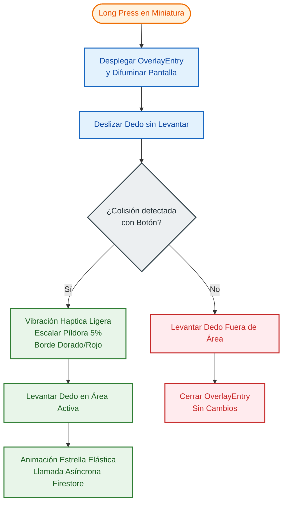
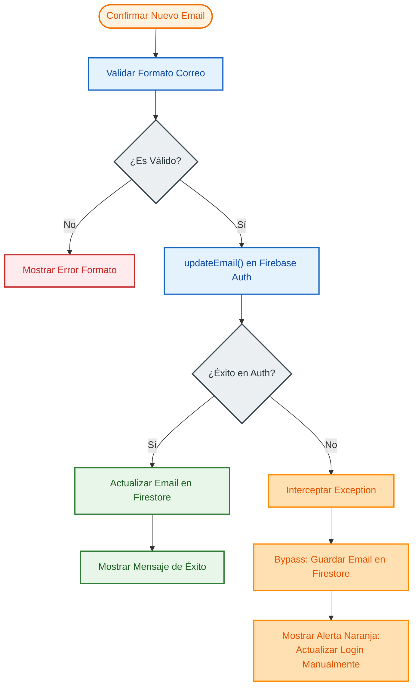

# CAPÍTULO 3: ANÁLISIS DE REQUISITOS Y MODELADO

---

## 3.1 Especificación de Requisitos Funcionales y No Funcionales
El análisis de requisitos constituye la fase fundacional del ciclo de vida del desarrollo de software. Permite traducir las necesidades del usuario y los objetivos de negocio en especificaciones técnicas precisas que el sistema debe satisfacer de forma obligatoria.

### Requisitos Funcionales (RF)
Los requisitos funcionales describen los servicios, comportamientos y operaciones específicas que debe realizar la aplicación Streaks.

#### Tabla 3.1: Requisitos Funcionales del Sistema

| Código | Requisito Funcional | Descripción | Prioridad |
| :--- | :--- | :--- | :--- |
| **RF-01** | Registro y Autenticación | El sistema debe permitir a nuevos usuarios registrarse mediante correo y contraseña, e iniciar sesión de forma segura. | Alta |
| **RF-02** | Personalización de Perfil | El usuario debe poder actualizar su avatar (eligiendo entre una paleta de gradientes predefinidos), su biografía y su correo. | Alta |
| **RF-03** | Registro de Hábitos | El usuario debe poder crear, editar y visualizar sus hábitos cotidianos, acumulando rachas (*streaks*) diarias. | Alta |
| **RF-04** | Creación de Publicaciones | El usuario debe poder publicar fotos de progreso diarias capturadas con la cámara o seleccionadas de la galería, asociadas a una descripción corta. | Alta |
| **RF-05** | Feed Social en Tiempo Real | La aplicación debe renderizar un feed dinámico cronológico inverso con las publicaciones de los usuarios a los que se sigue. | Alta |
| **RF-06** | Interacción Drag-to-Like | El usuario debe poder previsualizar un post mediante pulsación prolongada y arrastrar el dedo hacia una píldora flotante para añadir/quitar su estrella (like). | Media |
| **RF-07** | Control de Relaciones (Seguidores)| El usuario debe poder buscar otros perfiles, seguirlos y dejar de seguirlos, actualizando las listas correspondientes. | Alta |
| **RF-08** | Buscador de Perfiles | El sistema debe permitir filtrar la lista de seguidores y seguidos mediante texto en tiempo real. | Media |
| **RF-09** | Eliminación de Publicaciones | El usuario debe poder eliminar permanentemente sus publicaciones de progreso desde la vista detallada de su perfil. | Alta |

---

### Requisitos No Funcionales (RNF)
Los requisitos no funcionales definen los atributos de calidad, restricciones técnicas y estándares de rendimiento bajo los cuales debe operar la aplicación móvil.

#### Tabla 3.2: Requisitos No Funcionales del Sistema

| Código | Requisito No Funcional | Descripción / Métrica de Aceptación | Prioridad |
| :--- | :--- | :--- | :--- |
| **RNF-01** | Multiplataforma | La aplicación debe ser compilable y ejecutable en dispositivos Android (versión 7.0 o superior) e iOS (versión 14 o superior) desde un mismo código fuente. | Alta |
| **RNF-02** | Rendimiento Gráfico | El pintado e interpolación de animaciones en transiciones complejas (ej. *drag-to-like*) debe mantener una tasa mínima estable de 60 fotogramas por segundo (FPS). | Alta |
| **RNF-03** | Consistencia en Tiempo Real | Cualquier interacción en la base de datos (likes, nuevos posts) debe reflejarse en la UI de los seguidores suscritos en menos de 1.5 segundos en condiciones normales de red. | Alta |
| **RNF-04** | Seguridad de Datos | Las contraseñas de los usuarios no deben almacenarse en texto plano. Las transacciones de escritura en Firestore deben estar protegidas mediante políticas de acceso. | Alta |
| **RNF-05** | Tolerancia a Fallos | La aplicación debe ser capaz de guardar los cambios de perfil localmente en Firestore si el servidor principal de Firebase Auth experimenta problemas de verificación. | Media |
| **RNF-06** | Usabilidad Háptica | Se debe proveer confirmación vibratoria táctil instantánea ante gestos interactivos clave de éxito o fallo. | Media |

---

## 3.2 Diagramas de Casos de Uso y Escenarios Críticos
A continuación, se documentan detalladamente los flujos de ejecución correspondientes a los tres escenarios más críticos y complejos del sistema Streaks.

### Escenario Crítico 1: Gesto Contextual Drag-to-Like
*   **Actor**: Usuario de la aplicación.
*   **Precondiciones**: El usuario ha iniciado sesión y se encuentra visualizando la cuadrícula de publicaciones de un perfil de usuario.
*   **Disparador**: El usuario realiza una pulsación prolongada (*long press*) sobre la miniatura de una imagen.
*   **Flujo Principal**:
    1.  La aplicación detecta el inicio de la pulsación prolongada y despliega un menú flotante en un nivel superior de la UI (`OverlayEntry`). El fondo de la pantalla se difumina mediante un filtro Gaussiano.
    2.  El usuario, **sin levantar el dedo**, lo desliza en dirección vertical hacia la barra de acciones flotante (píldora).
    3.  El detector de gestos mapea las coordenadas globales del dedo y el motor geométrico determina una colisión con los límites del botón flotante.
    4.  El sistema emite una vibración háptica ligera, escala la píldora un 5% y cambia su borde a color dorado (o rojo si ya se le dio like previamente).
    5.  El usuario levanta el dedo mientras se encuentra posicionado sobre el área activa del botón.
    6.  El sistema dispara la animación de la estrella elástica en el centro del post y realiza la llamada asíncrona para actualizar la base de datos (Firestore).
    7.  El overlay se difumina progresivamente hasta cerrarse por completo.
*   **Flujos Alternativos**:
    *   *Desviación 5.a*: El usuario levanta el dedo fuera del área del botón. El overlay se cierra de inmediato sin realizar llamadas de red ni alterar los datos.



<!--  -->

### Escenario Crítico 2: Modificación Resiliente de Correo de Perfil
*   **Actor**: Usuario autenticado.
*   **Precondiciones**: El usuario se encuentra en la sección de Ajustes dentro de su perfil.
*   **Disparador**: El usuario pulsa sobre el campo "Email", introduce una nueva dirección válida y pulsa "Confirmar".
*   **Flujo Principal**:
    1.  El sistema valida sintácticamente el formato del correo.
    2.  La aplicación intenta actualizar las credenciales de seguridad en Firebase Authentication mediante `currentUser.updateEmail()`.
    3.  Al tener éxito, actualiza el campo del documento del usuario en Firestore.
    4.  Muestra un mensaje de éxito en pantalla.
*   **Flujo Alternativo (Bypass de Verificación)**:
    *   *Paso 2 Fallido*: Firebase Auth rechaza la actualización debido a políticas de verificación o sesiones antiguas (excepción `FirebaseAuthException`).
    *   El sistema intercepta la excepción, guarda el nuevo email directamente en el documento del perfil de Firestore (garantizando que el perfil muestre el correo actualizado en el ecosistema de la app) e informa al usuario mediante una alerta naranja de que sus credenciales de login físicas deberán actualizarse manualmente.



<!--  -->

### Escenario Crítico 3: Mensajería Asíncrona en Tiempo Real con Escritura Atómica
*   **Actor**: Usuario remitente.
*   **Precondiciones**: El usuario se encuentra dentro de la interfaz del chat privado con un destinatario y el canal de conversación ya está instanciado.
*   **Disparador**: El usuario redacta un mensaje de texto en el cuadro de entrada y presiona el botón "Enviar".
*   **Flujo Principal**:
    1.  La aplicación valida en cliente que el mensaje no esté vacío ni contenga caracteres incompatibles.
    2.  El sistema inicializa un lote de transacciones físicas de Firestore (`WriteBatch`) para asegurar la atomicidad de la operación.
    3.  Se añade al lote la inserción del documento del mensaje dentro del historial cronológico en `/conversations/{conversationId}/messages/{messageId}`.
    4.  Se añade al lote la actualización de los metadatos globales del canal de chat en `/conversations/{conversationId}`, modificando el texto del último mensaje (`lastMessage`), el timestamp de envío en el servidor (`lastMessageAt`) y el incremento incremental del contador de no leídos para el destinatario (`unreadCount_{receiverId}`).
    5.  Se ejecuta y confirma el lote atómicamente en la base de datos remota mediante `batch.commit()`.
    6.  El stream reactivo gestionado por `StreamProvider` a través de WebSockets notifica instantáneamente a la pantalla del chat de ambos terminales, actualizando la conversación en menos de 1.5 segundos.
*   **Flujo Alternativo (Persistencia en Caché Offline)**:
    *   *Paso 5 sin conexión*: En caso de pérdida temporal del canal de red, el SDK local de Firestore retiene el lote en la base de datos de caché SQLite interna del dispositivo.
    *   La interfaz de usuario del remitente refleja el mensaje con un estado visual transitorio de "enviado localmente", y el sistema reintenta la confirmación física en el servidor en segundo plano tan pronto como se restablezca la conectividad física.

---

## 3.3 Diseño de Base de Datos NoSQL: Modelo de Documentos y Subcolecciones
Cloud Firestore es una base de datos documental no relacional orientada al almacenamiento de pares clave-valor contenidos en documentos, los cuales a su vez se agrupan en colecciones. 

### Justificación del Diseño Desnormalizado
En bases de datos relacionales tradicionales (SQL), se busca la normalización de datos para evitar redundancias. En entornos NoSQL móviles, sin embargo, se prioriza la velocidad de lectura y la reducción de operaciones de consulta (reads). Para lograrlo, en Streaks se aplica la **desnormalización controlada**: los documentos de las publicaciones (`posts`) duplican deliberadamente el `username` y la `photoUrl` del autor en el momento de la creación. Esto evita tener que hacer una segunda consulta a la base de datos para obtener los datos del creador cada vez que se carga un post en el feed.

### Estructura de Esquemas de Documentos

#### Colección: `users`
Contiene los perfiles de usuario. La clave de cada documento corresponde al identificador único de usuario (`uid`) generado por Firebase Authentication.

```json
{
  "uid": "String (Clave Primaria)",
  "username": "String (Ej. 'carlos_dev')",
  "displayName": "String (Ej. 'Carlos Pérez')",
  "email": "String (Ej. 'carlos@example.com')",
  "photoUrl": "String (URL de Storage)",
  "profileGradientIndex": "Integer (Índice de color de 0 a 5)",
  "followersCount": "Integer (Número total de seguidores)",
  "followingCount": "Integer (Número total de seguidos)",
  "widgetConfig": "Map (Parámetros del widget de pantalla de inicio: widgetType, widgetBg, widgetColor, selectedHabitId)",
  "customGradient": "Array of Strings (Par de códigos hexadecimales del gradiente personalizado)"
}
```

#### Colección: `posts`
Colección global de publicaciones del feed. El identificador del documento es generado aleatoriamente por la API.

```json
{
  "id": "String (Clave Primaria)",
  "userId": "String (Enlace a document en users)",
  "imageUrl": "String (URL de Storage)",
  "caption": "String (Pie de foto, opcional)",
  "createdAt": "Timestamp (Fecha de creación ISO-8601)",
  "likesCount": "Integer (Número total de estrellas)",
  "likedBy": "Array of Strings (UIDs de usuarios que dieron estrella)"
}
```

#### Relación N:M: Colección `follows`
Modelado de la relación dirigida de seguimiento de perfiles. Cada documento se nombra bajo el patrón `"SEGUIDOR_SEGUIDO"` para evitar duplicaciones.

```json
{
  "followerId": "String (UID del usuario seguidor)",
  "followingId": "String (UID del usuario al que se sigue)",
  "createdAt": "Timestamp (Fecha de creación del seguimiento)"
}
```

#### Colección: `conversations`
Colección de salas de chat y mensajería instantánea bidireccional privada entre usuarios. El identificador del documento corresponde al par ordenado de UIDs de los participantes para prevenir duplicación de salas.

```json
{
  "id": "String (Clave Primaria, e.g., 'uidA_uidB')",
  "participants": "Array of Strings (Contiene los UIDs de los dos interlocutores)",
  "lastMessage": "String (Contenido de texto del último mensaje enviado)",
  "lastMessageAt": "Timestamp / FieldValue (Marca de tiempo del último mensaje, actualizada por servidor)",
  "unreadCount_UID_A": "Integer (Contador de mensajes pendientes de leer para el interlocutor A)",
  "unreadCount_UID_B": "Integer (Contador de mensajes pendientes de leer para el interlocutor B)"
}
```

##### Subcolección: `messages` (Ruta: `/conversations/{conversationId}/messages/{messageId}`)
Colección secundaria anidada que contiene la secuencia cronológica de mensajes intercambiados en la sala de chat.

```json
{
  "id": "String (Clave Primaria autogenerada por Firestore)",
  "senderId": "String (UID del remitente)",
  "receiverId": "String (UID del receptor)",
  "text": "String (Mensaje de texto plano enviado)",
  "timestamp": "Timestamp (Fecha y hora exacta de envío)"
}
```

---

## 3.4 Reglas de Seguridad e Integridad en el Almacenamiento en la Nube
Al trabajar con una arquitectura Serverless donde la aplicación móvil realiza operaciones de escritura directamente sobre la base de datos sin un servidor intermediario que filtre las peticiones, es imperativo establecer **Reglas de Seguridad** robustas en el backend.

### Reglas de Seguridad para Cloud Firestore
El archivo `firestore.rules` del proyecto Streaks define las políticas de control de acceso basándose en la identidad del usuario logueado (`request.auth`):

```javascript
rules_version = '2';
service cloud.firestore {
  match /databases/{database}/documents {

    // Reglas para la colección de usuarios
    match /users/{userId} {
      allow read: if request.auth != null; // Cualquier usuario logueado puede ver perfiles
      allow write: if request.auth != null && request.auth.uid == userId; // Solo el dueño puede editar su perfil
    }

    // Reglas para la colección de publicaciones
    match /posts/{postId} {
      allow read: if request.auth != null;
      allow create: if request.auth != null && request.resource.data.userId == request.auth.uid; // Solo se crean posts con el UID propio
      allow update: if request.auth != null && (
        request.resource.data.userId == request.auth.uid || // Dueño puede editar
        request.resource.data.likedBy.difference(resource.data.likedBy).size() == 1 // Permitir a terceros añadir su UID al array de likes
      );
      allow delete: if request.auth != null && resource.data.userId == request.auth.uid;
    }

    // Reglas para la relación de seguidores
    match /follows/{followId} {
      allow read: if request.auth != null;
      allow write: if request.auth != null && request.resource.data.followerId == request.auth.uid; // Solo puedes seguir en tu propio nombre
      allow delete: if request.auth != null && resource.data.followerId == request.auth.uid;
    }
  }
}
```
