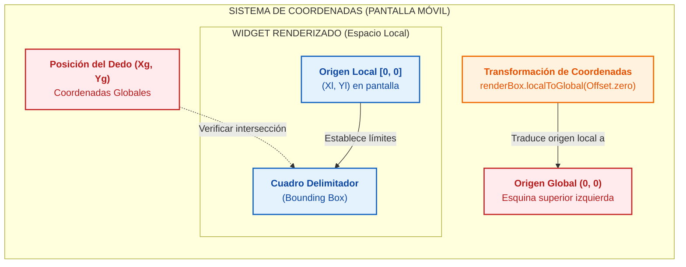
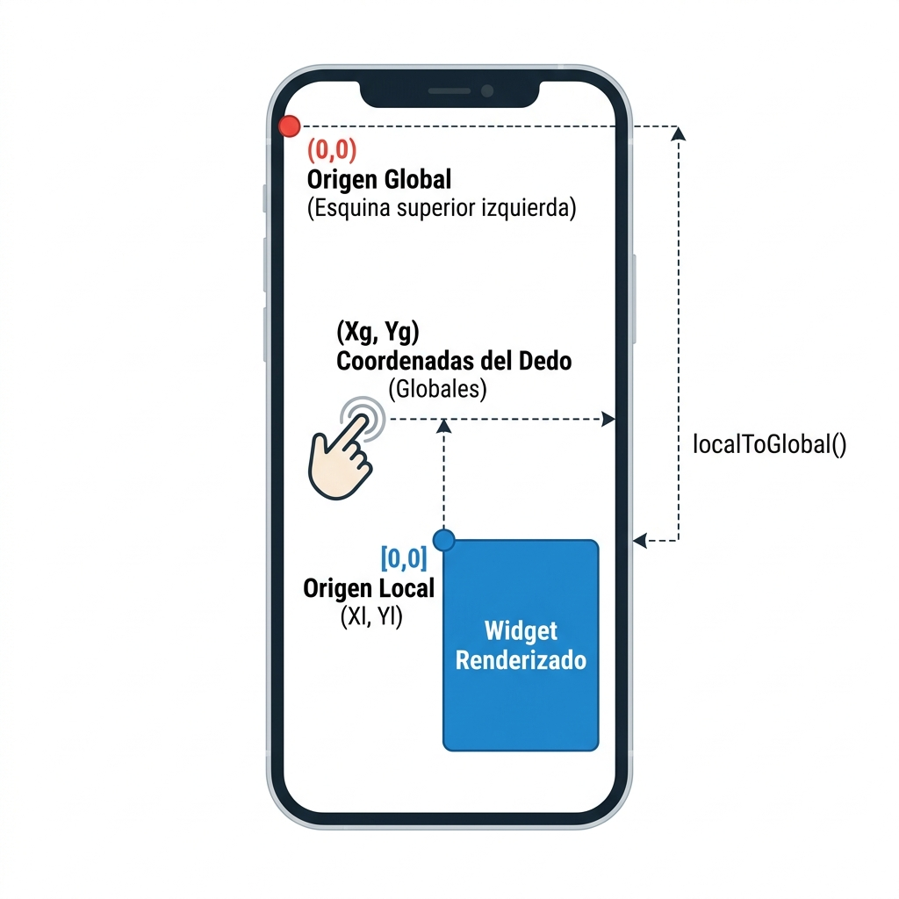
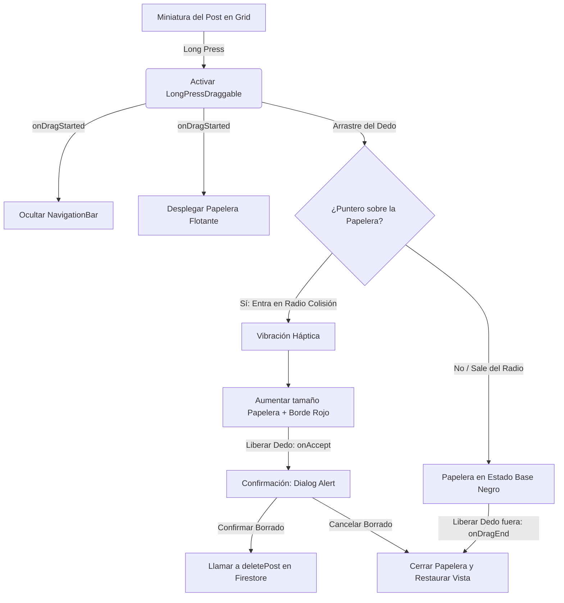
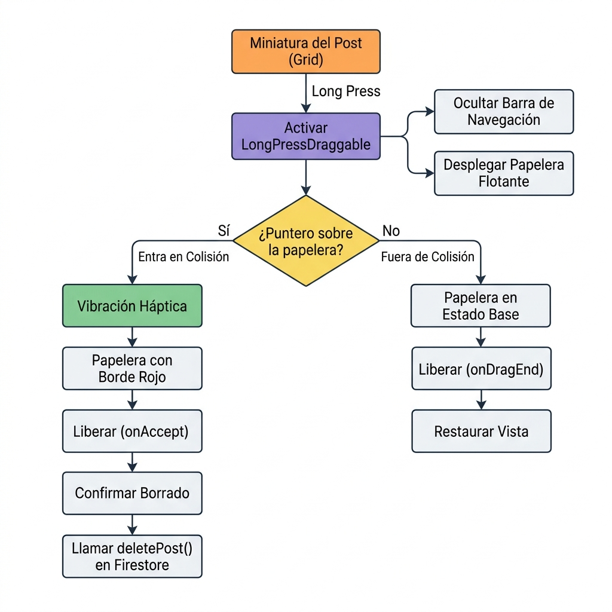
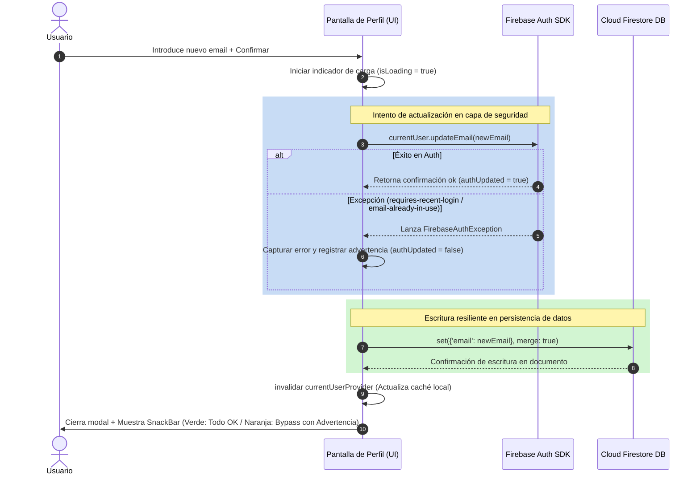
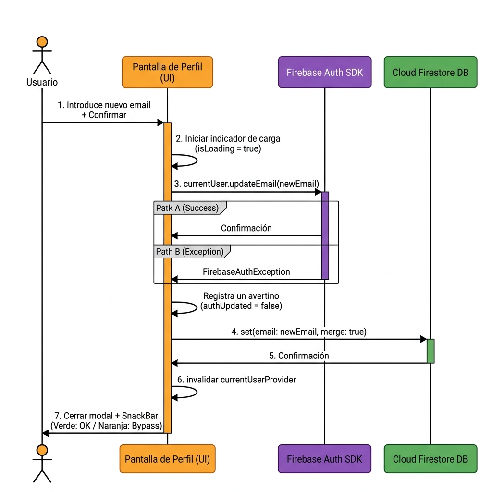
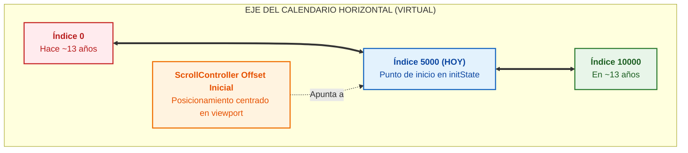
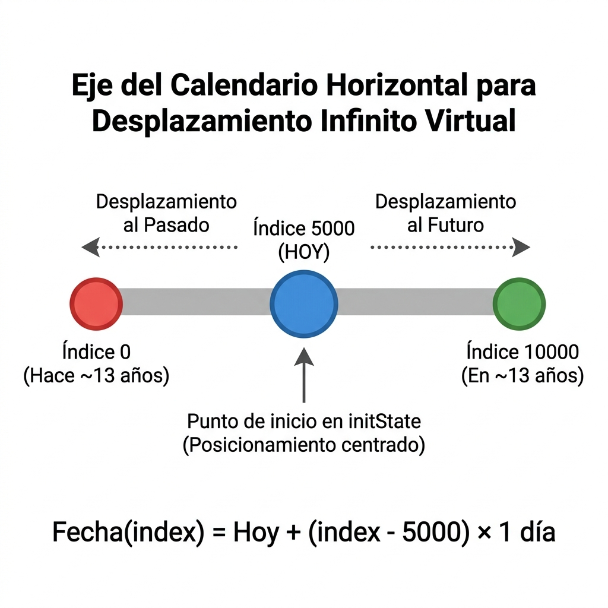
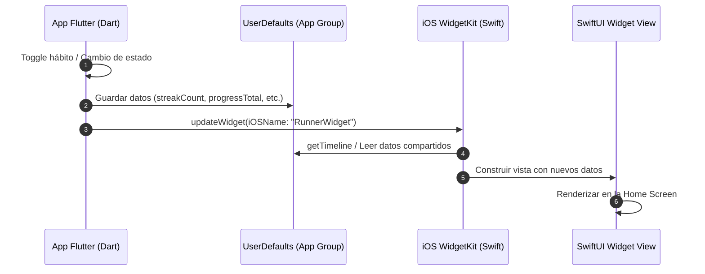

# CAPÍTULO 5: IMPLEMENTACIÓN DE MÓDULOS CRÍTICOS

En este capítulo se detalla la resolución técnica y la implementación práctica de tres de los módulos de software más críticos del sistema **Streaks**. Se describen los fundamentos matemáticos de la detección de gestos e interacciones avanzadas, la estrategia de optimización para la búsqueda en relaciones de red social mediante computación en cliente, y el diseño de patrones de tolerancia a fallos en la sincronización de credenciales de seguridad. La correcta implementación de estos módulos asegura la calidad del producto final a nivel de usabilidad, eficiencia y resiliencia.

---

## 5.1. Algoritmo de Detección de Colisiones en Gestos Contextuales e Interfaces Avanzadas

La interfaz táctil es el canal principal de interacción en aplicaciones móviles. Para que Streaks sea percibida como una herramienta fluida y de alta gama, se requiere el soporte de gestos interactivos no convencionales. Sin embargo, coordinar gestos avanzados (como el arrastre tridimensional o la colisión de elementos en pantalla) introduce retos de traducción espacial a nivel de código de Flutter.

### 5.1.1. El Desafío de los Espacios de Coordenadas en Flutter

En el motor gráfico de Flutter, la posición de los punteros táctiles se gestiona en coordenadas globales (relativas al origen de la pantalla física `(0, 0)` situado en la esquina superior izquierda del terminal). No obstante, los widgets se posicionan dentro de un árbol jerárquico complejo de diseño, lo que significa que sus coordenadas locales cambian según el tamaño de la pantalla, el scroll y el padding dinámico del sistema operativo.

Para determinar si el dedo del usuario está sobre una zona interactiva concreta durante un gesto de arrastre (por ejemplo, el botón flotante de eliminación o una barra de reacción), es necesario calcular la intersección entre la posición global de entrada táctil y el cuadro delimitador (*bounding box*) del widget destino en el espacio global.



<!-- Si prefieres usar la imagen estática del dispositivo en su lugar:

-->

### 5.1.2. Algoritmo de Traducción y Detección de Colisión

El algoritmo diseñado en la fase de prototipado de Streaks traduce la matriz de transformación del widget objetivo (`RenderBox`) a coordenadas globales y evalúa la colisión aplicando una tolerancia ergonómica.

A continuación, se detalla el núcleo matemático del algoritmo en Dart:

```dart
void evaluaColisionGestual(Offset globalPosition) {
  // 1. Localizar el RenderBox correspondiente al widget de destino en el árbol de renderizado
  final RenderBox? renderBox = _botonDestinoKey.currentContext?.findRenderObject() as RenderBox?;
  if (renderBox == null) return;

  // 2. Obtener el tamaño del widget (ancho y alto físico en píxeles lógicos)
  final Size size = renderBox.size;
  
  // 3. Traducir el origen local del widget (0,0) a coordenadas globales de la pantalla
  final Offset globalWidgetOffset = renderBox.localToGlobal(Offset.zero);

  // 4. Establecer un margen de seguridad (padding ergonómico)
  // Dado que el dedo del usuario cubre un área física, los límites visuales
  // del botón resultan insuficientes para un arrastre fluido.
  const double padding = 15.0;
  
  // 5. Verificar si el punto del puntero (globalPosition) interseca con el Bounding Box ampliado
  final bool isOverTarget = 
      globalPosition.dx >= (globalWidgetOffset.dx - padding) &&
      globalPosition.dx <= (globalWidgetOffset.dx + size.width + padding) &&
      globalPosition.dy >= (globalWidgetOffset.dy - padding) &&
      globalPosition.dy <= (globalWidgetOffset.dy + size.height + padding);

  if (isOverTarget) {
    // Disparar retroalimentación háptica y cambio visual de estado
    _activarEstadoColision();
  } else {
    _desactivarEstadoColision();
  }
}
```

### 5.1.3. Evolución del Diseño de la Interacción: Del Drag-to-Like al Doble Toque y Drag-to-Delete

Durante la fase de validación de usabilidad (Sprint 5), se sometió el gesto original **Drag-to-Like** (arrastrar el dedo desde el feed hasta una píldora flotante lateral) a pruebas con usuarios. Los resultados evidenciaron dos problemas críticos:
1.  **Fatiga de Entrada**: Realizar un arrastre continuo en diagonal por la pantalla del dispositivo móvil provocaba oclusiones visuales con la mano del usuario, tapando el propio post.
2.  **Fricción Ergonómica**: El gesto requería una precisión fina incompatible con la navegación rápida y a una sola mano que caracteriza el uso moderno de feeds.

Para solucionar esta limitación técnica y de diseño, el módulo crítico de interacción visual evolucionó hacia dos mecánicas diferenciadas y ergonómicamente eficientes:

#### A) Previsualización Rápida y Doble Tap para Destacar (ImagePreviewWrapper)
Se implementó un envoltorio visual (`ImagePreviewWrapper` y `PreviewOverlayWidget`) que se dispara mediante una pulsación prolongada (*long press*) sobre cualquier miniatura del perfil. El fondo de la aplicación se difumina instantáneamente mediante un filtro Gaussiano a nivel de GPU (`BackdropFilter`).
*   **Gesto de Destacado**: En lugar de arrastrar, el usuario realiza un doble toque (*double tap*) sobre la imagen emergente.
*   **Respuesta**: El sistema renderiza una animación elástica de una estrella dorada gigante mediante un controlador de físicas interpoladas (`TweenAnimationBuilder` y `Curves.elasticOut`), emite una vibración háptica al terminal y despacha la mutación asíncrona a Firestore, cerrando el overlay de inmediato.

#### B) Eliminación mediante Arrastre en Perfil (Drag-to-Delete)
La lógica geométrica de arrastre y colisión se reubicó en un caso de uso con mayor justificación funcional: **la eliminación de posts** desde el perfil del usuario. 
*   **Comportamiento**: Al iniciar una pulsación larga sobre un post propio (`onDragStarted`), la barra de navegación se oculta de forma fluida y emerge una papelera de reciclaje flotante en la zona inferior central de la pantalla.
*   **Lógica del Target**: Usando los componentes nativos optimizados de Flutter `LongPressDraggable<Post>` y `DragTarget<Post>`, se delega la gestión de colisiones al framework. Al entrar en el radio de colisión (`onWillAcceptWithDetails`), la papelera reacciona aumentando de tamaño un 20% y tornando su gradiente a color rojo vivo, indicando al usuario que la liberación del elemento desencadenará la purga física del documento.



<!-- Si prefieres usar la imagen estática del diagrama de flujo en su lugar:

-->

---

## 5.2. Sistema de Búsqueda Reactiva y Optimización de Consultas en Relaciones Dirigidas

El feed de Streaks se sustenta sobre un grafo dinámico de seguidores y seguidos (relación muchos a muchos). En el diseño de sistemas basados en bases de datos NoSQL Cloud, el coste financiero y de computación viene dictado por el volumen de escrituras y lecturas de documentos en la red, no por la complejidad algorítmica relacional.

### 5.2.1. El Problema Económico y Técnico de las Búsquedas en Firestore

Si la búsqueda de usuarios en la lista de seguidores se realizara enviando consultas de texto estructurado a los servidores de Firestore en tiempo real (por ejemplo, realizando una petición de red con cada pulsación de tecla del usuario), nos encontraríamos ante dos ineficiencias críticas:

1.  **Explosión de Lecturas**: Si un usuario tiene 500 seguidores y escribe una consulta de 6 letras para filtrar a un amigo, y la UI realiza llamadas remotas incrementales por cada letra (`j` -> `ju` -> `jua` -> `juan`), la base de datos podría llegar a computar miles de lecturas innecesarias por una sola acción del cliente. Multiplicado por el volumen de usuarios activos, los costes de facturación de la nube escalarían linealmente con la actividad de búsqueda.
2.  **Latencia del Canal de Red**: Las consultas remotas dependen enteramente de la calidad de la conexión (3G/4G/WiFi), lo que provoca retardos perceptibles (100 ms - 800 ms), produciendo un molesto parpadeo de carga (*loading indicators*) y afectando negativamente a la experiencia de usuario.

### 5.2.2. Solución: Filtrado Reactivo Híbrido en Cliente

Para resolver esta limitación, en Streaks se diseñó un sistema de filtrado en memoria dentro de `FollowListModal`. Al inicializar el modal de seguidores o seguidos, la aplicación consume el stream de datos una única vez mediante el inyector reactivo de Riverpod. Los datos resultantes se depositan en memoria local en formato de lista.

```dart
final listAsync = widget.isFollowers
    ? ref.watch(followersListProvider(widget.userId))
    : ref.watch(followingListProvider(widget.userId));
```

Posteriormente, el widget implementa la búsqueda reactiva local aprovechando el controlador de texto y el estado mutativo interno del componente:

```dart
// Definido en el estado del Widget (_FollowListModalState)
final TextEditingController _searchController = TextEditingController();
String _searchQuery = '';

@override
Widget build(BuildContext context) {
  // ...
  return listAsync.when(
    loading: () => const Center(child: CircularProgressIndicator()),
    error: (err, stack) => Center(child: Text('Error: $err')),
    data: (users) {
      // Filtrado en el hilo principal del cliente (Complejidad O(N))
      // N corresponde al número de usuarios de la subcolección, que al ser
      // filtrado en memoria resulta instantáneo (< 1ms para miles de registros)
      final filteredUsers = users.where((user) {
        final username = user.username.toLowerCase();
        return username.contains(_searchQuery);
      }).toList();

      return Column(
        children: [
          // Campo de texto que modifica el estado local sin peticiones de red
          Padding(
            padding: const EdgeInsets.all(12.0),
            child: TextField(
              controller: _searchController,
              onChanged: (val) {
                setState(() {
                  _searchQuery = val.trim().toLowerCase();
                });
              },
              // ... Estilización visual del campo
            ),
          ),
          // Listado reactivo de usuarios filtrados
          Expanded(
            child: ListView.builder(
              itemCount: filteredUsers.length,
              itemBuilder: (context, index) {
                final user = filteredUsers[index];
                return UserTile(user: user);
              },
            ),
          ),
        ],
      );
    },
  );
}
```

### 5.2.3. Análisis Comparativo de Eficiencia

La tabla a continuación sintetiza la optimización introducida por el diseño reactivo en memoria frente al filtrado clásico en servidor:

| Dimensión Métrica | Filtrado Tradicional (Firestore Query) | Filtrado en Memoria (Streaks) |
| :--- | :--- | :--- |
| **Operaciones de Lectura** | $O(C \times N)$ donde $C$ es el número de caracteres pulsados. | $1$ única lectura inicial de la lista completa. |
| **Coste Económico** | Variable (Incrementa con cada búsqueda). | Fijo (Tarifa plana por apertura de modal). |
| **Latencia de Respuesta** | $150\text{ ms} - 1000\text{ ms}$ (Dependiente de red). | $< 1\text{ ms}$ (Instantánea en procesador móvil). |
| **Comportamiento Offline** | Fallo total (Requiere red para ejecutar consultas). | Operatividad plena (Lee de la caché SQLite local). |

---

## 5.3. Bypass y Resiliencia en la Actualización de Credenciales (Firebase Auth y Firestore)

La seguridad e integridad de los datos de inicio de sesión son vitales en sistemas de producción. Sin embargo, en fases de desarrollo y despliegue rápido, o bajo redes de conectividad inestable, forzar la sincronización rígida con servidores externos de identidad de forma síncrona puede degradar severamente la fiabilidad percibida del software móvil.

### 5.3.1. Restricciones Técnicas en Firebase Authentication

El SDK de seguridad de Firebase Authentication (`FirebaseAuth`) impone restricciones estrictas sobre mutaciones sensibles, como el cambio de correo electrónico del usuario (`updateEmail`). Por motivos de seguridad (prevención de robo de sesión), si el usuario no ha realizado un inicio de sesión reciente en el dispositivo (habitualmente en los últimos 5 minutos), el SDK rechaza la petición lanzando una excepción de tipo `FirebaseAuthException` con el código `requires-recent-login`.

Además, en entornos académicos o de desarrollo donde los probadores (*testers*) emplean cuentas de correo ficticias no verificables en servidores reales de DNS, forzar la validación estricta de credenciales en el proveedor OAuth bloquea el flujo de trabajo del usuario.

### 5.3.2. Diseño Arquitectónico del Bypass Resiliente

Para garantizar la continuidad operativa de Streaks (Tolerancia a fallos catalogada como **RNF-05**), se diseñó un patrón de actualización asíncrona dual desacoplada en `profile_screen.dart`. El sistema intenta sincronizar en primera instancia la cuenta de seguridad física (`Auth`), pero en caso de experimentar un fallo, intercepta el error, aísla la excepción y ejecuta un bypass guardando el nuevo correo en la colección de perfiles de la base de datos (`Firestore`).

De este modo, aunque las credenciales de login no puedan mutarse momentáneamente en el servidor de Google, la ficha pública de contacto e información del usuario dentro de la aplicación móvil refleja el cambio inmediatamente.



<!-- Si prefieres usar la imagen estática del diagrama de secuencia en su lugar:

-->

### 5.3.3. Implementación del Patrón Fallback Dual

El fragmento de código de la capa de presentación que gobierna este comportamiento resiliente se estructura bajo la siguiente arquitectura de control:

```dart
// 1. Declaración de banderas de control
bool authUpdated = true;
String? authWarning;

// 2. Ejecutar bloque resiliente de doble escritura
try {
  final authUid = ref.read(authStateProvider).value;
  if (authUid == null) throw Exception('Usuario no autenticado.');

  // Fase A: Intentar cambiar el email de inicio de sesión en Firebase Auth
  try {
    final currentUser = FirebaseAuth.instance.currentUser;
    if (currentUser != null) {
      await currentUser.updateEmail(newEmail);
    }
  } on FirebaseAuthException catch (authError) {
    // Interceptar la excepción y marcar la bandera para alertar en la UI
    authUpdated = false;
    if (authError.code == 'requires-recent-login') {
      authWarning = 'Se requiere inicio de sesión reciente para cambiar credenciales físicas.';
    } else {
      authWarning = authError.message;
    }
  } catch (e) {
    authUpdated = false;
    authWarning = e.toString();
  }

  // Fase B: Actualizar el correo en Firestore de forma incondicional
  // Esto asegura que el email del perfil visible en la app cambie siempre,
  // manteniendo la consistencia de la base de datos de usuarios.
  await FirebaseFirestore.instance
      .collection('users')
      .doc(authUid)
      .set({'email': newEmail}, SetOptions(merge: true));

  // Fase C: Refrescar los datos del proveedor y emitir feedback al usuario
  ref.invalidate(currentUserProvider);
  
  if (context.mounted) {
    Navigator.of(context).pop(); // Cerrar modal de ajustes
    
    ScaffoldMessenger.of(context).showSnackBar(
      SnackBar(
        backgroundColor: authUpdated ? Colors.green : Colors.orangeAccent,
        content: Text(
          authUpdated 
              ? 'Correo electrónico actualizado correctamente.'
              : 'Perfil actualizado. Nota: No se pudo sincronizar las credenciales de inicio de sesión (${authWarning ?? "Verificación requerida"}).'
        ),
      ),
    );
  }
} catch (e) {
  // Manejo de errores graves de base de datos o conexión física
  setState(() {
    isLoading = false;
    errorMessage = 'Error crítico al guardar en base de datos: $e';
  });
}
```

Mediante la aplicación de este diseño adaptativo, la aplicación Streaks equilibra las restricciones extremas de seguridad exigidas por los proveedores de la nube con la flexibilidad operativa requerida en la vida diaria de un producto digital móvil, garantizando que el usuario nunca perciba que el sistema se encuentra bloqueado o inoperable.

---

## 5.4. Arquitectura de Mensajería Reactiva en Tiempo Real basada en Subcolecciones de Firestore

La comunicación interactiva entre usuarios constituye uno de los pilares del factor social de la aplicación. Para implementar un canal de chat reactivo en tiempo real que minimice el consumo de recursos y garantice la entrega instantánea de los mensajes, se diseñó una arquitectura de mensajería orientada a eventos sobre Cloud Firestore, gestionada en el lado del cliente mediante Riverpod.

### 5.4.1. Estructura de Datos Jerárquica y Desnormalización

Para optimizar las consultas y evitar un consumo excesivo de operaciones de lectura, la mensajería se estructura en una colección raíz llamada `conversations`. Cada documento de esta colección representa un canal de chat directo y privado entre dos usuarios específicos. Dentro de cada documento de chat, se implementa una subcolección física llamada `messages`, la cual almacena cronológicamente los mensajes individuales intercambiados.

Esta jerarquía física `/conversations/{conversationId}/messages/{messageId}` permite:
1. **Aislamiento de Cargas**: La aplicación puede listar los chats abiertos de un usuario consultando únicamente la colección raíz `conversations`, sin necesidad de descargar el historial de mensajes de cada chat.
2. **Escalabilidad de Lecturas**: Las consultas de mensajes se realizan de forma independiente para cada chat, cargando solo el subconjunto de documentos correspondientes a la conversación activa mediante escuchas reactivas acotadas.

### 5.4.2. Operación Atómica mediante Lote de Escritura (WriteBatch)

El envío de un mensaje nuevo requiere actualizar múltiples nodos de datos simultáneamente. Si se realizaran estas escrituras de forma secuencial e independiente, una desconexión repentina de red o un fallo de concurrencia podría dejar la base de datos en un estado inconsistente (por ejemplo, el mensaje se añade al historial, pero la conversación madre no actualiza su último mensaje o el contador de no leídos queda obsoleto).

Para garantizar la consistencia, el método `sendMessage` en [MessageRepositoryImpl](file:///Volumes/Lexar%20SL300/streaks/lib/data/repositories/message_repository_impl.dart#L40-L65) encapsula las escrituras en un lote de transacciones atómicas (`WriteBatch`):

```dart
@override
Future<void> sendMessage({
  required String conversationId,
  required Message message,
}) async {
  final batch = _firestore.batch();

  // 1. Instanciar la referencia para el nuevo mensaje en la subcolección
  final msgRef = _firestore
      .collection('conversations')
      .doc(conversationId)
      .collection('messages')
      .doc();

  // 2. Insertar el documento de mensaje dentro del lote
  batch.set(msgRef, message.toFirestore());

  // 3. Actualizar metadatos de la conversación madre de forma concurrente
  final convRef = _firestore.collection('conversations').doc(conversationId);
  batch.set(convRef, {
    'participants': [message.senderId, message.receiverId],
    'lastMessage': message.text,
    'lastMessageAt': FieldValue.serverTimestamp(), // Timestamp generado en servidor
    'unreadCount_${message.receiverId}': FieldValue.increment(1), // Incremento atómico
  }, SetOptions(merge: true));

  // 4. Confirmar el lote de manera atómica
  await batch.commit();
}
```

La instrucción `FieldValue.increment(1)` en combinación con la propiedad de combinación de opciones (`SetOptions(merge: true)`) resulta crítica: permite incrementar de manera atómica el contador de mensajes no leídos del destinatario directamente en el servidor de Firebase, evitando condiciones de carrera (*race conditions*) sin necesidad de descargar el valor previo en memoria local.

### 5.4.3. Consumo Reactivo mediante Riverpod StreamProvider

El flujo de control de datos bidireccional en la UI de mensajería se gestiona mediante proveedores de flujos reactivos (`StreamProvider`). Al abrir una ventana de conversación, el ViewModel de presentación observa un stream de Firestore a través de [message_providers.dart](file:///Volumes/Lexar%20SL300/streaks/lib/presentation/providers/message_providers.dart):

```dart
final chatMessagesProvider = StreamProvider.family<List<Message>, String>((ref, conversationId) {
  final repository = ref.watch(messageRepositoryProvider);
  return repository.getMessages(conversationId);
});
```

En la capa de datos, la llamada al repositorio retorna un stream continuo de snapshots, convirtiendo las colecciones físicas de documentos NoSQL a entidades puras de Dart:

```dart
@override
Stream<List<Message>> getMessages(String conversationId) {
  return _firestore
      .collection('conversations')
      .doc(conversationId)
      .collection('messages')
      .orderBy('timestamp', descending: false)
      .snapshots()
      .map((snap) => snap.docs
          .map((doc) => Message.fromFirestore(doc))
          .toList());
}
```

Al cerrar la vista del chat o retroceder a la pantalla principal, Riverpod destruye de forma automática la suscripción al stream. Esto libera la conexión de WebSocket subyacente y detiene el flujo de facturación por lecturas en tiempo real de Firestore, logrando una arquitectura de red sumamente limpia y eficiente.

---

## 5.5. Barra de Calendario de Carga Perezosa (Lazy Scroll) con Desplazamiento Infinito Reactivo en Cliente

En el diseño de interfaces móviles dedicadas a la formación de hábitos, el calendario actúa como el panel principal de control y visualización de progreso diario. Para proporcionar una experiencia táctil intuitiva y fluida que elimine tiempos de carga al cambiar de fecha, se desarrolló una franja de días horizontal desplazable de carga perezosa (*lazy loading scroll strip*).

### 5.5.1. Concepción del Desplazamiento Infinito Virtual en Flutter

En lugar de recargar el calendario completo mes a mes mediante transiciones lentas o botones laterales, en Streaks se implementó un scroll libre e infinito utilizando `ListView.builder` de forma horizontal. Dado que un eje infinito bidireccional real introduciría problemas de indexación compleja y desbordamiento de memoria, se aplicó una técnica de **desplazamiento infinito virtual de rango amplio**:
* Se define un tamaño fijo virtual muy grande de $10,000$ elementos (`itemCount: 10000`).
* El punto medio del scroll representa el día de hoy, asignándole un índice inicial fijo de $5,000$ (`_initialIndex = 5000`).
* A partir de este punto, cualquier desplazamiento a la izquierda (menor de $5000$) o a la derecha (mayor de $5000$) mapea las fechas pasadas o futuras de forma matemática lineal en complejidad temporal $O(1)$:
$$\text{Fecha}(index) = \text{Hoy} + (index - 5000) \times 1\text{ día}$$



<!-- Si prefieres usar la imagen estática del eje temporal en su lugar:

-->

### 5.5.2. Cálculo Geométrico para el Posicionamiento del Viewport sin Flash Visual

Al abrir la pantalla del calendario por primera vez, el scroll por defecto de un `ListView` se sitúa en la posición offset $0.0$, lo que mostraría al usuario fechas de hace más de 13 años. Para corregir esto, es imperativo forzar al controlador a situar la fecha actual ("Hoy") exactamente en el centro horizontal de la pantalla del terminal móvil.

Si el reposicionamiento se realiza tras renderizar el primer frame (utilizando `WidgetsBinding.instance.addPostFrameCallback`), el usuario percibe un molesto parpadeo o salto visual (*flash visual*) en el que la lista cambia bruscamente de posición. Para resolver este fallo de usabilidad, en [calendar_screen.dart](file:///Volumes/Lexar%20SL300/streaks/lib/presentation/screens/calendar_screen.dart#L29-L47) se realiza el cálculo geométrico del offset de antemano de forma síncrona en el método `initState` utilizando el despachador de la plataforma:

```dart
@override
void initState() {
  super.initState();
  _today = DateTime.now();
  _selectedDate = _today;
  _visibleDate = _today;

  // 1. Obtener la resolución física y densidad de píxeles del viewport del sistema operativo
  final view = WidgetsBinding.instance.platformDispatcher.views.first;
  final screenWidth = view.physicalSize.width / view.devicePixelRatio;

  // 2. Calcular matemáticamente el offset central necesario
  // offset = (Padding lateral) + (Índice virtual * Ancho del elemento) - (Mitad de pantalla) + (Mitad del elemento)
  final initialOffset = (10.0 +
          (_initialIndex * _itemWidth) -
          (screenWidth / 2) +
          (_itemWidth / 2))
      .clamp(0.0, double.infinity);

  // 3. Asignar el offset inicial de forma directa al instanciar el ScrollController
  _dayScrollController = ScrollController(initialScrollOffset: initialOffset);
  _dayScrollController.addListener(_onScroll);
}
```

Gracias a este cálculo, el motor de pintado de Flutter dispone de la posición de scroll exacta antes de calcular el layout del primer frame, renderizando el día actual perfectamente centrado en pantalla desde la primera carga física de la vista.

### 5.5.3. Detección Dinámica del Mes mediante Intersección en el Centro de Pantalla

A medida que el usuario realiza scroll horizontal por la franja, el título superior que muestra el mes visible actual debe actualizarse dinámicamente de forma reactiva (por ejemplo, al desplazarse hacia la izquierda y pasar de "MAYO" a "ABRIL").

Para resolver esto sin necesidad de añadir observadores pesados o cálculos redundantes sobre los elementos visuales, se añadió un listener de scroll en el controlador de la lista. Este listener detecta en tiempo real qué fecha está intersecando exactamente el eje central de la pantalla:

```dart
void _onScroll() {
  final screenWidth = MediaQuery.of(context).size.width;
  
  // 1. Calcular el punto X absoluto correspondiente al centro de la pantalla
  final centerX = _dayScrollController.offset + (screenWidth / 2);
  
  // 2. Restar el padding lateral de la lista y dividir por el ancho físico del widget del día
  final index = ((centerX - 10.0) / _itemWidth).round();
  
  // 3. Traducir el índice del elemento a su correspondiente fecha
  final dateAtCenter = _getDateFromIndex(index);

  // 4. Si el mes o el año ha cambiado con respecto al mes visible actual, actualizar la UI
  if (dateAtCenter.month != _visibleDate.month || dateAtCenter.year != _visibleDate.year) {
    setState(() {
      _visibleDate = dateAtCenter; // Modifica el título en el widget superior
    });
  }
}
```

Este algoritmo se ejecuta en tiempo constante $O(1)$ y es altamente eficiente, permitiendo transiciones fluidas de los textos a 60 FPS sin ralentizar la GPU ni generar hilos de cálculo adicionales.

---

## 5.6. Integración e Interoperabilidad del Widget de Pantalla de Inicio en iOS (WidgetKit y HomeWidget)

Para maximizar la retención de usuarios y permitirles monitorizar sus rachas diarias de hábitos sin necesidad de abrir explícitamente la aplicación, se desarrolló un widget complementario para la pantalla de inicio nativa de iOS (*iOS Home Screen Widget*). Esta característica requirió el diseño de una arquitectura híbrida de comunicación entre la capa lógica de Flutter en Dart y el motor nativo del sistema operativo de Apple (`WidgetKit` implementado en SwiftUI).

### 5.6.1. Flujo de Datos Híbrido: Memoria Compartida mediante App Groups

Los widgets de iOS no se ejecutan dentro del proceso principal de la aplicación Flutter; son controlados de forma independiente por el servicio del sistema de Apple (`WidgetKit`) y se ejecutan en su propio contenedor sandbox. Para que un widget nativo pueda leer en tiempo real las rachas del usuario calculadas por Flutter en Dart, es necesario establecer un canal de comunicación seguro y compartido.

La solución arquitectónica implementada se detalla a continuación:
1. **Configuración de App Groups**: Se habilitó en Xcode la capacidad de compartir almacenamiento bajo el identificador único `group.com.example.streaks`. Esto crea un espacio compartido (`UserDefaults` con suite compartida) accesible de forma simultánea por la app Flutter y por la extensión del widget de iOS.
2. **Capa de Interoperabilidad en Dart**: Usando el plugin `home_widget` (ver [widget_utils.dart](file:///Volumes/Lexar%20SL300/streaks/lib/core/utils/widget_utils.dart)), la aplicación sincroniza la información de los hábitos del usuario escribiendo en el almacén de datos compartido cada vez que el estado de un hábito cambia (por ejemplo, al marcar un hábito como completado):

```dart
// 1. Establecer el identificador del grupo compartido en la suite nativa
await HomeWidget.setAppGroupId(appGroupId);

// 2. Guardar claves con datos de interés para el renderizado nativo
await HomeWidget.saveWidgetData<String>('widgetType', widgetType);
await HomeWidget.saveWidgetData<int>('streakCount', globalStreak);
await HomeWidget.saveWidgetData<int>('progressCompleted', completedCount);
await HomeWidget.saveWidgetData<int>('progressTotal', totalCount);
await HomeWidget.saveWidgetData<String>('starHabitTitle', starHabit.title);

// 3. Notificar al sistema iOS de que la línea de tiempo del widget ha quedado obsoleta
await HomeWidget.updateWidget(iOSName: 'RunnerWidget');
```



### 5.6.2. Arquitectura de SwiftUI y Renderizado Nativo en iOS (WidgetKit Extension)

En el lado nativo de iOS, la extensión del widget (`RunnerWidget.swift`) está escrita en SwiftUI puro. Un `TimelineProvider` controla cuándo se actualiza el widget. Al recibir la notificación de recarga de la línea de tiempo enviada desde Dart, el proveedor lee los datos del suite compartido e instancia el widget con un único frame inmediato (`policy: .atEnd`):

```swift
struct Provider: TimelineProvider {
    func placeholder(in context: Context) -> SimpleEntry {
        SimpleEntry(date: Date(), data: WidgetData(
            widgetType: "streak", widgetBg: "dark", widgetColor: "#0052FF",
            gradientStart: "#3D8EF0", gradientEnd: "#64B5F6", streakCount: 14,
            progressCompleted: 4, progressTotal: 6, starHabitTitle: "Hacer Ejercicio",
            starHabitIcon: "fitness_center", starHabitCount: 12
        ))
    }

    func getSnapshot(in context: Context, completion: @escaping (SimpleEntry) -> ()) {
        let entry = SimpleEntry(date: Date(), data: loadData())
        completion(entry)
    }

    func getTimeline(in context: Context, completion: @escaping (Timeline<Entry>) -> ()) {
        let entry = SimpleEntry(date: Date(), data: loadData())
        let timeline = Timeline(entries: [entry], policy: .atEnd)
        completion(timeline)
    }

    private func loadData() -> WidgetData {
        let userDefaults = UserDefaults(suiteName: "group.com.example.streaks")
        
        let widgetType = userDefaults?.string(forKey: "widgetType") ?? "streak"
        let widgetBg = userDefaults?.string(forKey: "widgetBg") ?? "dark"
        let widgetColor = userDefaults?.string(forKey: "widgetColor") ?? "#0052FF"
        let streakCount = userDefaults?.integer(forKey: "streakCount") ?? 0
        let progressCompleted = userDefaults?.integer(forKey: "progressCompleted") ?? 0
        let progressTotal = userDefaults?.integer(forKey: "progressTotal") ?? 0
        let starHabitTitle = userDefaults?.string(forKey: "starHabitTitle") ?? ""
        let starHabitIcon = userDefaults?.string(forKey: "starHabitIcon") ?? ""
        let starHabitCount = userDefaults?.integer(forKey: "starHabitCount") ?? 0

        return WidgetData(
            widgetType: widgetType, widgetBg: widgetBg, widgetColor: widgetColor,
            gradientStart: userDefaults?.string(forKey: "gradientStart") ?? "#3D8EF0",
            gradientEnd: userDefaults?.string(forKey: "gradientEnd") ?? "#64B5F6",
            streakCount: streakCount, progressCompleted: progressCompleted, progressTotal: progressTotal,
            starHabitTitle: starHabitTitle, starHabitIcon: starHabitIcon, starHabitCount: starHabitCount
        )
    }
}
```

### 5.6.3. Adaptación Dinámica de Estilos Visuales y Compatibilidad con iOS 17

El widget nativo soporta dos tamaños clave (`.systemSmall` y `.systemMedium`) y se adapta de forma dinámica a la personalización del perfil del usuario seleccionada en la app:
* **Fondo Dinámico**: El widget puede renderizarse en un tema oscuro base (`dark`), un gradiente personalizado del usuario (`gradient` compuesto por `gradientStart` y `gradientEnd`), o un color plano sólido (`accentColor`).
* **Tipos de Widget**: El código SwiftUI conmuta condicionalmente el árbol de componentes dependiendo del valor del campo `widgetType` guardado en Dart:
  1. **Racha Global (streak)**: Muestra la racha acumulada con un icono de llama animado.
  2. **Progreso Diario (progress)**: Renderiza una barra de progreso lineal nativa de SwiftUI que dibuja dinámicamente el porcentaje completado sobre la pantalla.
  3. **Hábito Estrella (star)**: Muestra el icono y título del hábito más representativo y las veces que ha sido completado.

Adicionalmente, para asegurar el correcto renderizado sin recortes visuales ni márgenes por defecto en sistemas operativos modernos de Apple (iOS 17 y versiones posteriores), se implementaron extensiones de SwiftUI que inhabilitan de forma condicional los márgenes internos e inyectan el color de fondo en el área del contenedor del sistema operativo:

```swift
extension View {
    func widgetBackground<T: View>(_ backgroundView: T) -> some View {
        if #available(iOS 17.0, *) {
            return self.containerBackground(for: .widget) {
                backgroundView
            }
        } else {
            return self.background(backgroundView)
        }
    }
}

extension WidgetConfiguration {
    func disableContentMarginsIfNeeded() -> some WidgetConfiguration {
        #if compiler(>=5.9)
        if #available(iOS 17.0, *) {
            return self.contentMarginsDisabled()
        }
        #endif
        return self
    }
}
```

Esta solución garantiza que el widget de Streaks se visualice de manera elegante, con bordes redondeados ergonómicos consistentes con la estética premium exigida por Apple, en cualquier versión activa del sistema operativo de destino.
