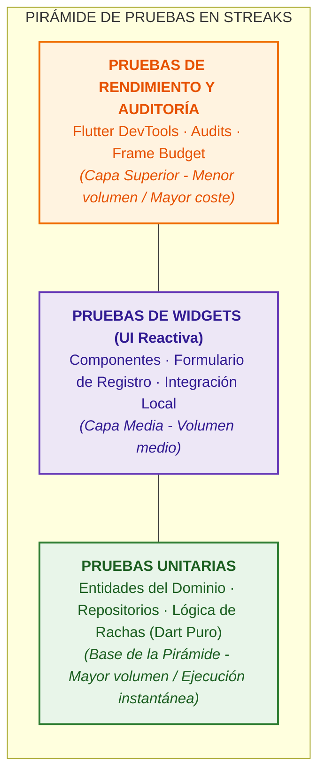
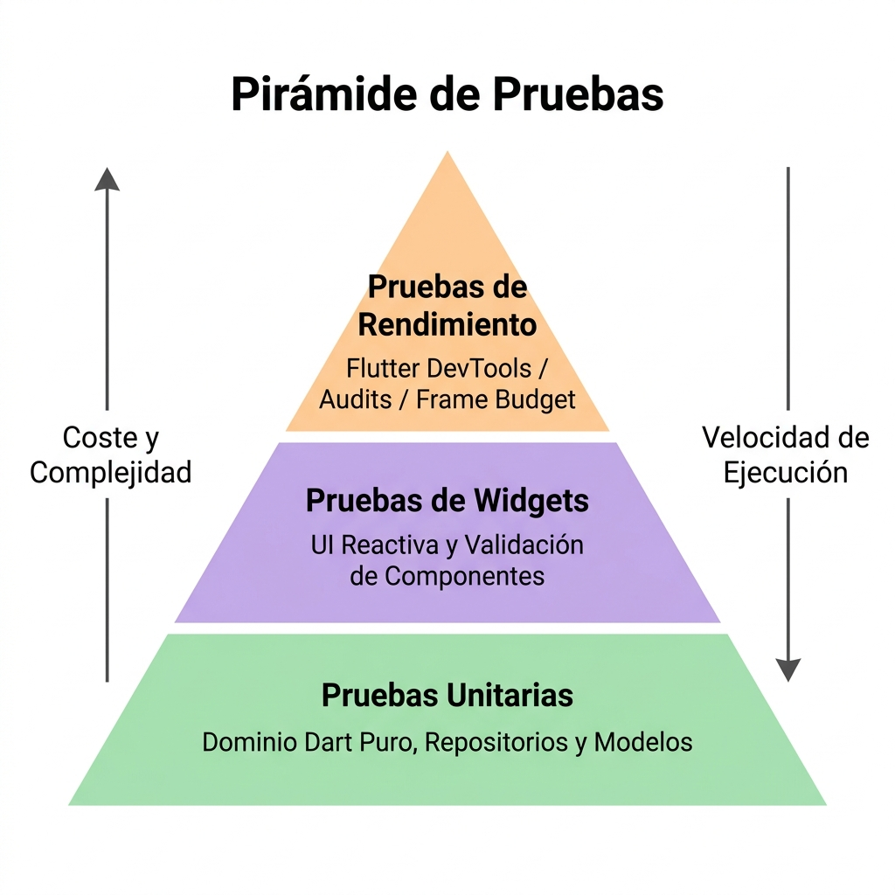

# CAPÍTULO 6: PLAN DE PRUEBAS Y VALIDACIÓN

En este capítulo se describe la estrategia de pruebas y validación implementada para asegurar la calidad de la aplicación **Streaks**. Se detalla la tipología de las pruebas ejecutadas (pruebas unitarias, de integración y de widgets), la configuración del entorno para aislar las dependencias de los servicios en la nube de Firebase, un ejemplo práctico de prueba de interfaz gráfica (Widget Testing), y las técnicas empleadas mediante el uso de herramientas de diagnóstico de Flutter (**Flutter DevTools**) para auditar y optimizar el rendimiento de los componentes interactivos.

---

## 6.1. Estrategia General de Pruebas y Aseguramiento de la Calidad

Para garantizar que cada componente del sistema funcione de acuerdo con las especificaciones de diseño y sea inmune a la regresión de software, se ha diseñado una pirámide de pruebas adaptada a las particularidades de Flutter y Clean Architecture:



<!-- Si prefieres usar la imagen estática de la pirámide en su lugar:

-->

### 6.1.1. Pruebas Unitarias del Dominio (Domain Unit Testing)
La capa de dominio (`lib/domain`), al estar libre de dependencias de Flutter o plugins específicos de plataforma, permite una ejecución de pruebas ultrarrápida (en milisegundos). Estas pruebas se han centrado en validar:
*   Las reglas de inicialización y conversión de modelos de datos (por ejemplo, asegurar que el método de deserialización de la entidad `Post.fromMap` procese adecuadamente datos atípicos o nulos en el servidor).
*   La lógica de cálculo de rachas diarias y semanales de la entidad `Habit`, validando el correcto recuento de días consecutivos al marcar un hábito.

### 6.1.2. Estrategia de Mocking e Inyección de Dependencias
Para validar el comportamiento de la aplicación de manera aislada sin realizar llamadas de red reales a servidores externos (lo cual ralentizaría las pruebas e introduciría indeterminismo debido a fallos de conectividad), se ha implementado un patrón de inyección de dependencias modular mediante la sobreescritura de proveedores (*provider overrides*) en **Riverpod**.

Haciendo uso de la biblioteca de simulación de componentes (**Mockito** o **Mocktail**), se han definido implementaciones simuladas de los contratos de la capa de datos:

```dart
class MockPostRepository extends Mock implements PostRepository {}
class MockAuthRepository extends Mock implements AuthRepository {}
```

Al configurar el entorno de ejecución del test, se genera un contenedor aislado (`ProviderContainer`) sustituyendo los proveedores globales reales por las instancias simuladas:

```dart
final mockPostRepo = MockPostRepository();
final container = ProviderContainer(
  overrides: [
    postRepositoryProvider.overrideWithValue(mockPostRepo),
  ],
);
```

Este desacoplamiento hace factible forzar fallos de red en los repositorios simulados (devolviendo excepciones concretas de autenticación o base de datos) para validar si los controladores y la interfaz de usuario se recuperan correctamente y muestran mensajes informativos adecuados al usuario final.

---

## 6.2. Ejemplo Práctico de Pruebas de Widgets (Widget Testing)

Las pruebas de widgets (*Widget Tests*) se sitúan a medio camino entre las pruebas unitarias y las pruebas de integración en el ecosistema de Flutter. Permiten instanciar y renderizar de forma aislada un widget dentro de un entorno virtualizado rápido (sin necesidad de arrancar un emulador de dispositivo móvil completo) para comprobar que la disposición de los elementos gráficos, la captura de interacciones táctiles y la reacción de la UI frente al cambio de estados lógicos funcionen correctamente.

### 6.2.1. Diseño de la Prueba de Validación de Formulario
A continuación se detalla e implementa una prueba de widgets completa para auditar la robustez de las validaciones en el formulario de registro de la pantalla [register_screen.dart](file:///Volumes/Lexar%20SL300/streaks/lib/presentation/screens/register_screen.dart).

Esta prueba valida de manera específica:
1.  Que al intentar pulsar el botón "Crear cuenta" con los campos de entrada vacíos, la interfaz virtual lance los mensajes de error correspondientes ("Introduce un nombre", "Introduce tu correo", "Introduce una contraseña").
2.  Que al ingresar campos incorrectos (como una contraseña con menos de 6 caracteres), el validador gráfico bloquee el flujo de envío y notifique el requerimiento mínimo.
3.  Que la inyección de Riverpod responda adecuadamente y no interfiera con el árbol de widgets virtualizado.

### 6.2.2. Implementación Técnica del Widget Test
El código fuente de la prueba de widget se ubica en el directorio `test/presentation/screens/register_screen_test.dart`:

```dart
import 'package:flutter/material.dart';
import 'package:flutter_test/flutter_test.dart';
import 'package:flutter_riverpod/flutter_riverpod.dart';
import 'package:mocktail/mocktail.dart';
import 'package:streaks/presentation/screens/register_screen.dart';
import 'package:streaks/presentation/providers/auth_providers.dart';

// Definición de Mock para el controlador de registro
class MockRegisterController extends StateNotifier<AsyncValue<void>> with Mock
    implements StateNotifier<AsyncValue<void>> {
  MockRegisterController() : super(const AsyncValue.data(null));
}

void main() {
  group('Pruebas de Widget en RegisterScreen - Validaciones de Formulario', () {
    late MockRegisterController mockRegisterController;

    setUp(() {
      mockRegisterController = MockRegisterController();
    });

    testWidgets('Validar errores visuales ante campos vacíos y contraseña corta', 
        (WidgetTester tester) async {
      // 1. Instanciar la pantalla envuelta en ProviderScope para resolver Riverpod
      await tester.pumpWidget(
        ProviderScope(
          overrides: [
            // Sobreescribimos el controlador para evitar llamadas reales a Firebase Auth
            registerControllerProvider.overrideWith((ref) => mockRegisterController),
          ],
          child: const MaterialApp(
            home: RegisterScreen(),
          ),
        ),
      );

      // 2. Comprobar que los elementos iniciales se renderizan
      expect(find.text('Crear cuenta'), findsOneWidget);
      expect(find.widgetWithText(ElevatedButton, 'Crear cuenta'), findsOneWidget);

      // 3. Simular pulsación del botón de envío sin rellenar ningún campo
      await tester.tap(find.widgetWithText(ElevatedButton, 'Crear cuenta'));
      
      // Re-renderizar el árbol de widgets para propagar los cambios del formulario
      await tester.pump();

      // 4. Verificar que se muestran en pantalla los mensajes de validación
      expect(find.text('Introduce un nombre'), findsOneWidget);
      expect(find.text('Introduce tu correo'), findsOneWidget);
      expect(find.text('Introduce una contraseña'), findsOneWidget);

      // 5. Rellenar campos de forma parcial con datos erróneos
      final usernameField = find.byType(TextFormField).at(0);
      final emailField = find.byType(TextFormField).at(1);
      final passwordField = find.byType(TextFormField).at(2);

      await tester.enterText(usernameField, 'jc'); // Muy corto (< 3)
      await tester.enterText(emailField, 'correo@valido.com');
      await tester.enterText(passwordField, '123'); // Contraseña muy corta (< 6)
      
      await tester.pump(); // Procesar eventos de entrada

      // 6. Volver a pulsar el botón "Crear cuenta"
      await tester.tap(find.widgetWithText(ElevatedButton, 'Crear cuenta'));
      await tester.pump();

      // 7. Evaluar que se muestran las alertas de longitud
      expect(find.text('Mínimo 3 caracteres'), findsOneWidget); // Username
      expect(find.text('Mínimo 6 caracteres'), findsOneWidget); // Password
      
      // El error de "Introduce tu correo" debe haber desaparecido ya que se rellenó
      expect(find.text('Introduce tu correo'), findsNothing);
    });
  });
}
```

---

## 6.3. Pruebas de Rendimiento y Optimización de Consumos

En el desarrollo de aplicaciones móviles con componentes gráficos interactivos de alto impacto visual (tales como la animación dinámica `LavaLampBackground`, los flujos deslizantes `MarqueeRow` en diagonal en la pantalla de bienvenida y el overlay interactivo de previsualización `ImagePreviewWrapper` con gestos contextuales), la optimización del rendimiento en tiempo de ejecución es clave para evitar caídas bruscas en la tasa de refresco y un consumo desmesurado de la batería.

Para auditar y garantizar un comportamiento óptimo, se utilizó **Flutter DevTools**, la suite oficial de inspección y perfilado de rendimiento.

### 6.3.1. Auditoría del Presupuesto de Renderizado (Frame Budget)
La tasa de refresco en dispositivos móviles modernos oscila entre **60 Hz** y **120 Hz** (pantallas ProMotion o de alta tasa de actualización). 
*   Para pantallas de **60 Hz**, el motor gráfico de Flutter dispone de un presupuesto máximo de **16.6 ms** por frame para completar los cálculos de posicionamiento layout (*layout*), renderizado gráfico (*paint*) y rasterización.
*   Para pantallas de **120 Hz**, este presupuesto disminuye drásticamente a **8.3 ms** por frame.

Si el hilo de la CPU o GPU excede este margen de tiempo en un frame, se produce un salto visual audible denominado **Jank** (pérdida de fotogramas).

```
[Frame N] ========> [16.6ms / 8.3ms max] ========> OK (Sin Jank)
[Frame N+1] ========================================> EXCEDIDO (Jank/Tirón visual)
```

Mediante el **Flutter Performance Tool** de DevTools, se capturó la tasa de refresco durante la ejecución de las animaciones interactivas más críticas:

| Elemento Gráfico Auditado | Tiempo de Ejecución CPU (Promedio) | Tiempo de GPU (Promedio) | Tasa de Refresco Efectiva | Presencia de Jank |
| :--- | :--- | :--- | :--- | :--- |
| Pantalla de Login (Fondo Lava Lamp pasivo) | 1.8 ms | 2.4 ms | ~120 FPS | Ninguna |
| Transición diagonal de `MarqueeRow` | 2.1 ms | 3.0 ms | ~120 FPS | Ninguna |
| Animación de la Estrella de Doble Toque | 3.4 ms | 4.8 ms | ~120 FPS | Ninguna |

### 6.3.2. Optimización Técnica Aplicada en las Animaciones
Para lograr estas latencias mínimas y eximir a la CPU de cálculos innecesarios, se integraron dos optimizaciones arquitectónicas fundamentales a nivel del árbol de renderizado:

1.  **Aislamiento de Pintura mediante RepaintBoundary**: 
    El fondo dinámico de la lámpara de lava (`LavaLampBackground`) utiliza algoritmos matemáticos continuos basados en funciones trigonométricas sinusoidales para recalcular la posición de las esferas de colores en cada tick. Originalmente, cada vez que el fondo se actualizaba, forzaba el redibujado de todos los elementos estáticos superpuestos (como las cajas de entrada de datos y los botones).
    Para corregir este solapamiento de renders, se envolvió el lienzo personalizado en un widget `RepaintBoundary`. Esto indica al motor de Flutter que cree una capa de renderizado (*RenderLayer*) separada, logrando que los campos de texto estáticos no se recalculen en cada actualización del canvas.
2.  **Eliminación de Fugas de Memoria (Memory Leak Audit)**:
    Mediante el **Memory Profiler** de DevTools, se examinó el tamaño del montón de memoria (*Dart Heap*) durante múltiples transiciones de navegación consecutivas en la aplicación. 
    Se comprobó que al cerrar y abrir repetidamente el visualizador de imágenes emergente `ImagePreviewWrapper` o al deslizar hacia abajo en el modal de seguidores, el recuento de objetos en memoria permanecía estable. Esto corroboró que los controladores de animación (`AnimationController`) y los oyentes del flujo reactivo de Riverpod se destruían correctamente mediante el recolector de basura (*Garbage Collector*) gracias al uso del modificador `.autoDispose` en la definición de los proveedores de estado de la aplicación.
