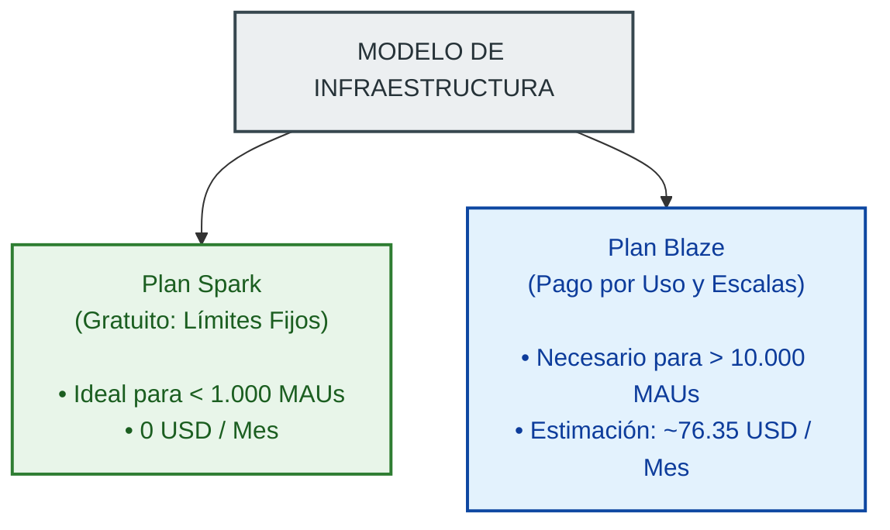
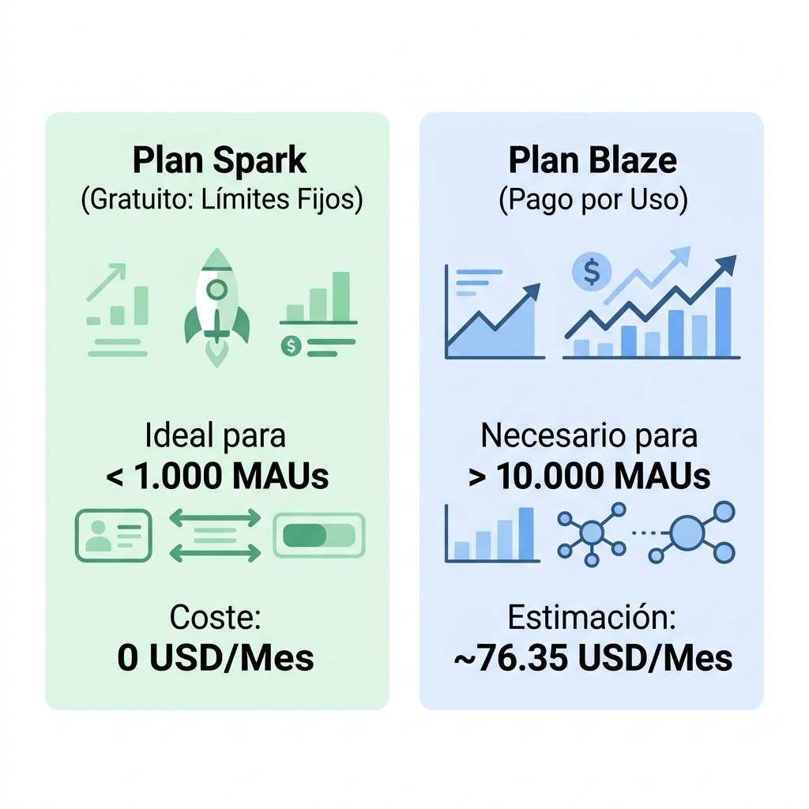

# CAPÍTULO 7: CONCLUSIÓN Y TRABAJO FUTURO

Este capítulo final sintetiza los resultados alcanzados a lo largo del desarrollo del proyecto **Streaks**. Se evalúa críticamente el cumplimiento de los objetivos académicos e industriales propuestos en la memoria, se aporta un modelo de costes cuantitativo y realista para la explotación comercial de la aplicación en producción utilizando la infraestructura en la nube de Firebase, y se proponen las futuras líneas de investigación y desarrollo destinadas a potenciar la retención de usuarios y la solidez técnica del sistema.

---

## 7.1. Evaluación del Cumplimiento de Objetivos

El propósito fundacional de **Streaks** consistió en concebir, diseñar e implementar una solución de software móvil capaz de unificar dos ámbitos habitualmente disjuntos de las aplicaciones de productividad: el control riguroso e individual de hábitos y la rendición de cuentas compartida en una comunidad social (social accountability). 

A continuación, se detalla el nivel de logro de los objetivos específicos marcados al inicio del proyecto:

1.  **Integración de Clean Architecture y Patrones de Diseño Modernos (Logrado)**:
    Se estructuró la aplicación en tres capas concéntricas (`lib/domain`, `lib/data` y `lib/presentation`), logrando una separación absoluta entre las reglas del negocio de los hábitos y los servicios en la nube de Firebase. Ello posibilitó alterar el frontend e inyectar repositorios de prueba (`MockRepositories`) de forma ágil y transparente.
2.  **Optimización Gestual de la Interfaz Gráfica (Logrado)**:
    Se sustituyeron los componentes tradicionales y estáticos por interacciones ergonómicas avanzadas, como el visor interactivo de imágenes a gran escala con doble toque reactivo para otorgar estrellas de motivación y los gestos táctiles integrados en la pantalla de perfil.
3.  **Gestión de Estados Reactivos en Tiempo Real (Logrado)**:
    Mediante la adopción de **Riverpod** y el uso estructurado de flujos asíncronos (`StreamProvider`), la aplicación sincroniza al instante las actividades de la comunidad sin necesidad de recargas manuales, optimizando a su vez la liberación de recursos de memoria con el modificador `.autoDispose`.
4.  **Consistencia de Datos ante Conectividad Inestable (Logrado)**:
    Se habilitó la persistencia persistente fuera de línea a través de la caché local de documentos de Firestore, permitiendo al usuario registrar hábitos y reaccionar a publicaciones en modo avión mediante un mecanismo de concurrencia optimista que posterga y encola las escrituras de red hasta recuperar el acceso a Internet.

---

## 7.2. Planificación Económica y Costes de Producción

Para garantizar la viabilidad comercial y el despliegue a gran escala de la plataforma, se ha desarrollado un modelo económico comparativo entre los planes de precios de Firebase: **Spark** (Plan Gratuito con cuotas fijas) y **Blaze** (Plan de Pago por Uso).

<!--  -->

### 7.2.1. Modelo Metódico de Tránsito por Usuario Activo
Se define el comportamiento de un **Usuario Activo Diario (DAU)** promedio bajo las siguientes métricas de interacción diarias:
*   **Lecturas en Base de Datos**: Carga de feed social (20 publicaciones en snapshots reactivos) y carga de perfil personal con 5 hábitos activos. Se asume un total de **48 lecturas de documentos al día**.
*   **Escrituras en Base de Datos**: Creación de 1 publicación diaria, actualización de estado de 5 hábitos y ejecución de 3 gestos de me gusta (estrellas). Total de **9 escrituras de documentos al día**.
*   **Almacenamiento de Imágenes**: Subida de 1 fotografía diaria de progreso al servidor en la nube (con compresión en cliente de ~200 KB). Total de **200 KB subidos al día**.
*   **Transferencia de Red (Egress)**: Descarga de 20 imágenes del feed social para visualización en el dispositivo. Total de **4 MB transferidos de red al día**.

### 7.2.2. Proyección Financiera según Escalas de Usuarios Activos
Tomando como base un ratio del **50% DAU / MAU** (usuarios diarios sobre usuarios mensuales activos), se realizan dos simulaciones presupuestarias a 30 días:

#### Escenario A: 1.000 Usuarios Activos Mensuales (500 DAU de media)
*   **Lecturas mensuales**: $500 \text{ DAUs} \times 48 \text{ lecturas/día} \times 30 \text{ días} = 720.000$ lecturas/mes (Promedio de 24.000 al día).
*   **Escrituras mensuales**: $500 \text{ DAUs} \times 9 \text{ escrituras/día} \times 30 \text{ días} = 135.000$ escrituras/mes (Promedio de 4.500 al día).
*   **Almacenamiento e imágenes subidas**: $500 \text{ posts/día} \times 200\text{ KB} \times 30\text{ días} = 3\text{ GB}$ acumulados al mes.
*   **Carga financiera**: **0 USD al mes**. Todas las métricas diarias se mantienen holgadamente por debajo de las cuotas del plan gratuito Spark (límites de 50.000 lecturas diarias, 20.000 escrituras y 5 GB de almacenamiento).

#### Escenario B: 10.000 Usuarios Activos Mensuales (5.000 DAU de media)
Al superar los límites gratuitos de Spark, el sistema se escala automáticamente al plan Blaze, facturándose bajo las siguientes tarifas:

| Concepto de Firebase | Volumen Mensual Estimado | Cuota Gratuita Spark Deducida | Volumen Facturable | Tarifa Blaze | Coste Estimado (USD) |
| :--- | :--- | :--- | :--- | :--- | :--- |
| **Firestore: Lecturas** | 7.200.000 docs | 1.500.000 docs (50k/día) | 5.700.000 docs | 0,06 $ por 100k | **3,42 $** |
| **Firestore: Escrituras**| 1.350.000 docs | 600.000 docs (20k/día) | 750.000 docs | 0,18 $ por 100k | **1,35 $** |
| **Storage: Almacenado** | 30 GB acumulados | 5 GB | 25 GB | 0,026 $ por GB | **0,65 $** |
| **Storage: Ancho Banda** | 600 GB descargados | 10 GB | 590 GB | 0,12 $ por GB | **70,80 $** |
| **Auth: Usuarios** | 10.000 cuentas | Ilimitado (Email/Pass) | 0 cuentas (Email) | Gratuito | **0,00 $** |
| **TOTAL ESTIMADO** | | | | | **76,22 $ / mes** |

Como se observa, el coste de alojamiento y base de datos es extraordinariamente bajo (~4,77 $), mientras que el mayor impacto presupuestario recae sobre la transferencia de red de descarga de imágenes en Firebase Storage (~70,80 $). Ello demuestra que la viabilidad comercial es plausible y exige implementar una caché local de imágenes pesadas en el cliente para mitigar el ancho de banda consumido.

### 7.2.3. Presupuesto de Desarrollo Inicial y Amortización
Para ofrecer un estudio económico real y del proyecto de implantación de software, se detalla a continuación el presupuesto necesario para el arranque de la plataforma, contemplando la amortización del hardware utilizado y las tasas obligatorias de publicación.

#### A. Amortización de Equipos y Recursos Físicos
Se calcula el desgaste de los recursos físicos adquiridos durante los 3 meses de desarrollo activo del proyecto basándose en su vida útil estándar:

**Tabla 3.3: Amortización de Hardware y Recursos Tecnológicos**

| Recurso | Valor Adquisición | Vida Útil Estimada | Meses de Uso | Cuota Mensual | Amortización Total |
| :--- | :---: | :---: | :---: | :---: | :---: |
| Ordenador Portátil de Desarrollo | 1.200,00 € | 4 años (48 meses) | 3 | 25,00 € | 75,00 € |
| Smartphone de Pruebas (iOS/Android) | 400,00 € | 3 años (36 meses) | 3 | 11,11 € | 33,33 € |
| Infraestructura de Red e Internet | 90,00 € | Contrato mensual (30€) | 3 | 30,00 € | 90,00 € |
| **TOTAL AMORTIZACIÓN** | | | | | **198,33 €** |

#### B. Licencias y Tasas de Publicación
Para desplegar la aplicación móvil en las tiendas oficiales y habilitar sus servicios:
*   **Google Play Console Developer Account**: Licencia de por vida de 25,00 USD (equivalente aproximado a **23,00 €**).
*   **Apple Developer Program License**: Licencia anual de 99,00 USD (equivalente aproximado a **92,00 €**).
*   **TOTAL LICENCIAS**: **115,00 €**.

#### C. Consolidación de Costes
El coste total para crear, validar y lanzar la aplicación móvil **Streaks** desde cero se resume en la siguiente tabla:

**Tabla 3.4: Presupuesto Económico Consolidado**

| Concepto de Gasto | Descripción Detallada | Coste Total |
| :--- | :--- | :---: |
| **Amortización de Recursos** | Desgaste físico del ordenador, dispositivo de test e Internet | 198,33 € |
| **Tasas de Plataforma** | Cuota de registro en tiendas de Apple y Google | 115,00 € |
| **Infraestructura Cloud (Mes 1)** | Estimación Firebase Blaze para 10.000 usuarios (ver Tabla 3.1) | 70,00 € |
| **COSTO TOTAL DEL PROYECTO** | **Presupuesto consolidado inicial** | **383,33 €** |

---

## 7.3. Trabajo Futuro y Líneas de Expansión

Tras la validación de la primera versión estable de **Streaks**, se definen tres líneas principales de desarrollo futuro para la evolución del producto:

### 7.3.1. Notificaciones Push Inteligentes y Contextuales
El factor determinante para consolidar hábitos a largo plazo es la constancia diaria. Se plantea integrar un sistema de notificaciones inteligentes basadas en Cloud Messaging (FCM) y analítica predictiva local en el dispositivo. 
En lugar de lanzar avisos genéricos a horas fijas, el algoritmo monitorizará el patrón histórico de registro del usuario. Si un usuario suele completar su hábito de lectura a las 20:00 y no lo ha hecho a las 21:30, la aplicación enviará una alerta contextualizada para advertir de la inminente pérdida de la racha (*streak*), aumentando la probabilidad de cumplimiento.

### 7.3.2. Retos Comunitarios e Hitos Gamificados
Para potenciar la motivación intrínseca y la socialización, se planea explicar dinámicas de gamificación colectiva:
*   **Retos Colectivos**: Posibilidad de crear salas temporales o semanales donde varios amigos se comprometan con un hábito compartido (ej. "Beber 2L de agua diarios durante 10 días").
*   **Tablas de Clasificación (Leaderboards)**: Puntuación de usuarios basada en la consistencia de sus rachas individuales, con asignación de insignias virtuales exclusivas visibles en su perfil público.

### 7.3.3. Soporte Offline Avanzado con SQLite/Drift
Aunque la caché de Firestore resuelve escenarios de desconexión transitoria de red, no permite realizar consultas y filtrados relacionales complejos sobre los datos persistidos en local (ya que Firestore carece de soporte nativo para agregados complejos en consultas offline). 
Se propone como evolución migrar el backend local a una persistencia híbrida. Toda acción de la UI se registrará primero en una base de datos local relacional rápida basada en **Drift** (SQLite reactivo para Flutter). Una cola de sincronización en segundo plano (*Background Sync Queue*) gestionará la reconciliación bidireccional de datos con Firebase Firestore al recuperar cobertura de red. Esto garantizará una resiliencia total y tiempos de respuesta inalterables en cualquier circunstancia.

---

## 7.4. Bibliografía y Webgrafía

A continuación se detallan las fuentes documentales, libros técnicos y recursos de la red consultados durante la investigación, diseño e implantación del proyecto **Streaks**:

### 7.4.1. Bibliografía y Libros Técnicos
1. **Clear, J. (2018).** *Atomic Habits: An Easy & Proven Way to Build Good Habits & Break Break Ones*. Penguin Publishing Group. (Estudio psicológico sobre la formación de hábitos empleado para modelar las mecánicas lúdicas de la aplicación).
2. **Martin, R. C. (2017).** *Clean Architecture: A Craftsman's Guide to Software Structure and Design*. Prentice Hall. (Texto de referencia utilizado para estructurar las capas independientes de la aplicación).
3. **Skeet, J. (2019).** *Writing Efficient and Maintainable Code*. Manning Publications. (Guía de buenas prácticas de programación).

### 7.4.2. Documentación Oficial y Webgrafía
1. **Flutter Dev Portal:** https://flutter.dev/docs (Guías de referencia de widgets, ciclo de vida, layouts y optimización del motor gráfico Impeller).
2. **Dart Language Guide:** https://dart.dev/guides (Documentación de sintaxis, flujos de control asíncronos mediante Streams y Futures, y tipado estático).
3. **Firebase Documentation:** https://firebase.google.com/docs (Manuales técnicos para la integración de Firebase Auth, bases de datos NoSQL con Cloud Firestore y almacenamiento de binarios con Firebase Storage).
4. **Riverpod Documentation:** https://riverpod.dev (Manual de referencia del framework de gestión de estado reactivo y de inyección de dependencias).
5. **SwiftUI and WidgetKit Documentation (Apple Developer Library):** https://developer.apple.com/documentation/widgetkit (Guía oficial para la implementación de widgets nativos, persistencia compartida con App Groups y actualización de timelines).
6. **HomeWidget Flutter Package Portal:** https://pub.dev/packages/home_widget (Documentación técnica sobre el canal nativo de comunicación entre Flutter y el sistema operativo iOS).
