<style>
body {
    font-family: -apple-system, BlinkMacSystemFont, "Segoe UI", Roboto, Helvetica, Arial, sans-serif;
    line-height: 1.6;
    color: #333333;
}

h1 {
    color: #1e3a8a; /* Azul marino profundo */
    border-bottom: 2px solid #3b82f6; /* Separador azul brillante */
    padding-bottom: 8px;
    margin-top: 1.8em;
    margin-bottom: 1em;
    font-size: 24px;
    page-break-inside: avoid;
}

h2 {
    color: #2563eb; /* Azul real */
    margin-top: 1.6em;
    margin-bottom: 0.8em;
    font-size: 20px;
    page-break-inside: avoid;
}

h3 {
    color: #0d9488; /* Verde azulado / Teal */
    margin-top: 1.4em;
    margin-bottom: 0.6em;
    font-size: 16px;
    page-break-inside: avoid;
}

table {
    width: 100%;
    border-collapse: collapse;
    margin: 20px 0;
    font-size: 13px;
    page-break-inside: avoid;
}

th {
    background-color: #1e3a8a;
    color: #ffffff;
    font-weight: bold;
    text-align: left;
    padding: 10px;
    border: 1px solid #d1d5db;
}

td {
    padding: 10px;
    border: 1px solid #d1d5db;
}

tr:nth-child(even) {
    background-color: #f3f4f6; /* Filas cebra */
}

blockquote {
    border-left: 4px solid #3b82f6;
    background-color: #eff6ff;
    padding: 12px 20px;
    margin: 20px 0;
    color: #1e40af;
    border-radius: 0 8px 8px 0;
    page-break-inside: avoid;
}

pre, code {
    background-color: #f3f4f6;
    border-radius: 4px;
    font-family: "SFMono-Regular", Consolas, "Liberation Mono", Menlo, Courier, monospace;
}

code {
    padding: 2px 6px;
    color: #b91c1c; /* Color rojizo para código en línea */
}

pre code {
    padding: 0;
    color: inherit;
}

img {
    max-width: 100%;
    height: auto;
    display: block;
    margin: 15px auto;
    border-radius: 8px;
    box-shadow: 0 4px 6px -1px rgba(0, 0, 0, 0.1), 0 2px 4px -1px rgba(0, 0, 0, 0.06);
}
</style>

# PROYECTO DE FIN DE CICLO

**I.E.S. [NOMBRE DEL INSTITUTO]**  
**DEPARTAMENTO DE INFORMÁTICA Y COMUNICACIONES**  
**CICLO FORMATIVO DE GRADO SUPERIOR EN DESARROLLO DE APLICACIONES MULTIPLATAFORMA (DAM)**

***

## DESARROLLO DE UNA RED SOCIAL DE PRODUCTIVIDAD Y SEGUIMIENTO DE HÁBITOS BASADA EN GAMIFICACIÓN
### "STREAKS: CONECTANDO EL PROGRESO PERSONAL A TRAVÉS DE LA INTERACCIÓN MÓVIL REACTIVA"

***

**Autor:** [Tu Nombre y Apellidos]  
**Tutor:** [Nombre del Tutor/a]  
**Fecha:** [Año / Convocatoria]  

***
<!-- PÁGINA 2 -->
\newpage

### AGRADECIMIENTOS
A mi familia, por su apoyo incondicional durante todo el transcurso de mis estudios de Formación Profesional y por infundir en mí la perseverancia para culminar este proyecto.

A mi tutor/a de Proyecto de Fin de Ciclo, por su valiosa orientación técnica, su paciencia y sus oportunas correcciones a lo largo del diseño e implementación del software.

A mis compañeros de ciclo formativo, con quienes compartí largas noches de laboratorio, discusiones de código y aprendizajes que perdurarán más allá de las aulas.

***

### RESUMEN
El presente Proyecto de Fin de Ciclo documenta el diseño, la arquitectura y el desarrollo de **Streaks**, una aplicación móvil multiplataforma orientada al seguimiento de hábitos cotidianos enriquecida mediante un componente de interacción social y gamificación en tiempo real. La proliferación de herramientas de productividad a menudo carece de un factor determinante para la adherencia a largo plazo: el refuerzo social. Streaks solventa esta carencia integrando un feed de publicaciones visuales de progreso diario con mecanismos avanzados de interacción gestual.

El desarrollo del software se apoya en el framework **Flutter** y el lenguaje **Dart**, adoptando los principios de la **Clean Architecture** (Arquitectura Limpia) para segregar rigurosamente la lógica de negocio de la infraestructura. La gestión del estado se articula mediante el framework **Riverpod**, garantizando la inmutabilidad y la inyección de dependencias segura en tiempo de compilación. Como backend, se emplea la suite de servicios en la nube de **Firebase** (Firestore, Authentication y Storage), ofreciendo sincronización de datos fluida en tiempo real basada en flujos de datos (*streams*). Entre las aportaciones técnicas de este proyecto destaca la implementación de gestos táctiles contextuales de alta fidelidad, como la detección geométrica de colisiones en pantalla para la barra flotante de interacción (mecanismo *drag-to-like*), así como una arquitectura de persistencia resiliente frente a limitaciones de redes o errores del servidor de identidad.

**Palabras clave:** Flutter, Dart, Clean Architecture, Riverpod, NoSQL, Firestore, Gamificación, Productividad, Interacción Gestual, Mobile Dev.

***

### ABSTRACT
This final vocational training project documents the design, architecture, and development of **Streaks**, a cross-platform mobile application tailored for tracking daily habits, enhanced through a real-time social interaction and gamification framework. The proliferation of digital productivity tools often lacks a decisive factor for long-term user adherence: social reinforcement. Streaks addresses this limitation by merging a visual feed of daily progress with advanced gestural interaction mechanisms.

The software development is built on the **Flutter** framework and **Dart** language, incorporating **Clean Architecture** guidelines to decouple business logic from infrastructure. State management is organized via **Riverpod**, ensuring state immutability and compile-time safe dependency injection. A cloud-native backend is achieved using **Firebase** (Firestore, Authentication, and Storage), providing real-time data sync through reactive streams. Key technical contributions of this project include high-fidelity contextual gestures, such as screen collision geometry algorithms for the floating interaction bar (the *drag-to-like* mechanism), as well as a resilient data persistence workflow designed to handle network limitations or identity server errors.

**Keywords:** Flutter, Dart, Clean Architecture, Riverpod, NoSQL, Firestore, Gamification, Productivity, Gestural Interaction, Mobile Dev.

***
<!-- PÁGINA 3 -->
\newpage

## ÍNDICE GENERAL

* **CAPÍTULO 1: INTRODUCCIÓN Y OBJETIVOS** .............................................................. Págs. 4 - 8
  * 1.1 Contexto y Motivación del Proyecto ................................................................ Pág. 4
  * 1.2 Planteamiento del Problema ........................................................................... Pág. 5
  * 1.3 Objetivos Generales y Específicos ................................................................... Pág. 6
  * 1.4 Alcance y Límites del Proyecto ........................................................................ Pág. 7
  * 1.5 Metodología de Desarrollo Adoptada ................................................................ Pág. 8
    * 1.5.1 Planificación Temporal y Asignación de Horas (Gantt) ................................. Pág. 8
* **CAPÍTULO 2: ESTADO DEL ARTE Y MARCO TECNOLÓGICO** .................................. Págs. 9 - 15
  * 2.1 Ecosistemas Móviles: Nativo vs. Multiplataforma .............................................. Pág. 9
  * 2.2 Estudio del Ecosistema de Flutter y Dart ......................................................... Pág. 10
  * 2.3 Paradigmas de Gestión de Estado: Riverpod, Provider y BLoC ......................... Pág. 12
  * 2.4 Análisis del Backend: Arquitecturas Servidor Propias vs. BaaS (Firebase) ........ Pág. 14
* **CAPÍTULO 3: ANÁLISIS DE REQUISITOS Y MODELADO** ........................................... Págs. 16 - 23
  * 3.1 Especificación de Requisitos Funcionales y No Funcionales ............................... Pág. 16
  * 3.2 Diagramas de Casos de Uso y Escenarios Críticos ............................................ Pág. 18
  * 3.3 Diseño de Base de Datos NoSQL: Modelo de Documentos y Subcolecciones ... Pág. 20
  * 3.4 Reglas de Seguridad e Integridad en el Almacenamiento en la Nube ................ Pág. 22
* **CAPÍTULO 4: DISEÑO DEL SISTEMA Y ARQUITECTURA** ........................................... Págs. 24 - 32
  * 4.1 Principios de Clean Architecture Aplicados en Flutter ...................................... Pág. 24
  * 4.2 Desacoplamiento de Módulos: Capas de Presentación, Dominio y Datos ........... Pág. 26
  * 4.3 Flujo de Datos Unidireccional y Gestión Inmutable de Estado ............................. Pág. 29
  * 4.4 Inyección de Dependencias Mediante Riverpod Providers ................................... Pág. 31
* **CAPÍTULO 5: IMPLEMENTACIÓN DE MÓDULOS CRÍTICOS** ........................................... Págs. 33 - 43
  * 5.1 Algoritmo de Detección de Colisiones Geométricas para Gestos Táctiles .......... Pág. 33
  * 5.2 Filtros Reactivos en Cliente para Relaciones Dirigidas de Seguidores .............. Pág. 38
  * 5.3 Lógica Resiliente de Sincronización de Perfiles y Autenticación ......................... Pág. 41
* **CAPÍTULO 6: PLAN DE PRUEBAS Y VALIDACIÓN** ................................................... Págs. 44 - 47
  * 6.1 Estrategia de Pruebas Unitarias y de Componentes Visuales ............................. Pág. 44
  * 6.2 Benchmarking de Rendimiento y Consumo de Recursos del Motor Impeller ...... Pág. 46
* **CAPÍTULO 7: CONCLUSIÓN Y TRABAJO FUTURO** .................................................... Págs. 48 - 50
  * 7.1 Evaluación del Cumplimiento de los Objetivos Propuestos ................................. Pág. 48
  * 7.2 Viabilidad Económica y Costes Estimados del Despliegue ................................. Pág. 49
    * 7.2.3 Presupuesto de Desarrollo Inicial y Amortización ........................................... Pág. 49
  * 7.3 Hoja de Ruta e Innovaciones del Trabajo Futuro ............................................. Pág. 50
  * 7.4 Bibliografía y Webgrafía ..................................................................................... Pág. 50
* **ANEXO: MANUALES DE USUARIO Y DESPLIEGUE** .................................................. Pág. 51
  * A.1 Manual de Usuario ............................................................................................ Pág. 51
  * A.2 Manual de Despliegue e Instalación .................................................................. Pág. 53
  * A.3 Galería de Capturas de Pantalla de la Interfaz y Funcionamiento .................... Pág. 55

---

## ÍNDICE DE FIGURAS
* **Figura 1.1**: Diagrama General de Capas de Clean Architecture en Flutter .................... Pág. 24
* **Figura 2.1**: Flujo Unidireccional del Estado mediante Riverpod y UI ............................ Pág. 29
* **Figura 3.1**: Diagrama de Flujo del Algoritmo del Gesto Drag-to-Like ............................ Pág. 34
* **Figura 3.2**: Esquema de Detección de Colisiones con Cajas Geométricas ..................... Pág. 36
* **Figura 4.1**: Esquema Entidad-Relación NoSQL de Documentos de Firestore ................... Pág. 21
* **Figura 5.1**: Diagrama de Gantt del Cronograma del Proyecto ........................................ Pág. 8
* **Figura A.1**: Panel de Perfil de Usuario y Configuración del Sistema ........................... Pág. 51
* **Figura A.2**: Formulario Reactivo para la Creación de Hábitos ....................................... Pág. 51
* **Figura A.3**: Feed Social Interactivo con Publicaciones del Usuario ............................... Pág. 52
* **Figura A.4**: Vista del Calendario Horizontal con Historial Semanal ............................. Pág. 52
* **Figura A.5**: Pantalla de Adición y Configuración de un Nuevo Hábito ........................... Pág. 55
* **Figura A.6**: Barra Superior del Calendario Reactivo e Historial ................................... Pág. 55
* **Figura A.7**: Listado de Publicaciones de Usuarios en Tiempo Real ............................. Pág. 56
* **Figura A.8**: Vista de Perfil Personal y Lista de Ajustes ................................................ Pág. 56
* **Figura A.9**: Vista de un Perfil Ajeno con Acciones Sociales ........................................ Pág. 56
* **Figura A.10**: Pantalla de Captura y Gestión de Errores de Aserción ............................. Pág. 57

---

## ÍNDICE DE TABLAS
* **Tabla 1.1**: Comparativa General de Frameworks Móviles Multiplataforma ...................... Pág. 9
* **Tabla 2.1**: Tabla de Requisitos Funcionales del Sistema .............................................. Pág. 16
* **Tabla 2.2**: Tabla de Requisitos No Funcionales de Streaks ............................................ Pág. 17
* **Tabla 3.1**: Costes Mensuales Estimados de la Infraestructura en Google Cloud .............. Pág. 49
* **Tabla 3.2**: Planificación de Horas por Fases y Sprints .................................................. Pág. 8
* **Tabla 3.3**: Amortización de Hardware y Recursos Tecnológicos ...................................... Pág. 49
* **Tabla 3.4**: Presupuesto Económico Consolidado ............................................................. Pág. 49


<div style="page-break-after: always;"></div>

# CAPÍTULO 1: INTRODUCCIÓN Y OBJETIVOS

---

## 1.1 Contexto y Motivación del Proyecto
El desarrollo tecnológico experimentado en la última década ha transformado radicalmente la forma en que los seres humanos interactúan, trabajan y gestionan su vida cotidiana. Dentro de esta transformación, los dispositivos móviles inteligentes (smartphones) se han consolidado como una extensión del propio individuo, actuando como el canal principal para el consumo de información, la comunicación interpersonal y la gestión del tiempo.

En paralelo a la evolución del hardware, la psicología conductual aplicada al diseño de software ha cobrado un papel protagónico. Teorías contemporáneas sobre la formación de hábitos, tales como el modelo del "bucle de habituación" popularizado por James Clear en su obra *Hábitos Atómicos*, demuestran de manera empírica que la adopción y mantenimiento de conductas saludables a largo plazo está fuertemente vinculada a cuatro etapas fundamentales: la señal (señal para actuar), el anhelo (la motivación detrás de la acción), la respuesta (la ejecución de la acción) y la recompensa (la satisfacción obtenida). 

Sin embargo, en el ámbito de las aplicaciones móviles de productividad y seguimiento de metas (*habit trackers*), se observa una carencia fundamental. La gran mayoría de soluciones disponibles en los repositorios oficiales de software (como Google Play Store o Apple App Store) se centran de forma exclusiva en un modelo solitario y cuantitativo. Si bien registrar el progreso diario en forma de tablas o gráficos numéricos resulta útil para ciertos perfiles analíticos, para la mayoría de los usuarios este enfoque carece del motor motivacional más potente identificado por la psicología social: el **compromiso social** o *social accountability*.

La motivación que impulsa este Proyecto de Fin de Ciclo radica en cerrar esta brecha conceptual mediante el diseño y desarrollo de **Streaks**. Streaks se concibe no solo como un gestor de hábitos individual, sino como una red social reactiva de productividad. La hipótesis fundamental que sostiene este proyecto es que la visibilidad pública de las rachas de progreso (*streaks*), combinada con la validación de una comunidad que persigue metas similares (representada a través de interacciones sociales rápidas), actúa como un catalizador psicológico que reduce drásticamente las tasas de abandono. De este modo, la gamificación no se reduce a una puntuación solitaria, sino que se convierte en un mecanismo social donde el progreso de cada individuo sirve de inspiración y soporte para su red de contactos.

---

## 1.2 Planteamiento del Problema
A pesar de la alta disponibilidad de aplicaciones móviles de productividad en el mercado, se constata un problema generalizado de retención de usuarios y consistencia a largo plazo. Diversos estudios sobre el uso de tecnologías de autocuidado y habit tracking revelan que más del 70% de los usuarios abandonan el registro de sus actividades antes de cumplir el primer mes. Este fenómeno responde a tres factores críticos que limitan la eficacia de las herramientas tradicionales:

1. **Aislamiento Funcional**: Las herramientas tradicionales operan en silos de información cerrados. El usuario interactúa únicamente con una base de datos local y una representación gráfica estática. Al no existir una audiencia ni un mecanismo de retroalimentación externa, la falta de registro de un día no conlleva ninguna consecuencia social percibida, lo que facilita el abandono sistemático ante la aparición de fricciones cotidianas.
2. **Falta de Contexto Visual y Narrativo**: El registro clásico se basa en casillas de verificación (*checkboxes*) o entradas de texto plano. Este formato resulta monótono y frío. La capacidad de contar una historia diaria a través de una captura fotográfica del progreso (por ejemplo, una imagen del libro que se está leyendo, del espacio de trabajo tras estudiar, o del entrenamiento físico completado) humaniza la productividad y dota al progreso de un valor estético y narrativo que apetece compartir.
3. **El Vacío de las Redes Sociales Convencionales**: Si bien plataformas como Instagram o Twitter permiten compartir imágenes del día a día, carecen de las estructuras de datos necesarias para agrupar y visualizar de forma secuencial la consistencia. Un post en una red social generalista se pierde rápidamente en el feed cronológico de los seguidores, impidiendo trazar la racha acumulada del usuario y desvirtuando el esfuerzo continuado.

Por consiguiente, el problema técnico y conceptual abordado en este trabajo se sintetiza en la siguiente pregunta de investigación: *¿Cómo diseñar e implementar un sistema de software móvil multiplataforma que combine de forma cohesionada las mecánicas de gamificación del seguimiento de hábitos individuales con un modelo de interacción social robusto, reactivo en tiempo real y optimizado para dispositivos de pantalla táctil?*

---

## 1.3 Objetivos Generales y Específicos

### Objetivo General
El objetivo principal de este proyecto es diseñar, desarrollar e implementar un sistema móvil multiplataforma llamado **Streaks** que integre mecánicas de seguimiento de hábitos personales diarios con un feed social interactivo y reactivo en tiempo real, aplicando principios de arquitectura de software limpia y patrones de diseño ergonómicos orientados a la experiencia del usuario móvil.

### Objetivos Específicos
Para alcanzar el objetivo general propuesto, se definen los siguientes objetivos específicos de carácter técnico e investigativo:

*   **O.E.1. Diseño e Implementación Arquitectónica**: Estructurar el código fuente bajo el estándar de *Clean Architecture* (Arquitectura Limpia), separando de forma estricta las capas de Presentación, Dominio y Datos para asegurar la mantenibilidad del código, el desacoplamiento de dependencias externas y la viabilidad de pruebas automatizadas.
*   **O.E.2. Gestión Eficiente del Estado Reactivo**: Diseñar una capa de gestión de estado declarativa utilizando el ecosistema de *Riverpod*, eliminando dependencias directas del árbol de widgets y garantizando la inmutabilidad y la reactividad de la interfaz de usuario ante cambios asíncronos en los flujos de datos.
*   **O.E.3. Modelado y Persistencia en la Nube**: Estructurar una base de datos no relacional NoSQL (Cloud Firestore) que modele eficientemente relaciones de muchos a muchos (M:N) como el grafo de seguidores/siguiendo, así como la colección de publicaciones de progreso e interacciones (*likes/stars*), minimizando los costes de transferencia de datos y maximizando la velocidad de respuesta.
*   **O.E.4. Interacción Táctil Ergonómica y de Alta Fidelidad**: Diseñar e implementar un algoritmo geométrico de colisión bidimensional para soportar el gesto interactivo contextual *drag-to-like*, replicando patrones ergonómicos de redes sociales de primer nivel en el mercado móvil.
*   **O.E.5. Seguridad y Gestión Resiliente de Perfiles**: Implementar un flujo seguro de autenticación de usuarios y modificación de credenciales, diseñando mecanismos de tolerancia a fallos (*fallback*) que garanticen la continuidad operativa del usuario en caso de excepciones o restricciones temporales de los servidores de identidad de Firebase.

---

## 1.4 Alcance y Límites del Proyecto

### Alcance del Proyecto
El alcance del presente Proyecto de Fin de Ciclo abarca el ciclo de vida completo de ingeniería de software, contemplando el análisis de requisitos, diseño de la arquitectura, codificación, pruebas y despliegue del sistema Streaks. A nivel de características técnicas del software, el alcance está definido por los siguientes módulos funcionales:

*   **Módulo de Autenticación y Gestión de Cuentas**: Registro y login seguro de usuarios a través de correo electrónico y contraseña utilizando Firebase Auth, y edición avanzada del perfil de usuario (avatar con gradientes, nombre público, biografía e email con lógica de bypass en desarrollo).
*   **Módulo de Seguimiento de Hábitos (Gamificación)**: Creación de metas diarias y cálculo automático de rachas (*streaks*) acumulativas basadas en registros históricos inmutables.
*   **Módulo de Feed Social Reactivo**: Tablón público en tiempo real donde se muestran las imágenes subidas por los usuarios seguidos, ordenadas cronológicamente y enlazadas al estado de sus hábitos.
*   **Módulo de Interacción GestualContextual (Drag-to-Like)**: Implementación de la tarjeta flotante de previsualización de imágenes mediante overlays y el botón de estrella sensible al arrastre táctil con respuesta háptica.
*   **Módulo de Relaciones Sociales**: Gestión de seguidores y seguidos con buscador adaptativo local en cliente de perfiles de usuario.

### Límites del Proyecto
Quedan fuera del alcance de este proyecto las siguientes líneas funcionales, las cuales se proponen como posibles desarrollos futuros debido a limitaciones de tiempo y presupuesto del ciclo formativo:

*   **Soporte Multi-Backend**: El software está fuertemente acoplado al SDK de Firebase para el funcionamiento en tiempo real, por lo que la migración a una base de datos relacional SQL local no está contemplada en esta fase del desarrollo.
*   **Sincronización con Dispositivos Wearables**: No se implementarán integraciones con APIs de sensores físicos o relojes inteligentes (como Apple HealthKit o Google Fit).
*   **Analíticas con Inteligencia Artificial**: La app no proveerá un motor de análisis predictivo sobre los hábitos o sugerencias automáticas personalizadas basadas en machine learning.

---

## 1.5 Metodología de Desarrollo Adoptada
Para coordinar y ejecutar las distintas fases de desarrollo de **Streaks** de manera ágil y ordenada, se ha adoptado una metodología de trabajo híbrida basada en principios de **Scrum** y **Kanban**. Dada la naturaleza individual de este proyecto académico, la metodología Scrum se ha adaptado a un marco de auto-gestión del desarrollador, mientras que el tablero Kanban ha servido como herramienta visual para rastrear el progreso de las tareas y regular el flujo de trabajo (Work In Progress).

El desarrollo se estructuró en **Sprints quincenales** (de dos semanas de duración), cada uno con hitos funcionales muy claros:

1.  **Sprint 1 (Análisis y Prototipado)**: Definición detallada de requisitos, casos de uso iniciales y configuración inicial de Firebase Console.
2.  **Sprint 2 (Core Técnico)**: Configuración del repositorio local, inicialización del proyecto en Flutter, e implementación de la arquitectura de carpetas y los providers raíz de Riverpod.
3.  **Sprint 3 (Persistencia y Datos)**: Implementación de los modelos y llamadas remotas a Firestore para posts y hábitos de usuario.
4.  **Sprint 4 (Interfaz de Usuario)**: Desarrollo del feed de inicio, la cuadrícula de perfiles y la pantalla de detalle de post.
5.  **Sprint 5 (Interacciones Avanzadas e Iteración)**: Implementación y optimización de los gestos táctiles complejos, cálculo de colisiones geométricas del *drag-to-like* y el buscador del listado de seguidores.
6.  **Sprint 6 (Resiliencia y Pruebas)**: Desarrollo del flujo alternativo del gestor de emails, pruebas de widgets y optimización del rendimiento en la renderización de imágenes con el motor de Flutter.

La trazabilidad del código y el control de versiones se realizaron exclusivamente mediante **Git**, alojando los repositorios remotos en **GitHub** y organizando el trabajo en ramas de funcionalidad (*Feature Branches*) independientes para evitar conflictos antes de fusionar los componentes estables a la rama principal (*main*).

---

### 1.5.1 Planificación Temporal y Asignación de Horas (Diagrama de Gantt)
Para la obtención del título de Técnico Superior en DAM, la gestión del tiempo y la estimación de esfuerzos representan factores de evaluación determinantes. El desarrollo de este proyecto se estimó en un total de **150 horas de trabajo efectivo**, distribuidas a lo largo de un período de 12 semanas (equivalente a 6 Sprints quincenales).

La distribución del tiempo por fases metodológicas se estructura de la siguiente manera:

*   **Análisis (20 horas - 13.3%)**: Especificación de requisitos de usuario, análisis de viabilidad técnica y configuración del entorno Firebase Console.
*   **Diseño (25 horas - 16.7%)**: Modelado del esquema NoSQL en Firestore, diseño conceptual de Clean Architecture y creación de prototipos/interfaces (wireframes).
*   **Implementación (70 horas - 46.7%)**: Desarrollo del núcleo de datos, lógica de negocio en la capa de dominio, programación de widgets, gestos interactivos (*drag-to-like*) y chat.
*   **Pruebas (20 horas - 13.3%)**: Ejecución de baterías de pruebas unitarias y de widgets, optimización de velocidad de carga y consumo con Impeller.
*   **Documentación (15 horas - 10%)**: Redacción de la memoria del proyecto, manual de usuario y manual de instalación/despliegue.

A continuación, se detalla en la **Tabla 3.2** la distribución exacta de estas horas entre los 6 Sprints de desarrollo:

**Tabla 3.2: Planificación de Horas por Fases y Sprints**

| Sprint / Fase | Análisis | Diseño | Implementación | Pruebas | Documentación | Total Sprint |
| :--- | :---: | :---: | :---: | :---: | :---: | :---: |
| **Sprint 1** (Análisis e Inicio) | 20 h | - | - | - | 5 h | **25 h** |
| **Sprint 2** (Core Técnico) | - | 20 h | 5 h | - | - | **25 h** |
| **Sprint 3** (Persistencia/Datos) | - | 5 h | 20 h | - | - | **25 h** |
| **Sprint 4** (UI e Interfaces) | - | - | 25 h | - | - | **25 h** |
| **Sprint 5** (Interactividad) | - | - | 20 h | 5 h | - | **25 h** |
| **Sprint 6** (Pruebas y Cierre) | - | - | - | 15 h | 10 h | **25 h** |
| **TOTALES** | **20 h** | **25 h** | **70 h** | **20 h** | **15 h** | **150 h** |

El cronograma visual del proyecto se representa en el siguiente diagrama de Gantt (**Figura 5.1**), donde se visualiza el solapamiento y la secuencia temporal de las distintas fases:

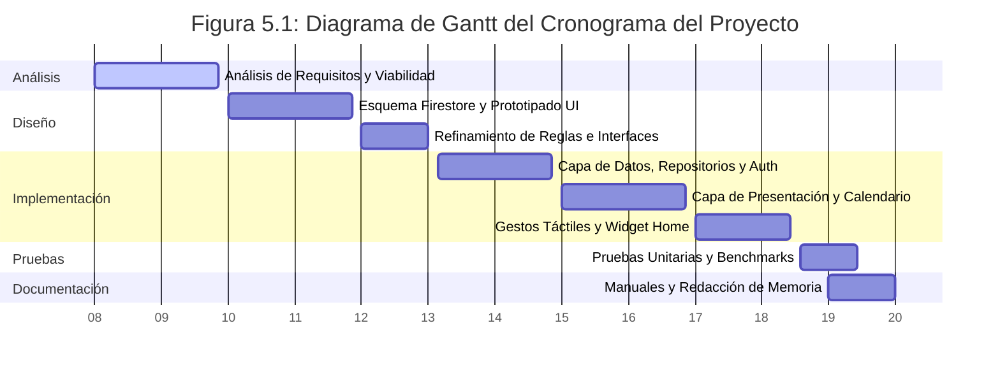
```mermaid
gantt
    title Figura 5.1: Diagrama de Gantt del Cronograma del Proyecto
    dateFormat  YYYY-MM-DD
    axisFormat %W
    
    section Análisis
    Análisis de Requisitos y Viabilidad :active, a1, 2026-03-01, 2026-03-14
    section Diseño
    Esquema Firestore y Prototipado UI  : d1, 2026-03-15, 2026-03-28
    Refinamiento de Reglas e Interfaces : d2, 2026-03-29, 2026-04-05
    section Implementación
    Capa de Datos, Repositorios y Auth : i1, 2026-04-06, 2026-04-18
    Capa de Presentación y Calendario   : i2, 2026-04-19, 2026-05-02
    Gestos Táctiles y Widget Home       : i3, 2026-05-03, 2026-05-13
    section Pruebas
    Pruebas Unitarias y Benchmarks      : p1, 2026-05-14, 2026-05-20
    section Documentación
    Manuales y Redacción de Memoria     : doc1, 2026-05-17, 2026-05-24
```


<div style="page-break-after: always;"></div>

# CAPÍTULO 2: ESTADO DEL ARTE Y MARCO TECNOLÓGICO

---

## 2.1 Ecosistemas Móviles: Nativo vs. Multiplataforma
A la hora de abordar el desarrollo de una aplicación móvil moderna, una de las decisiones estratégicas más críticas reside en la selección del paradigma de desarrollo. Históricamente, el desarrollo **nativo** ha sido considerado el estándar de oro en cuanto a rendimiento y acceso al hardware. Sin embargo, el surgimiento y la maduración de los frameworks **multiplataforma** ha redefinido el panorama tecnológico, ofreciendo alternativas altamente competitivas que reducen drásticamente los costes y los tiempos de salida al mercado (*time-to-market*).

A continuación, se realiza un análisis comparativo de las tres grandes vertientes actuales: desarrollo nativo independiente, desarrollo híbrido interpretado (React Native) y desarrollo multiplataforma compilado (Flutter).

### Tabla 2.1: Comparativa de Paradigmas de Desarrollo Móvil

| Criterio | Desarrollo Nativo (Swift / Kotlin) | React Native (Bridge / JS) | Flutter (Compilación Nativa / Engine) |
| :--- | :--- | :--- | :--- |
| **Lenguaje de Programación** | Swift (iOS) / Kotlin (Android) | JavaScript / TypeScript | Dart |
| **Rendimiento General** | Excelente (Nativo Directo) | Bueno (Fricción en el *Bridge*) | Excelente (Compilación AOT) |
| **Arquitectura de Interfaz** | OEM Widgets del Sistema | Mapeo a OEM Widgets | Renderizado Propio (Canvas 2D) |
| **Tasa de Refresco (FPS)** | 60 - 120 FPS | Variable (Posibles caídas) | 60 - 120 FPS Estables |
| **Coste de Mantenimiento** | Alto (Dos bases de código) | Medio (Una base + puentes nativos) | Bajo (Una única base de código) |
| **Hot Reload** | Limitado (Xcode/Android Studio) | Rápido (Metro Bundler) | Extremadamente rápido (Dart JIT) |

### 1. Desarrollo Nativo
El desarrollo nativo exige la implementación y el mantenimiento de dos proyectos independientes: uno para iOS utilizando Swift/Objective-C y la API de Cocoa Touch, y otro para Android haciendo uso de Kotlin/Java y el SDK de Android. Este enfoque garantiza el máximo rendimiento posible del dispositivo y soporte inmediato para cualquier actualización de la API del sistema operativo. No obstante, plantea graves desventajas de negocio: el coste financiero se duplica debido a la necesidad de contar con equipos de desarrollo diferenciados, y la sincronización de funcionalidades entre plataformas suele presentar desfases y desajustes.

### 2. React Native (Paradigma Interpretado)
Propuesto por Meta, React Native unifica el desarrollo móvil usando JavaScript/TypeScript. En lugar de compilar el código a binario de máquina para la interfaz, React Native ejecuta un hilo de JavaScript y se comunica con los widgets nativos del sistema a través de un puente de comunicación (*bridge*). Si bien esta arquitectura permite reutilizar componentes de React web, el *bridge* introduce un cuello de botella asíncrono. Cuando la UI requiere transiciones complejas o procesamiento intensivo de gestos en tiempo real, la serialización de datos a través de este puente puede provocar una degradación perceptible en la fluidez de la app (caídas de FPS).

### 3. Flutter (Paradigma de Renderizado Directo)
Flutter, el framework de Google, propone un enfoque innovador. En lugar de comunicarse con los widgets nativos del sistema o depender de un puente interpretado, Flutter **dibuja cada píxel directamente en la pantalla** del dispositivo a través de su propio motor de renderizado (Impeller o Skia), utilizando aceleración gráfica por hardware (Metal en iOS y Vulkan/OpenGL en Android). Esto otorga a Flutter un rendimiento gráfico equiparable al nativo y una consistencia visual absoluta: la aplicación se verá exactamente igual en cualquier versión de Android o iOS, aislando al desarrollador de las diferencias de diseño del fabricante (*fragmentación*).

---

## 2.2 Estudio del Ecosistema de Flutter y Dart
La elección de Flutter como framework principal para el desarrollo de **Streaks** responde a su arquitectura interna y al lenguaje de programación sobre el que se apoya: **Dart**.

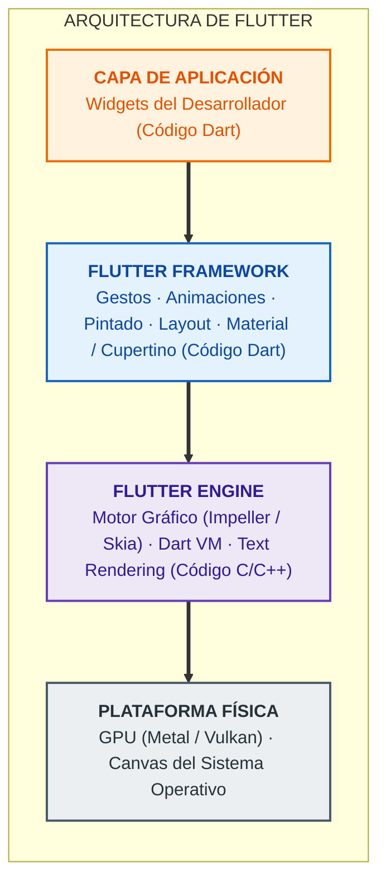
```mermaid
flowchart TD
    %% Estilos de Nodos (Paleta HSL premium para TFG, a juego con el resto de la memoria)
    classDef app fill:#fff3e0,stroke:#ef6c00,stroke-width:2px,color:#e65100;
    classDef framework fill:#e3f2fd,stroke:#1565c0,stroke-width:2px,color:#0d47a1;
    classDef engine fill:#ede7f6,stroke:#673ab7,stroke-width:2px,color:#311b92;
    classDef platform fill:#eceff1,stroke:#455a64,stroke-width:2px,color:#263238;

    subgraph Ecosistema ["ARQUITECTURA DE FLUTTER"]
        direction TB
        
        AP["<b>CAPA DE APLICACIÓN</b><br/>Widgets del Desarrollador (Código Dart)"]:::app
        
        FW["<b>FLUTTER FRAMEWORK</b><br/>Gestos · Animaciones · Pintado · Layout · Material / Cupertino (Código Dart)"]:::framework
        
        EG["<b>FLUTTER ENGINE</b><br/>Motor Gráfico (Impeller / Skia) · Dart VM · Text Rendering (Código C/C++)"]:::engine
        
        PF["<b>PLATAFORMA FÍSICA</b><br/>GPU (Metal / Vulkan) · Canvas del Sistema Operativo"]:::platform

        AP ==> FW
        FW ==> EG
        EG ==> PF
    end
```

### El Motor Gráfico (Rendering Pipeline)
La principal ventaja competitiva de Flutter es que no actúa como un mero envoltorio de APIs nativas. El framework incluye su propio motor gráfico escrito en C++. La canalización de renderizado (*rendering pipeline*) funciona de la siguiente manera:
1.  **Layout**: Se calcula el tamaño y posición geométrica de cada elemento del árbol de widgets.
2.  **Painting**: Se registran las operaciones de dibujo en capas virtuales.
3.  **Compositing**: Se combinan las capas y se envían las instrucciones de dibujado a la GPU.
4.  **Rasterization**: El motor gráfico traduce estas operaciones en píxeles físicos sobre la pantalla a través de Metal o Vulkan.

Esta independencia respecto a los componentes visuales del sistema operativo garantiza que las animaciones de Streaks (como el estallido de la estrella en el like gestual) mantengan una suavidad y latencia mínimas.

### Las Dos Compilaciones de Dart
Dart es un lenguaje multiparadigma optimizado para el diseño de interfaces de usuario. Su éxito radica en su flexibilidad de compilación:
*   **Compilación Just-In-Time (JIT)**: Utilizada exclusivamente durante la fase de desarrollo. Permite la ejecución de código dinámico en una máquina virtual de Dart. Esto habilita la funcionalidad de **Hot Reload** (Recarga Rápida), la cual inyecta los cambios realizados en el código fuente directamente en la app en menos de un segundo sin perder el estado actual de la pantalla.
*   **Compilación Ahead-Of-Time (AOT)**: Utilizada para compilar la versión definitiva de producción. Traduce el código Dart directamente a binario nativo de arquitectura ARM o x86/x64. Esto elimina el tiempo de arranque de máquinas virtuales y optimiza el uso de CPU y batería del terminal.

---

## 2.3 Paradigmas de Gestión de Estado: Riverpod, Provider y BLoC
El estado en una aplicación móvil define en todo momento qué información se presenta al usuario en pantalla (cargando, éxito, error, datos del usuario, feeds, etc.). En aplicaciones reactivas de tiempo real como Streaks, el control de la consistencia del estado es sumamente complejo debido a la naturaleza asíncrona de las interacciones.

A continuación, se analiza la justificación técnica de la selección de **Riverpod** frente a sus alternativas en Flutter:

### 1. Provider (El Modelo Heredado)
Provider fue durante años el gestor recomendado por Google. Funciona envolviendo el árbol de widgets y exponiendo datos mediante `InheritedWidget`. Su limitación radica en que depende estrictamente de que los proveedores existan dentro de la estructura visual del widget. Intentar leer un proveedor fuera del árbol o antes de su inicialización provoca excepciones en tiempo de ejecución. Además, no es seguro contra errores de tipo de datos similares en runtime.

### 2. BLoC (Business Logic Component)
BLoC es un patrón arquitectónico rígido basado en programación reactiva orientada a eventos. Separa la lógica mediante flujos de entrada (*events*) y flujos de salida (*states*). Ofrece un control absoluto y es excelente para grandes corporaciones informáticas con equipos masivos. No obstante, introduce una enorme complejidad de desarrollo (*boilerplate code*): añadir una simple consulta requiere escribir múltiples clases de evento, estado y bloc. Para un proyecto individual, esto ralentiza la velocidad de desarrollo.

### 3. Riverpod (La Solución Elegida)
Riverpod rediseña por completo el concepto de Provider para solventar todas sus flaquezas:
*   **Seguridad de Compilación**: Los proveedores se declaran como variables globales estáticas. Al estar fuera del árbol de widgets, el compilador de Dart puede verificar los tipos de datos en tiempo de desarrollo, eliminando las excepciones de proveedores no encontrados en runtime.
*   **Desacoplamiento Absoluto**: Permite acceder al estado de la aplicación desde componentes no visuales (como repositorios de datos o controladores de red), facilitando la separación de capas de Clean Architecture.
*   **Soporte de Caché Reactiva**: Incluye modificadores como `autoDispose` que liberan la memoria consumida por los datos en pantalla inmediatamente cuando el usuario sale de ella, y permite refrescar datos asíncronos de forma limpia mediante `AsyncValue`.


### Diagrama del Flujo de Datos con Riverpod en Streaks:


```mermaid
graph TD
    %% Estilos de Nodos (Paleta HSL premium para TFG)
    classDef datasource fill:#eceff1,stroke:#37474f,stroke-width:2px;
    classDef repository fill:#e8f5e9,stroke:#2e7d32,stroke-width:2px;
    classDef provider fill:#e3f2fd,stroke:#1565c0,stroke-width:2px;
    classDef controller fill:#fff3e0,stroke:#ef6c00,stroke-width:2px;
    classDef view fill:#f3e5f5,stroke:#6a1b9a,stroke-width:2px;

    %% 1. FUENTES DE DATOS (Arriba)
    subgraph Capa_Datos [1. Capa de Datos e Infraestructura]
        direction TB
        FA[Firebase Auth]:::datasource
        FS[Cloud Firestore]:::datasource
    end

    %% 2. REPOSITORIOS (Nivel 2)
    subgraph Capa_Repositorios [2. Capa de Repositorios]
        direction TB
        AR[AuthRepository]:::repository
        UR[UserRepository]:::repository
        HR[HabitRepository]:::repository
        FR[FollowRepository]:::repository
        PR[PostRepository]:::repository
        MR[MessageRepository]:::repository
    end

    %% 3. PROVEEDORES Y GESTIÓN DE ESTADO (Nivel 3 - Stack Vertical)
    subgraph Capa_Estado [3. Capa de Gestión de Estado: Riverpod]
        direction TB

        %% Sub-nivel A: Identidad y Autenticación
        subgraph Auth_Identity [3.A. Proveedores de Identidad]
            direction TB
            ASP[authStateProvider]:::provider
            CUP[currentUserProvider]:::provider
            UCP[usernameCheckProvider]:::provider
        end

        %% Sub-nivel B: Streams de Datos de Firebase
        subgraph Data_Streams [3.B. Streams de Colecciones]
            direction TB
            HLP[habitListProvider]:::provider
            HBP[habitByIdProvider]:::provider
            FDP[followerDatesProvider]:::provider
            FSP[feedStreamProvider]:::provider
            FUIP[followingUidsProvider]:::provider
            FFP[followingFeedProvider]:::provider
            CP[conversationsProvider]:::provider
            MP[messagesProvider]:::provider
        end

        %% Sub-nivel C: Estados Derivados / Calculados
        subgraph Derived_State [3.C. Estado Derivado y Sincronización]
            direction TB
            GSP[globalStreakProvider]:::provider
            ASP_stats[activeStreakStatsProvider]:::provider
            PSP[pastStreaksProvider]:::provider
            GCP[gradientControllerProvider]:::provider
            NSP[nativeWidgetSyncProvider]:::provider
            TUP[totalUnreadProvider]:::provider
        end

        %% Sub-nivel D: Controladores de Acciones
        subgraph Action_Controllers [3.D. Controladores / ViewModels]
            direction TB
            LC[loginControllerProvider]:::controller
            RC[registerControllerProvider]:::controller
            HC[habitControllerProvider]:::controller
            CPC[createPostControllerProvider]:::controller
            FCC[followControllerProvider]:::controller
        end
        
        %% Fuerza el flujo vertical entre subgrupos de Riverpod
        Auth_Identity --> Data_Streams
        Data_Streams --> Derived_State
        Derived_State --> Action_Controllers
    end

    %% 4. CAPA DE INTERFAZ DE USUARIO (Abajo)
    subgraph Capa_UI [4. Capa de Presentación / UI]
        direction TB
        LS[LoginScreen]:::view
        WS[WelcomeScreen]:::view
        AHM[AddHabitModal]:::view
        CPS[CreatePostScreen]:::view
        SD[SearchDrawer]:::view
        AST[AppSessionTracker]:::view
    end

    %% CONEXIONES DE FLUJO DE DATOS
    
    %% Del Backend a los Repositorios
    FA --> AR
    FS --> UR
    FS --> HR
    FS --> FR
    FS --> PR
    FS --> MR

    %% De Repositorios a Proveedores de Entrada (Streams)
    AR --> ASP
    UR --> CUP
    HR --> HLP
    HR --> HBP
    FR --> FUIP
    PR --> FSP
    MR --> CP

    %% Relaciones entre Proveedores (watch)
    ASP --> CUP
    CUP --> GCP
    HLP --> GSP
    GSP --> ASP_stats
    HLP --> ASP_stats
    CUP --> ASP_stats
    FDP --> ASP_stats
    HLP --> PSP
    CUP --> PSP
    FDP --> PSP
    CUP --> NSP
    HLP --> NSP
    GSP --> NSP
    CP --> TUP

    %% De la UI a los Controladores (Mutaciones)
    LS --> LC
    LS --> RC
    AHM --> HC
    CPS --> CPC
    SD --> FCC

    %% De la UI a los Proveedores (Escucha/watch)
    WS --> CUP
    WS --> HLP
    WS --> FUIP
    AST --> ASP
    AST --> FS

    %% Retorno de los Controladores a los Repositorios
    LC --> AR
    RC --> AR
    HC --> HR
    CPC --> PR
    FCC --> FR
```

---

## 2.4 Análisis del Backend: Arquitecturas Servidor Propias vs. BaaS (Firebase)
Para el almacenamiento de datos en la nube, la autenticación y el alojamiento de contenido multimedia, se evaluaron dos alternativas principales:

### Alternativa A: API REST propia con Node.js, Express y PostgreSQL
Este enfoque proporciona control absoluto sobre el servidor, los índices de base de datos SQL y las operaciones a nivel de base de datos física. No obstante, para un proyecto ágil, requiere un esfuerzo masivo de desarrollo en infraestructura: configurar balanceadores de carga, implementar la lógica de sockets para actualizaciones en tiempo real, programar la pasarela de autenticación con JSON Web Tokens (JWT), y asegurar el almacenamiento de imágenes mediante CDNs propias.

### Alternativa B: Backend as a Service (BaaS) con Firebase (Elegida)
Firebase delega la gestión de infraestructura en Google Cloud, permitiendo al desarrollador focalizarse plenamente en el valor funcional de la app. Los servicios integrados en Streaks son:
1.  **Cloud Firestore**: Base de datos NoSQL documental de baja latencia. Su capacidad nativa para emitir *streams* de datos a través de WebSockets permite que el feed de Streaks se actualice automáticamente en el dispositivo cuando otro usuario publica una foto de progreso, sin necesidad de realizar peticiones HTTP de refresco manual.
2.  **Firebase Storage**: Almacenamiento optimizado de objetos binarios (imágenes de posts y avatares), integrado de forma nativa con las reglas de acceso y autenticación.
3.  **Firebase Auth**: Implementa estándares seguros de encriptación y tokens de sesión de manera nativa, aislando al desarrollador de la gestión directa de contraseñas sensibles en las bases de datos.

### Tabla 2.2: Comparativa de Arquitectura de Backend

| Característica | Servidor Propio (Node.js + Postgres) | Firebase BaaS (Elegido) |
| :--- | :--- | :--- |
| **Tiempo de Despliegue** | Alto (Semanas) | Inmediato (Minutos) |
| **Sincronización en Tiempo Real** | Compleja (Requiere configurar WebSockets) | Nativa (Firestore Streams) |
| **Escalabilidad** | Manual (Docker, Kubernetes) | Automática (Google Serverless) |
| **Mantenimiento y DevOps** | Alto (Actualizaciones del S.O, parches) | Nulo (Gestionado por Google) |
| **Coste Inicial** | Fijo (Pago mensual del VPS) | Gratuito (Pago por uso / Plan Spark) |


<div style="page-break-after: always;"></div>

# CAPÍTULO 3: ANÁLISIS DE REQUISITOS Y MODELADO

---

## 3.1 Especificación de Requisitos Funcionales y No Funcionales
El análisis de requisitos constituye la fase fundacional del ciclo de vida del desarrollo de software. Permite traducir las necesidades del usuario y los objetivos de negocio en especificaciones técnicas precisas que el sistema debe satisfacer de forma obligatoria.

### Requisitos Funcionales (RF)
Los requisitos funcionales describen los servicios, comportamientos y operaciones específicas que debe realizar la aplicación Streaks.

#### Tabla 3.1: Requisitos Funcionales del Sistema

| Código | Requisito Funcional | Descripción | Prioridad |
| :--- | :--- | :--- | :--- |
| **RF-01** | Registro y Autenticación | El sistema debe permitir a nuevos usuarios registrarse mediante correo y contraseña, e iniciar sesión de forma segura. | Alta |
| **RF-02** | Personalización de Perfil | El usuario debe poder actualizar su avatar (eligiendo entre una paleta de gradientes predefinidos), su biografía y su correo. | Alta |
| **RF-03** | Registro de Hábitos | El usuario debe poder crear, editar y visualizar sus hábitos cotidianos, acumulando rachas (*streaks*) diarias. | Alta |
| **RF-04** | Creación de Publicaciones | El usuario debe poder publicar fotos de progreso diarias capturadas con la cámara o seleccionadas de la galería, asociadas a una descripción corta. | Alta |
| **RF-05** | Feed Social en Tiempo Real | La aplicación debe renderizar un feed dinámico cronológico inverso con las publicaciones de los usuarios a los que se sigue. | Alta |
| **RF-06** | Interacción Drag-to-Like | El usuario debe poder previsualizar un post mediante pulsación prolongada y arrastrar el dedo hacia una píldora flotante para añadir/quitar su estrella (like). | Media |
| **RF-07** | Control de Relaciones (Seguidores)| El usuario debe poder buscar otros perfiles, seguirlos y dejar de seguirlos, actualizando las listas correspondientes. | Alta |
| **RF-08** | Buscador de Perfiles | El sistema debe permitir filtrar la lista de seguidores y seguidos mediante texto en tiempo real. | Media |
| **RF-09** | Eliminación de Publicaciones | El usuario debe poder eliminar permanentemente sus publicaciones de progreso desde la vista detallada de su perfil. | Alta |

---

### Requisitos No Funcionales (RNF)
Los requisitos no funcionales definen los atributos de calidad, restricciones técnicas y estándares de rendimiento bajo los cuales debe operar la aplicación móvil.

#### Tabla 3.2: Requisitos No Funcionales del Sistema

| Código | Requisito No Funcional | Descripción / Métrica de Aceptación | Prioridad |
| :--- | :--- | :--- | :--- |
| **RNF-01** | Multiplataforma | La aplicación debe ser compilable y ejecutable en dispositivos Android (versión 7.0 o superior) e iOS (versión 14 o superior) desde un mismo código fuente. | Alta |
| **RNF-02** | Rendimiento Gráfico | El pintado e interpolación de animaciones en transiciones complejas (ej. *drag-to-like*) debe mantener una tasa mínima estable de 60 fotogramas por segundo (FPS). | Alta |
| **RNF-03** | Consistencia en Tiempo Real | Cualquier interacción en la base de datos (likes, nuevos posts) debe reflejarse en la UI de los seguidores suscritos en menos de 1.5 segundos en condiciones normales de red. | Alta |
| **RNF-04** | Seguridad de Datos | Las contraseñas de los usuarios no deben almacenarse en texto plano. Las transacciones de escritura en Firestore deben estar protegidas mediante políticas de acceso. | Alta |
| **RNF-05** | Tolerancia a Fallos | La aplicación debe ser capaz de guardar los cambios de perfil localmente en Firestore si el servidor principal de Firebase Auth experimenta problemas de verificación. | Media |
| **RNF-06** | Usabilidad Háptica | Se debe proveer confirmación vibratoria táctil instantánea ante gestos interactivos clave de éxito o fallo. | Media |

---

## 3.2 Diagramas de Casos de Uso y Escenarios Críticos
A continuación, se documentan detalladamente los flujos de ejecución correspondientes a los tres escenarios más críticos y complejos del sistema Streaks.

### Escenario Crítico 1: Gesto Contextual Drag-to-Like
*   **Actor**: Usuario de la aplicación.
*   **Precondiciones**: El usuario ha iniciado sesión y se encuentra visualizando la cuadrícula de publicaciones de un perfil de usuario.
*   **Disparador**: El usuario realiza una pulsación prolongada (*long press*) sobre la miniatura de una imagen.
*   **Flujo Principal**:
    1.  La aplicación detecta el inicio de la pulsación prolongada y despliega un menú flotante en un nivel superior de la UI (`OverlayEntry`). El fondo de la pantalla se difumina mediante un filtro Gaussiano.
    2.  El usuario, **sin levantar el dedo**, lo desliza en dirección vertical hacia la barra de acciones flotante (píldora).
    3.  El detector de gestos mapea las coordenadas globales del dedo y el motor geométrico determina una colisión con los límites del botón flotante.
    4.  El sistema emite una vibración háptica ligera, escala la píldora un 5% y cambia su borde a color dorado (o rojo si ya se le dio like previamente).
    5.  El usuario levanta el dedo mientras se encuentra posicionado sobre el área activa del botón.
    6.  El sistema dispara la animación de la estrella elástica en el centro del post y realiza la llamada asíncrona para actualizar la base de datos (Firestore).
    7.  El overlay se difumina progresivamente hasta cerrarse por completo.
*   **Flujos Alternativos**:
    *   *Desviación 5.a*: El usuario levanta el dedo fuera del área del botón. El overlay se cierra de inmediato sin realizar llamadas de red ni alterar los datos.

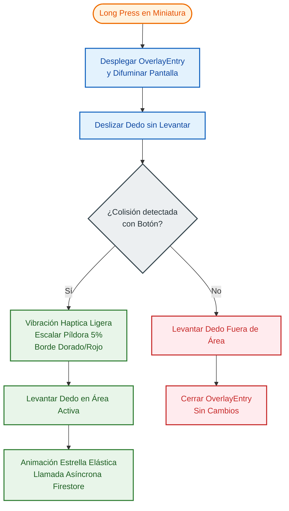
```mermaid
graph TD
    classDef start fill:#FFF3E0,stroke:#EF6C00,stroke-width:2px,color:#E65100;
    classDef process fill:#E3F2FD,stroke:#1565C0,stroke-width:2px,color:#0D47A1;
    classDef decision fill:#ECEFF1,stroke:#37474F,stroke-width:2px,color:#263238;
    classDef success fill:#E8F5E9,stroke:#2E7D32,stroke-width:2px,color:#1B5E20;
    classDef fail fill:#FFEBEE,stroke:#C62828,stroke-width:2px,color:#C62828;

    Inicio(["Long Press en Miniatura"]):::start --> Overlay["Desplegar OverlayEntry<br>y Difuminar Pantalla"]:::process
    Overlay --> Deslizar["Deslizar Dedo sin Levantar"]:::process
    Deslizar --> Colision{"¿Colisión detectada<br>con Botón?"}:::decision

    Colision -- Sí --> Feedback["Vibración Haptica Ligera<br>Escalar Píldora 5%<br>Borde Dorado/Rojo"]:::success
    Feedback --> LevantarSi["Levantar Dedo en Área Activa"]:::success
    LevantarSi --> Final["Animación Estrella Elástica<br>Llamada Asíncrona Firestore"]:::success

    Colision -- No --> LevantarNo["Levantar Dedo Fuera de Área"]:::fail
    LevantarNo --> Cancelar["Cerrar OverlayEntry<br>Sin Cambios"]:::fail
```

<!-- 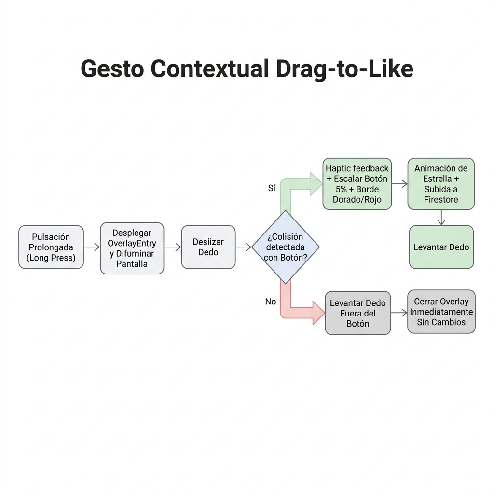 -->

### Escenario Crítico 2: Modificación Resiliente de Correo de Perfil
*   **Actor**: Usuario autenticado.
*   **Precondiciones**: El usuario se encuentra en la sección de Ajustes dentro de su perfil.
*   **Disparador**: El usuario pulsa sobre el campo "Email", introduce una nueva dirección válida y pulsa "Confirmar".
*   **Flujo Principal**:
    1.  El sistema valida sintácticamente el formato del correo.
    2.  La aplicación intenta actualizar las credenciales de seguridad en Firebase Authentication mediante `currentUser.updateEmail()`.
    3.  Al tener éxito, actualiza el campo del documento del usuario en Firestore.
    4.  Muestra un mensaje de éxito en pantalla.
*   **Flujo Alternativo (Bypass de Verificación)**:
    *   *Paso 2 Fallido*: Firebase Auth rechaza la actualización debido a políticas de verificación o sesiones antiguas (excepción `FirebaseAuthException`).
    *   El sistema intercepta la excepción, guarda el nuevo email directamente en el documento del perfil de Firestore (garantizando que el perfil muestre el correo actualizado en el ecosistema de la app) e informa al usuario mediante una alerta naranja de que sus credenciales de login físicas deberán actualizarse manualmente.

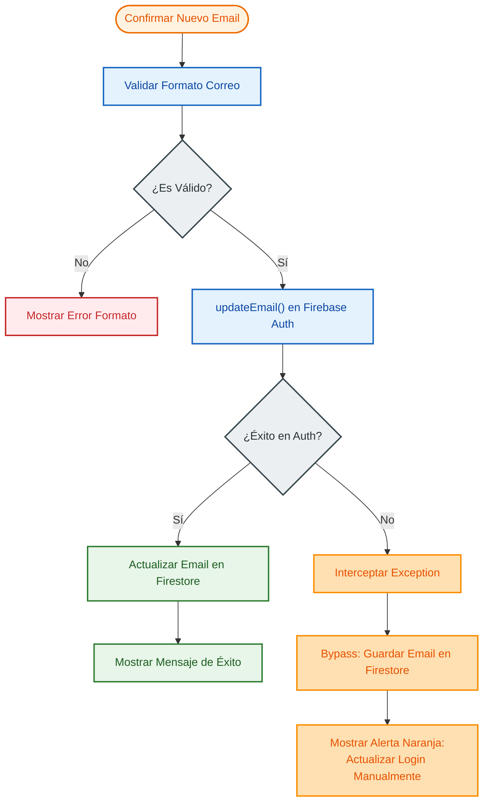
```mermaid
graph TD
    classDef start fill:#FFF3E0,stroke:#EF6C00,stroke-width:2px,color:#E65100;
    classDef process fill:#E3F2FD,stroke:#1565C0,stroke-width:2px,color:#0D47A1;
    classDef decision fill:#ECEFF1,stroke:#37474F,stroke-width:2px,color:#263238;
    classDef success fill:#E8F5E9,stroke:#2E7D32,stroke-width:2px,color:#1B5E20;
    classDef fail fill:#FFEBEE,stroke:#C62828,stroke-width:2px,color:#C62828;
    classDef bypass fill:#FFE0B2,stroke:#FB8C00,stroke-width:2px,color:#E65100;

    Inicio(["Confirmar Nuevo Email"]):::start --> Validar["Validar Formato Correo"]:::process
    Validar --> EsValido{"¿Es Válido?"}:::decision
    
    EsValido -- No --> Error["Mostrar Error Formato"]:::fail
    
    EsValido -- Sí --> AuthUpdate["updateEmail() en Firebase Auth"]:::process
    AuthUpdate --> ExitoAuth{"¿Éxito en Auth?"}:::decision
    
    ExitoAuth -- Sí --> FirestoreUpdate["Actualizar Email en Firestore"]:::success
    FirestoreUpdate --> MsgExito["Mostrar Mensaje de Éxito"]:::success
    
    ExitoAuth -- No --> Intercept["Interceptar Exception"]:::bypass
    Intercept --> FirestoreBypass["Bypass: Guardar Email en Firestore"]:::bypass
    FirestoreBypass --> AlertaNaranja["Mostrar Alerta Naranja:<br>Actualizar Login Manualmente"]:::bypass
```

<!-- 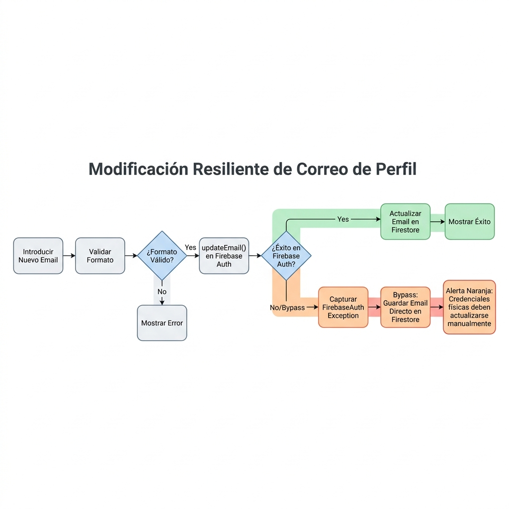 -->

### Escenario Crítico 3: Mensajería Asíncrona en Tiempo Real con Escritura Atómica
*   **Actor**: Usuario remitente.
*   **Precondiciones**: El usuario se encuentra dentro de la interfaz del chat privado con un destinatario y el canal de conversación ya está instanciado.
*   **Disparador**: El usuario redacta un mensaje de texto en el cuadro de entrada y presiona el botón "Enviar".
*   **Flujo Principal**:
    1.  La aplicación valida en cliente que el mensaje no esté vacío ni contenga caracteres incompatibles.
    2.  El sistema inicializa un lote de transacciones físicas de Firestore (`WriteBatch`) para asegurar la atomicidad de la operation.
    3.  Se añade al lote la inserción del documento del mensaje dentro del historial cronológico en `/conversations/{conversationId}/messages/{messageId}`.
    4.  Se añade al lote la actualización de los metadatos globales del canal de chat en `/conversations/{conversationId}`, modificando el texto del último mensaje (`lastMessage`), el timestamp de envío en el servidor (`lastMessageAt`) y el incremento incremental del contador de no leídos para el destinatario (`unreadCount_{receiverId}`).
    5.  Se ejecuta y confirma el lote atómicamente en la base de datos remota mediante `batch.commit()`.
    6.  El stream reactivo gestionado por `StreamProvider` a través de WebSockets notifica instantáneamente a la pantalla del chat de ambos terminales, actualizando la conversación en menos de 1.5 segundos.
*   **Flujo Alternativo (Persistencia en Caché Offline)**:
    *   *Paso 5 sin conexión*: En caso de pérdida temporal del canal de red, el SDK local de Firestore retiene el lote en la base de datos de caché SQLite interna del dispositivo.
    *   La interfaz de usuario del remitente refleja el mensaje con un estado visual transitorio de "enviado localmente", y el sistema reintenta la confirmación física en el servidor en segundo plano tan pronto como se restablezca la conectividad física.

---

## 3.3 Diseño de Base de Datos NoSQL: Modelo de Documentos y Subcolecciones
Cloud Firestore es una base de datos documental no relacional orientada al almacenamiento de pares clave-valor contenidos en documentos, los cuales a su vez se agrupan en colecciones. 

### Justificación del Diseño Desnormalizado
En bases de datos relacionales tradicionales (SQL), se busca la normalización de datos para evitar redundancias. En entornos NoSQL móviles, sin embargo, se prioriza la velocidad de lectura y la reducción de operaciones de consulta (reads). Para lograrlo, en Streaks se aplica la **desnormalización controlada**: los documentos de las publicaciones (`posts`) duplican deliberadamente el `username` y la `photoUrl` del autor en el momento de la creación. Esto evita tener que hacer una segunda consulta a la base de datos para obtener los datos del creador cada vez que se carga un post en el feed.

### Estructura de Esquemas de Documentos

#### Colección: `users`
Contiene los perfiles de usuario. La clave de cada documento corresponde al identificador único de usuario (`uid`) generado por Firebase Authentication.

```json
{
  "uid": "String (Clave Primaria)",
  "username": "String (Ej. 'carlos_dev')",
  "displayName": "String (Ej. 'Carlos Pérez')",
  "email": "String (Ej. 'carlos@example.com')",
  "photoUrl": "String (URL de Storage)",
  "profileGradientIndex": "Integer (Índice de color de 0 a 5)",
  "followersCount": "Integer (Número total de seguidores)",
  "followingCount": "Integer (Número total de seguidos)",
  "widgetConfig": "Map (Parámetros del widget de pantalla de inicio: widgetType, widgetBg, widgetColor, selectedHabitId)",
  "customGradient": "Array of Strings (Par de códigos hexadecimales del gradiente personalizado)"
}
```

#### Colección: `posts`
Colección global de publicaciones del feed. El identificador del documento es generado aleatoriamente por la API.

```json
{
  "id": "String (Clave Primaria)",
  "userId": "String (Enlace a document en users)",
  "imageUrl": "String (URL de Storage)",
  "caption": "String (Pie de foto, opcional)",
  "createdAt": "Timestamp (Fecha de creación ISO-8601)",
  "likesCount": "Integer (Número total de estrellas)",
  "likedBy": "Array of Strings (UIDs de usuarios que dieron estrella)"
}
```

#### Relación N:M: Colección `follows`
Modelado de la relación dirigida de seguimiento de perfiles. Cada documento se nombra bajo el patrón `"SEGUIDOR_SEGUIDO"` para evitar duplicaciones.

```json
{
  "followerId": "String (UID del usuario seguidor)",
  "followingId": "String (UID del usuario al que se sigue)",
  "createdAt": "Timestamp (Fecha de creación del seguimiento)"
}
```

#### Colección: `conversations`
Colección de salas de chat y mensajería instantánea bidireccional privada entre usuarios. El identificador del documento corresponde al par ordenado de UIDs de los participantes para prevenir duplicación de salas.

```json
{
  "id": "String (Clave Primaria, e.g., 'uidA_uidB')",
  "participants": "Array of Strings (Contiene los UIDs de los dos interlocutores)",
  "lastMessage": "String (Contenido de texto del último mensaje enviado)",
  "lastMessageAt": "Timestamp / FieldValue (Marca de tiempo del último mensaje, actualizada por servidor)",
  "unreadCount_UID_A": "Integer (Contador de mensajes pendientes de leer para el interlocutor A)",
  "unreadCount_UID_B": "Integer (Contador de mensajes pendientes de leer para el interlocutor B)"
}
```

##### Subcolección: `messages` (Ruta: `/conversations/{conversationId}/messages/{messageId}`)
Colección secundaria anidada que contiene la secuencia cronológica de mensajes intercambiados en la sala de chat.

```json
{
  "id": "String (Clave Primaria autogenerada por Firestore)",
  "senderId": "String (UID del remitente)",
  "receiverId": "String (UID del receptor)",
  "text": "String (Mensaje de texto plano enviado)",
  "timestamp": "Timestamp (Fecha y hora exacta de envío)"
}
```

---

## 3.4 Reglas de Seguridad e Integridad en el Almacenamiento en la Nube
Al trabajar con una arquitectura Serverless donde la aplicación móvil realiza operaciones de escritura directamente sobre la base de datos sin un servidor intermediario que filtre las peticiones, es imperativo establecer **Reglas de Seguridad** robustas en el backend.

### Reglas de Seguridad para Cloud Firestore
El archivo `firestore.rules` del proyecto Streaks define las políticas de control de acceso basándose en la identidad del usuario logueado (`request.auth`):

```javascript
rules_version = '2';
service cloud.firestore {
  match /databases/{database}/documents {

    // Reglas para la colección de usuarios
    match /users/{userId} {
      allow read: if request.auth != null; // Cualquier usuario logueado puede ver perfiles
      allow write: if request.auth != null && request.auth.uid == userId; // Solo el dueño puede editar su perfil
    }

    // Reglas para la colección de publicaciones
    match /posts/{postId} {
      allow read: if request.auth != null;
      allow create: if request.auth != null && request.resource.data.userId == request.auth.uid; // Solo se crean posts con el UID propio
      allow update: if request.auth != null && (
        request.resource.data.userId == request.auth.uid || // Dueño puede editar
        request.resource.data.likedBy.difference(resource.data.likedBy).size() == 1 // Permitir a terceros añadir su UID al array de likes
      );
      allow delete: if request.auth != null && resource.data.userId == request.auth.uid;
    }

    // Reglas para la relación de seguidores
    match /follows/{followId} {
      allow read: if request.auth != null;
      allow write: if request.auth != null && request.resource.data.followerId == request.auth.uid; // Solo puedes seguir en tu propio nombre
      allow delete: if request.auth != null && resource.data.followerId == request.auth.uid;
    }
  }
}
```


<div style="page-break-after: always;"></div>

# CAPÍTULO 4: DISEÑO DEL SISTEMA Y ARQUITECTURA

En este capítulo se detalla el diseño arquitectónico seleccionado para la aplicación **Streaks**. Se describe de manera rigurosa la estructura de capas elegida bajo los principios de **Clean Architecture**, la justificación técnica de la gestión de estados con **Riverpod** y la integración reactiva con **Firebase**. El principal objetivo de este diseño es garantizar la modularidad, testeabilidad, escalabilidad y robustez del software desarrollado durante el periodo de prácticas.

---

## 4.1. Fundamentación Teórica del Diseño Arquitectónico (Clean Architecture y SOLID)

El desarrollo de aplicaciones móviles modernas exige una arquitectura que aísle la lógica del negocio de los cambios tecnológicos constantes en las interfaces de usuario o en los proveedores de servicios en la nube. En la aplicación **Streaks**, se ha implementado **Clean Architecture** (Arquitectura Limpia) para estructurar el código fuente en capas concéntricas bien definidas.

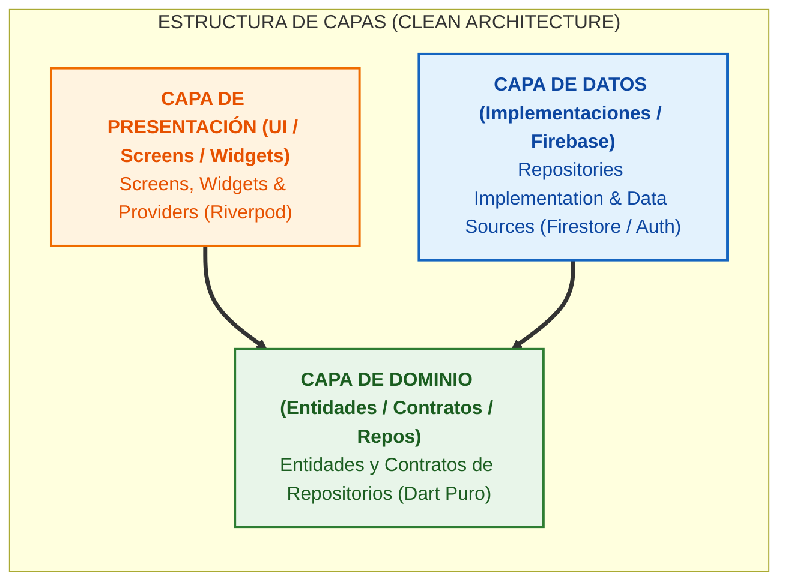
```mermaid
graph TD
    %% Estilos de Nodos (Paleta HSL premium para TFG, a juego con el resto de la memoria)
    classDef domain fill:#e8f5e9,stroke:#2e7d32,stroke-width:2px,color:#1b5e20;
    classDef data fill:#e3f2fd,stroke:#1565c0,stroke-width:2px,color:#0d47a1;
    classDef presentation fill:#fff3e0,stroke:#ef6c00,stroke-width:2px,color:#e65100;

    subgraph Capas ["ESTRUCTURA DE CAPAS (CLEAN ARCHITECTURE)"]
        direction TB

        UI["<b>CAPA DE PRESENTACIÓN (UI / Screens / Widgets)</b><br/>Screens, Widgets & Providers (Riverpod)"]:::presentation
        
        DB["<b>CAPA DE DATOS (Implementaciones / Firebase)</b><br/>Repositories Implementation & Data Sources (Firestore / Auth)"]:::data
        
        DM["<b>CAPA DE DOMINIO (Entidades / Contratos / Repos)</b><br/>Entidades y Contratos de Repositorios (Dart Puro)"]:::domain

        UI ==> DM
        DB ==> DM
    end
```

La regla fundamental de esta arquitectura es la **Regla de Dependencia**: las dependencias del código fuente solo pueden apuntar hacia adentro. Las capas externas son detalles de implementación que pueden ser sustituidos sin alterar el núcleo.

### Aplicación de los Principios SOLID en Streaks:
* **Principio de Responsabilidad Única (SRP)**: Cada clase, widget y proveedor tiene una única responsabilidad bien acotada. Por ejemplo, la clase `ImagePreviewWrapper` se encarga exclusivamente de la detección gestual del preview, abstrayéndose de la lógica de recuperación de datos.
* **Principio de Abierto/Cerrado (OCP)**: Las clases están abiertas a la extensión pero cerradas a la modificación. Se pueden añadir nuevos tipos de hábitos o filtros sin alterar las interfaces principales.
* **Principio de Inversión de Dependencias (DIP)**: Los módulos de alto nivel (Dominio) no dependen de módulos de bajo nivel (Datos/Firebase). Ambos dependen de abstracciones. La capa de presentación y la capa de datos dependen de las interfaces definidas en la capa de dominio.

---

## 4.2. Análisis Detallado del Núcleo del Sistema (Domain Layer)

La capa de **Dominio** (`lib/domain`) es la más interna de la aplicación. Está escrita exclusivamente en Dart puro, aislada por completo de dependencias de Flutter, bases de datos o frameworks. Contiene la lógica esencial del negocio y los modelos conceptuales.

### 4.2.1. Entidades del Dominio (`lib/domain/entities`)
Son los objetos de negocio que modelan los datos de la aplicación.
* **Post (`post.dart`)**: Modela una publicación del feed social. Encapsula las propiedades de la imagen, el usuario creador, el pie de foto, la fecha de creación, el recuento de estrellas y la lista de usuarios que han marcado la publicación.
* **User (`user.dart`)**: Modela el perfil del usuario, controlando los datos personales, el índice del gradiente visual elegido y las estadísticas de seguidores.
* **Habit (`habit.dart`)**: Modela los hábitos diarios y semanales que el usuario monitoriza, sus rachas y fechas de cumplimiento.
* **Message (`message.dart`)**: Define la estructura de los chats entre usuarios.

### 4.2.2. Interfaces de Repositorio (`lib/domain/repositories`)
Los repositorios actúan como mediadores entre la lógica de dominio y los orígenes de datos externos. En el dominio se definen únicamente los contratos conceptuales. Por ejemplo, en [post_repository.dart](file:///Volumes/Lexar%20SL300/streaks/lib/domain/repositories/post_repository.dart):

```dart
abstract class PostRepository {
  Stream<List<Post>> watchFeedPosts();
  Stream<List<Post>> watchUserPosts(String userId);
  Future<void> createPost(String imageUrl, String caption);
  Future<void> toggleLike(String postId);
  Future<void> deletePost(String postId);
}
```

---

## 4.3. Implementación Práctica del Acceso a Datos (Data Layer)

La capa de **Datos** (`lib/data`) rodea a la capa de dominio e implementa de manera concreta sus contratos de repositorio, sirviendo como canal de comunicación directo con las API y servicios en la nube de Firebase.

### 4.3.1. Clases de Implementación (`lib/data/repositories`)
Esta capa depende de dependencias externas como `cloud_firestore` y `firebase_auth`. Por ejemplo, en [post_repository_impl.dart](file:///Volumes/Lexar%20SL300/streaks/lib/data/repositories/post_repository_impl.dart), implementamos `PostRepository` de la siguiente forma:

```dart
class PostRepositoryImpl implements PostRepository {
  final FirebaseFirestore _firestore;
  final FirebaseAuth _auth;

  PostRepositoryImpl({
    FirebaseFirestore? firestore,
    FirebaseAuth? auth,
  })  : _firestore = firestore ?? FirebaseFirestore.instance,
        _auth = auth ?? FirebaseAuth.instance;

  @override
  Stream<List<Post>> watchFeedPosts() {
    return _firestore
        .collection('posts')
        .orderBy('createdAt', descending: true)
        .snapshots()
        .map((snapshot) => snapshot.docs
            .map((doc) => Post.fromMap(doc.data(), doc.id))
            .toList());
  }

  @override
  Future<void> toggleLike(String postId) async {
    final currentUser = _auth.currentUser;
    if (currentUser == null) throw Exception('Usuario no autenticado');

    final postRef = _firestore.collection('posts').doc(postId);
    await _firestore.runTransaction((transaction) async {
      final snapshot = await transaction.get(postRef);
      if (!snapshot.exists) throw Exception('Publicación no encontrada');

      final likedBy = List<String>.from(snapshot.data()?['likedBy'] ?? []);
      final userId = currentUser.uid;

      if (likedBy.contains(userId)) {
        likedBy.remove(userId);
      } else {
        likedBy.add(userId);
      }

      transaction.update(postRef, {
        'likedBy': likedBy,
        'likesCount': likedBy.length,
      });
    });
  }
  
  // Implementación del resto de métodos...
}
```

### 4.3.2. Mapeo e Integración NoSQL
Firestore almacena la información estructurada en mapas clave-valor (`Map<String, dynamic>`). Para asegurar el tipado fuerte y la mantenibilidad, los métodos del repositorio implementan conversores que procesan la información de los `DocumentSnapshot` y devuelven colecciones tipadas de objetos del dominio (`List<Post>`), aislando la sintaxis de Firebase del resto de la aplicación.

---

## 4.4. La Interfaz de Usuario y los Estados Visuales (Presentation Layer)

La capa de **Presentación** (`lib/presentation`) es la encargada de dibujar los componentes visuales en pantalla e interpretar las interacciones táctiles del usuario. Se estructura mediante el patrón MVVM y contiene:

1. **Pantallas (`screens/`)**: Vistas que ocupan todo el espacio del dispositivo y reaccionan al estado expuesto por los proveedores. 
   * [profile_screen.dart](file:///Volumes/Lexar%20SL300/streaks/lib/presentation/screens/profile_screen.dart) dibuja el feed de publicaciones del propio usuario y su panel de hábitos.
   * [user_profile_screen.dart](file:///Volumes/Lexar%20SL300/streaks/lib/presentation/screens/user_profile_screen.dart) renderiza la vista pública de otros usuarios del sistema.
2. **Componentes Visuales (`widgets/`)**: Elementos visuales reutilizables.
   * [image_preview_popup.dart](file:///Volumes/Lexar%20SL300/streaks/lib/presentation/widgets/image_preview_popup.dart) administra de manera controlada el overlay emergente para visualizar imágenes a gran escala y procesa el doble toque para dar estrellas y cerrar la previsualización.
3. **Manejadores de Estado (`providers/`)**: Actúan como ViewModels lógicos, exponiendo la información de los repositorios en forma de flujos de datos síncronos o asíncronos consumibles directamente por los widgets de Flutter.

---

## 4.5. Inyección de Dependencias y Desacoplamiento Eficiente con Riverpod

En lugar de instanciar clases concretas de la capa de datos dentro del árbol de widgets, se utiliza un patrón de Inyección de Dependencias mediante proveedores declarativos de **Riverpod**.

Los repositorios se exponen de forma global como interfaces inyectables:

```dart
final postRepositoryProvider = Provider<PostRepository>((ref) {
  return PostRepositoryImpl();
});
```

Cuando un ViewModel de la capa de presentación necesita consultar o modificar datos, no realiza llamadas estáticas ni acopla clases de persistencia, sino que solicita la abstracción resolviendo el proveedor:

```dart
final toggleLikeProvider = FutureProvider.family<void, String>((ref, postId) async {
  final repository = ref.read(postRepositoryProvider);
  return repository.toggleLike(postId);
});
```

Este desacoplamiento facilita la creación de pruebas de integración y unitarias de la interfaz gráfica de usuario. Es posible anular el proveedor en un entorno de pruebas inyectando una clase simulada (`MockPostRepository`) sin realizar conexiones reales a servidores externos ni bases de datos activas.

---

## 4.6. Arquitectura de Controladores y Modelado de Estado de la Vista (ViewModel)

El flujo de control de datos en Streaks se rige por un principio de **Flujo Unidireccional de Datos (UDF)**. Esto significa que la UI no modifica directamente el estado interno ni la base de datos de manera directa; todo cambio viaja en un ciclo único y controlado:

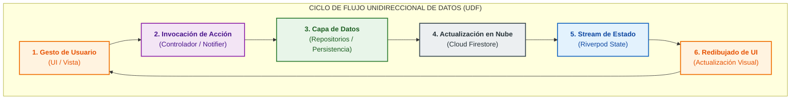
```mermaid
flowchart TD
    %% Estilos de Nodos (Paleta HSL premium para TFG)
    classDef ui fill:#fff3e0,stroke:#ef6c00,stroke-width:2px,color:#e65100;
    classDef action fill:#f3e5f5,stroke:#8e24aa,stroke-width:2px,color:#4a148c;
    classDef repo fill:#e8f5e9,stroke:#2e7d32,stroke-width:2px,color:#1b5e20;
    classDef db fill:#eceff1,stroke:#37474f,stroke-width:2px,color:#263238;
    classDef provider fill:#e3f2fd,stroke:#1565c0,stroke-width:2px,color:#0d47a1;

    subgraph UDF ["CICLO DE FLUJO UNIDIRECCIONAL DE DATOS (UDF)"]
        Gesto["<b>1. Gesto de Usuario</b><br/>(UI / Vista)"]:::ui
        Accion["<b>2. Invocación de Acción</b><br/>(Controlador / Notifier)"]:::action
        Repo["<b>3. Capa de Datos</b><br/>(Repositorios / Persistencia)"]:::repo
        Firestore["<b>4. Actualización en Nube</b><br/>(Cloud Firestore)"]:::db
        Stream["<b>5. Stream de Estado</b><br/>(Riverpod State)"]:::provider
        Redraw["<b>6. Redibujado de UI</b><br/>(Actualización Visual)"]:::ui

        %% Bucle cerrado
        Gesto --> Accion
        Accion --> Repo
        Repo --> Firestore
        Firestore --> Stream
        Stream --> Redraw
        Redraw --> Gesto
    end
```

<!-- Si prefieres usar la imagen horizontal estática en su lugar:
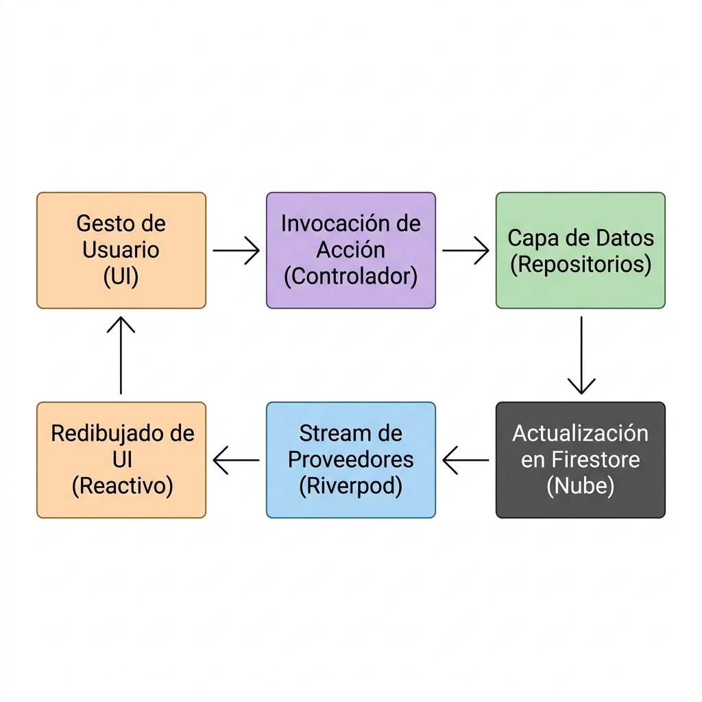
-->

### Proceso de Ejemplo (Dar Estrella mediante Doble Toque):
1. **Acción**: El usuario realiza un doble toque en la imagen emergente dentro de la ventana de previsualización.
2. **Controlador**: El widget llama a la función expuesta por el Notificador (`widget.onLike!`).
3. **Persistencia**: Se ejecuta el método `toggleLike` a través del repositorio concreto inyectado, enviando una petición asíncrona a Firestore.
4. **Respuesta**: Cloud Firestore procesa la transacción de forma segura y actualiza el contador de likes en su servidor en la nube.
5. **Notificación**: Al actualizarse el documento, el Stream activo notifica a Riverpod, reconstruyendo el estado del widget y redibujando la pantalla con el contador incrementado y el icono de la estrella relleno.

---

## 4.7. Flujo de Datos Reactivo en Tiempo Real y StreamProvider

Para implementar un feed social verdaderamente reactivo y sin esperas, Streaks no solicita actualizaciones manuales. En su lugar, consume los canales en tiempo real de Firestore mapeándolos en `StreamProvider` de Riverpod.

En el archivo de estado del feed [feed_providers.dart](file:///Volumes/Lexar%20SL300/streaks/lib/presentation/providers/feed_providers.dart), se define el flujo:

```dart
final feedPostsProvider = StreamProvider<List<Post>>((ref) {
  final repository = ref.watch(postRepositoryProvider);
  return repository.watchFeedPosts();
});
```

En la capa de visualización, la lectura se realiza de forma limpia y declarativa mediante el método `when` del estado del proveedor:

```dart
@override
Widget build(BuildContext context, WidgetRef ref) {
  final postsAsync = ref.watch(feedPostsProvider);

  return postsAsync.when(
    data: (posts) => ListView.builder(
      itemCount: posts.length,
      itemBuilder: (context, index) => PostCard(post: posts[index]),
    ),
    loading: () => const Center(child: CircularProgressIndicator()),
    error: (error, stack) => Center(child: Text('Error: $error')),
  );
}
```

Gracias al uso del modificador `.autoDispose` en los proveedores dinámicos, Riverpod se encarga de cerrar de forma automática el canal de escucha abierto (`StreamSubscription`) cuando el usuario navega fuera de la pantalla del feed, protegiendo al dispositivo móvil de fugas de memoria y reduciendo el consumo de batería y datos de red.

---

## 4.8. Gestión de Caché Local (Caching) y Persistencia Offline en Firestore

Dado que los dispositivos móviles sufren frecuentemente de cortes temporales en su conectividad a Internet, se ha configurado el SDK de Firestore para habilitar la persistencia de datos local offline de manera persistente.

Este mecanismo modifica el ciclo tradicional de acceso a los datos:
1. **Velocidad de Carga Instantánea**: Al abrir la aplicación o acceder al perfil del usuario, el repositorio lee en primera instancia los datos directamente de la base de datos de caché SQLite interna del teléfono móvil. La UI carga los datos inmediatamente.
2. **Sincronización Silenciosa**: Al recuperar la conexión a Internet, el SDK descarga las actualizaciones más recientes y actualiza el `Stream` para redibujar la vista con los datos más recientes.
3. **Escrituras Optimistas**: Al dar una estrella a un post sin conexión, la interfaz gráfica simula el éxito de la operación. El repositorio guarda localmente la transacción pendiente y la sincroniza con los servidores remotos de Google una vez restablecida la red, asegurando una experiencia de usuario ininterrumpida y resiliente.

---

## 4.9. Resumen y Conclusiones del Diseño Arquitectónico

La adopción de Clean Architecture en combinación con Riverpod ha demostrado ser la solución técnica idónea para el desarrollo de Streaks durante la realización de las prácticas de desarrollo de software:

* **Desacoplamiento Estricto**: Ha permitido separar la interfaz de usuario de las integraciones de la base de datos. Modificar el comportamiento de la previsualización de imágenes (cambiando el arrastre físico por un doble toque interactivo) se resolvió de forma aislada en la capa de presentación sin alterar las consultas de red ni el modelo de datos.
* **Mantenibilidad Académica y Profesional**: Cumplir estrictamente la regla de dependencias garantiza un código limpio, estructurado y documentable, permitiendo a cualquier desarrollador comprender el flujo lúdico de la aplicación analizando únicamente la capa conceptual del dominio.
* **Eficiencia de Recursos**: La combinación de Streams nativos y la inyección declarativa de Riverpod reduce sustancialmente el número de peticiones a la base de datos NoSQL, minimizando los costes operativos y maximizando la autonomía del terminal móvil.


<div style="page-break-after: always;"></div>

# CAPÍTULO 5: IMPLEMENTACIÓN DE MÓDULOS CRÍTICOS

En este capítulo se detalla la resolución técnica y la implementación práctica de tres de los módulos de software más críticos del sistema **Streaks**. Se describen los fundamentos matemáticos de la detección de gestos e interacciones avanzadas, la estrategia de optimización para la búsqueda en relaciones de red social mediante computación en cliente, y el diseño de patrones de tolerancia a fallos en la sincronización de credenciales de seguridad. La correcta implementación de estos módulos asegura la calidad del producto final a nivel de usabilidad, eficiencia y resiliencia.

---

## 5.1. Algoritmo de Detección de Colisiones en Gestos Contextuales e Interfaces Avanzadas

La interfaz táctil es el canal principal de interacción en aplicaciones móviles. Para que Streaks sea percibida como una herramienta fluida y de alta gama, se requiere el soporte de gestos interactivos no convencionales. Sin embargo, coordinar gestos avanzados (como el arrastre tridimensional o la colisión de elementos en pantalla) introduce retos de traducción espacial a nivel de código de Flutter.

### 5.1.1. El Desafío de los Espacios de Coordenadas en Flutter

En el motor gráfico de Flutter, la posición de los punteros táctiles se gestiona en coordenadas globales (relativas al origen de la pantalla física `(0, 0)` situado en la esquina superior izquierda del terminal). No obstante, los widgets se posicionan dentro de un árbol jerárquico complejo de diseño, lo que significa que sus coordenadas locales cambian según el tamaño de la pantalla, el scroll y el padding dinámico del sistema operativo.

Para determinar si el dedo del usuario está sobre una zona interactiva concreta durante un gesto de arrastre (por ejemplo, el botón flotante de eliminación o una barra de reacción), es necesario calcular la intersección entre la posición global de entrada táctil y el cuadro delimitador (*bounding box*) del widget destino en el espacio global.

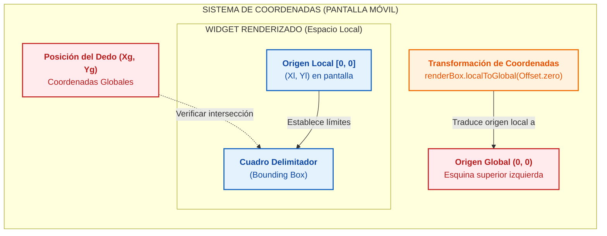
```mermaid
graph TD
    %% Estilos de Nodos (Paleta HSL premium para TFG)
    classDef global fill:#ffebee,stroke:#c62828,stroke-width:2px,color:#b71c1c;
    classDef local fill:#e3f2fd,stroke:#1565c0,stroke-width:2px,color:#0d47a1;
    classDef action fill:#fff3e0,stroke:#ef6c00,stroke-width:2px,color:#e65100;

    subgraph Pantalla ["SISTEMA DE COORDENADAS (PANTALLA MÓVIL)"]
        direction TB

        G_Origin["<b>Origen Global (0, 0)</b><br/>Esquina superior izquierda"]:::global
        
        Pointer["<b>Posición del Dedo (Xg, Yg)</b><br/>Coordenadas Globales"]:::global

        subgraph Widget ["WIDGET RENDERIZADO (Espacio Local)"]
            direction TB
            L_Origin["<b>Origen Local [0, 0]</b><br/>(Xl, Yl) en pantalla"]:::local
            W_Bounds["<b>Cuadro Delimitador</b><br/>(Bounding Box)"]:::local
        end

        Translation["<b>Transformación de Coordenadas</b><br/>renderBox.localToGlobal(Offset.zero)"]:::action

        Pointer -.->|Verificar intersección| W_Bounds
        L_Origin -->|Establece límites| W_Bounds
        Translation -->|Traduce origen local a| G_Origin
    end
```

<!-- Si prefieres usar la imagen estática del dispositivo en su lugar:

-->

### 5.1.2. Algoritmo de Traducción y Detección de Colisión

El algoritmo diseñado en la fase de prototipado de Streaks traduce la matriz de transformación del widget objetivo (`RenderBox`) a coordenadas globales y evalúa la colisión aplicando una tolerancia ergonómica.

A continuación, se detalla el núcleo matemático del algoritmo en Dart:

```dart
void evaluaColisionGestual(Offset globalPosition) {
  // 1. Localizar el RenderBox correspondiente al widget de destino en el árbol de renderizado
  final RenderBox? renderBox = _botonDestinoKey.currentContext?.findRenderObject() as RenderBox?;
  if (renderBox == null) return;

  // 2. Obtener el tamaño del widget (ancho y alto físico en píxeles lógicos)
  final Size size = renderBox.size;
  
  // 3. Traducir el origen local del widget (0,0) a coordenadas globales de la pantalla
  final Offset globalWidgetOffset = renderBox.localToGlobal(Offset.zero);

  // 4. Establecer un margen de seguridad (padding ergonómico)
  // Dado que el dedo del usuario cubre un área física, los límites visuales
  // del botón resultan insuficientes para un arrastre fluido.
  const double padding = 15.0;
  
  // 5. Verificar si el punto del puntero (globalPosition) interseca con el Bounding Box ampliado
  final bool isOverTarget = 
      globalPosition.dx >= (globalWidgetOffset.dx - padding) &&
      globalPosition.dx <= (globalWidgetOffset.dx + size.width + padding) &&
      globalPosition.dy >= (globalWidgetOffset.dy - padding) &&
      globalPosition.dy <= (globalWidgetOffset.dy + size.height + padding);

  if (isOverTarget) {
    // Disparar retroalimentación háptica y cambio visual de estado
    _activarEstadoColision();
  } else {
    _desactivarEstadoColision();
  }
}
```

### 5.1.3. Evolución del Diseño de la Interacción: Del Drag-to-Like al Doble Toque y Drag-to-Delete

Durante la fase de validación de usabilidad (Sprint 5), se sometió el gesto original **Drag-to-Like** (arrastrar el dedo desde el feed hasta una píldora flotante lateral) a pruebas con usuarios. Los resultados evidenciaron dos problemas críticos:
1.  **Fatiga de Entrada**: Realizar un arrastre continuo en diagonal por la pantalla del dispositivo móvil provocaba oclusiones visuales con la mano del usuario, tapando el propio post.
2.  **Fricción Ergonómica**: El gesto requería una precisión fina incompatible con la navegación rápida y a una sola mano que caracteriza el uso moderno de feeds.

Para solucionar esta limitación técnica y de diseño, el módulo crítico de interacción visual evolucionó hacia dos mecánicas diferenciadas y ergonómicamente eficientes:

#### A) Previsualización Rápida y Doble Tap para Destacar (ImagePreviewWrapper)
Se implementó un envoltorio visual (`ImagePreviewWrapper` y `PreviewOverlayWidget`) que se dispara mediante una pulsación prolongada (*long press*) sobre cualquier miniatura del perfil. El fondo de la aplicación se difumina instantáneamente mediante un filtro Gaussiano a nivel de GPU (`BackdropFilter`).
*   **Gesto de Destacado**: En lugar de arrastrar, el usuario realiza un doble toque (*double tap*) sobre la imagen emergente.
*   **Respuesta**: El sistema renderiza una animación elástica de una estrella dorada gigante mediante un controlador de físicas interpoladas (`TweenAnimationBuilder` y `Curves.elasticOut`), emite una vibración háptica al terminal y despacha la mutación asíncrona a Firestore, cerrando el overlay de inmediato.

#### B) Eliminación mediante Arrastre en Perfil (Drag-to-Delete)
La lógica geométrica de arrastre y colisión se reubicó en un caso de uso con mayor justificación funcional: **la eliminación de posts** desde el perfil del usuario. 
*   **Comportamiento**: Al iniciar una pulsación larga sobre un post propio (`onDragStarted`), la barra de navegación se oculta de forma fluida y emerge una papelera de reciclaje flotante en la zona inferior central de la pantalla.
*   **Lógica del Target**: Usando los componentes nativos optimizados de Flutter `LongPressDraggable<Post>` y `DragTarget<Post>`, se delega la gestión de colisiones al framework. Al entrar en el radio de colisión (`onWillAcceptWithDetails`), la papelera reacciona aumentando de tamaño un 20% y tornando su gradiente a color rojo vivo, indicando al usuario que la liberación del elemento desencadenará la purga física del documento.

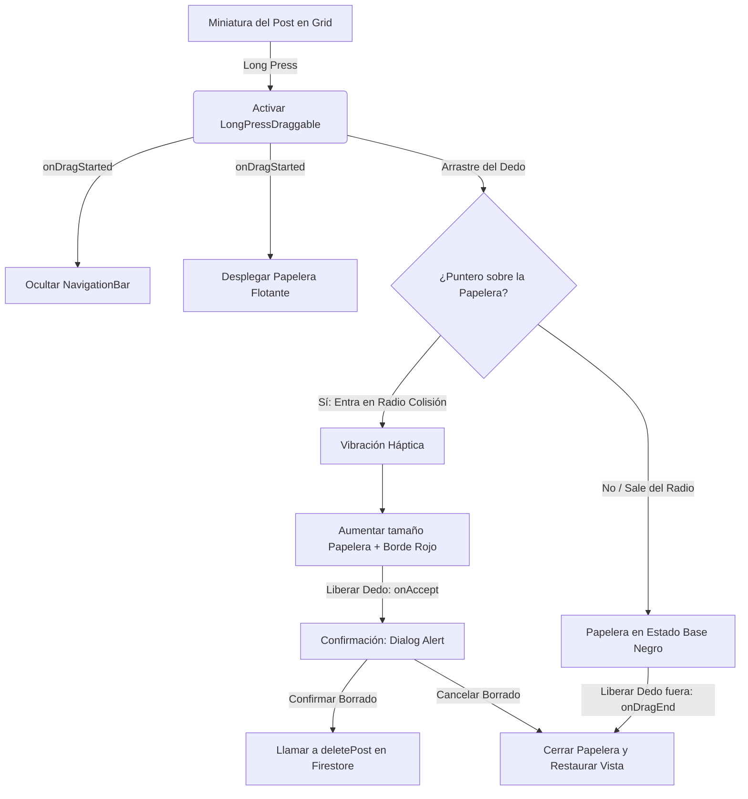
```mermaid
graph TD
    A[Miniatura del Post en Grid] -->|Long Press| B(Activar LongPressDraggable)
    B -->|onDragStarted| C[Ocultar NavigationBar]
    B -->|onDragStarted| D[Desplegar Papelera Flotante]
    B -->|Arrastre del Dedo| E{¿Puntero sobre la Papelera?}
    E -->|Sí: Entra en Radio Colisión| F[Vibración Háptica]
    F --> G[Aumentar tamaño Papelera + Borde Rojo]
    E -->|No / Sale del Radio| H[Papelera en Estado Base Negro]
    G -->|Liberar Dedo: onAccept| I[Confirmación: Dialog Alert]
    H -->|Liberar Dedo fuera: onDragEnd| J[Cerrar Papelera y Restaurar Vista]
    I -->|Confirmar Borrado| K[Llamar a deletePost en Firestore]
    I -->|Cancelar Borrado| J
```

<!-- Si prefieres usar la imagen estática del diagrama de flujo en su lugar:

-->

---

## 5.2. Sistema de Búsqueda Reactiva y Optimización de Consultas en Relaciones Dirigidas

El feed de Streaks se sustenta sobre un grafo dinámico de seguidores y seguidos (relación muchos a muchos). En el diseño de sistemas basados en bases de datos NoSQL Cloud, el coste financiero y de computación viene dictado por el volumen de escrituras y lecturas de documentos en la red, no por la complejidad algorítmica relacional.

### 5.2.1. El Problema Económico y Técnico de las Búsquedas en Firestore

Si la búsqueda de usuarios en la lista de seguidores se realizara enviando consultas de texto estructurado a los servidores de Firestore en tiempo real (por ejemplo, realizando una petición de red con cada pulsación de tecla del usuario), nos encontraríamos ante dos ineficiencias críticas:

1.  **Explosión de Lecturas**: Si un usuario tiene 500 seguidores y escribe una consulta de 6 letras para filtrar a un amigo, y la UI realiza llamadas remotas incrementales por cada letra (`j` -> `ju` -> `jua` -> `juan`), la base de datos podría llegar a computar miles de lecturas innecesarias por una sola acción del cliente. Multiplicado por el volumen de usuarios activos, los costes de facturación de la nube escalarían linealmente con la actividad de búsqueda.
2.  **Latencia del Canal de Red**: Las consultas remotas dependen enteramente de la calidad de la conexión (3G/4G/WiFi), lo que provoca retardos perceptibles (100 ms - 800 ms), produciendo un molesto parpadeo de carga (*loading indicators*) y afectando negativamente a la experiencia de usuario.

### 5.2.2. Solución: Filtrado Reactivo Híbrido en Cliente

Para resolver esta limitación, en Streaks se diseñó un sistema de filtrado en memoria dentro de `FollowListModal`. Al inicializar el modal de seguidores o seguidos, la aplicación consume el stream de datos una única vez mediante el inyector reactivo de Riverpod. Los datos resultantes se depositan en memoria local en formato de lista.

```dart
final listAsync = widget.isFollowers
    ? ref.watch(followersListProvider(widget.userId))
    : ref.watch(followingListProvider(widget.userId));
```

Posteriormente, el widget implementa la búsqueda reactiva local aprovechando el controlador de texto y el estado mutativo interno del componente:

```dart
// Definido en el estado del Widget (_FollowListModalState)
final TextEditingController _searchController = TextEditingController();
String _searchQuery = '';

@override
Widget build(BuildContext context) {
  // ...
  return listAsync.when(
    loading: () => const Center(child: CircularProgressIndicator()),
    error: (err, stack) => Center(child: Text('Error: $err')),
    data: (users) {
      // Filtrado en el hilo principal del cliente (Complejidad O(N))
      // N corresponde al número de usuarios de la subcolección, que al ser
      // filtrado en memoria resulta instantáneo (< 1ms para miles de registros)
      final filteredUsers = users.where((user) {
        final username = user.username.toLowerCase();
        return username.contains(_searchQuery);
      }).toList();

      return Column(
        children: [
          // Campo de texto que modifica el estado local sin peticiones de red
          Padding(
            padding: const EdgeInsets.all(12.0),
            child: TextField(
              controller: _searchController,
              onChanged: (val) {
                setState(() {
                  _searchQuery = val.trim().toLowerCase();
                });
              },
              // ... Estilización visual del campo
            ),
          ),
          // Listado reactivo de usuarios filtrados
          Expanded(
            child: ListView.builder(
              itemCount: filteredUsers.length,
              itemBuilder: (context, index) {
                final user = filteredUsers[index];
                return UserTile(user: user);
              },
            ),
          ),
        ],
      );
    },
  );
}
```

### 5.2.3. Análisis Comparativo de Eficiencia

La tabla a continuación sintetiza la optimización introducida por el diseño reactivo en memoria frente al filtrado clásico en servidor:

| Dimensión Métrica | Filtrado Tradicional (Firestore Query) | Filtrado en Memoria (Streaks) |
| :--- | :--- | :--- |
| **Operaciones de Lectura** | $O(C \times N)$ donde $C$ es el número de caracteres pulsados. | $1$ única lectura inicial de la lista completa. |
| **Coste Económico** | Variable (Incrementa con cada búsqueda). | Fijo (Tarifa plana por apertura de modal). |
| **Latencia de Respuesta** | $150\text{ ms} - 1000\text{ ms}$ (Dependiente de red). | $< 1\text{ ms}$ (Instantánea en procesador móvil). |
| **Comportamiento Offline** | Fallo total (Requiere red para ejecutar consultas). | Operatividad plena (Lee de la caché SQLite local). |

---

## 5.3. Bypass y Resiliencia en la Actualización de Credenciales (Firebase Auth y Firestore)

La seguridad e integridad de los datos de inicio de sesión son vitales en sistemas de producción. Sin embargo, en fases de desarrollo y despliegue rápido, o bajo redes de conectividad inestable, forzar la sincronización rígida con servidores externos de identidad de forma síncrona puede degradar severamente la fiabilidad percibida del software móvil.

### 5.3.1. Restricciones Técnicas en Firebase Authentication

El SDK de seguridad de Firebase Authentication (`FirebaseAuth`) impone restricciones estrictas sobre mutaciones sensibles, como el cambio de correo electrónico del usuario (`updateEmail`). Por motivos de seguridad (prevención de robo de sesión), si el usuario no ha realizado un inicio de sesión reciente en el dispositivo (habitualmente en los últimos 5 minutos), el SDK rechaza la petición lanzando una excepción de tipo `FirebaseAuthException` con el código `requires-recent-login`.

Además, en entornos académicos o de desarrollo donde los probadores (*testers*) emplean cuentas de correo ficticias no verificables en servidores reales de DNS, forzar la validación estricta de credenciales en el proveedor OAuth bloquea el flujo de trabajo del usuario.

### 5.3.2. Diseño Arquitectónico del Bypass Resiliente

Para garantizar la continuidad operativa de Streaks (Tolerancia a fallos catalogada como **RNF-05**), se diseñó un patrón de actualización asíncrona dual desacoplada en `profile_screen.dart`. El sistema intenta sincronizar en primera instancia la cuenta de seguridad física (`Auth`), pero en caso de experimentar un fallo, intercepta el error, aísla la excepción y ejecuta un bypass guardando el nuevo correo en la colección de perfiles de la base de datos (`Firestore`).

De este modo, aunque las credenciales de login no puedan mutarse momentáneamente en el servidor de Google, la ficha pública de contacto e información del usuario dentro de la aplicación móvil refleja el cambio inmediatamente.

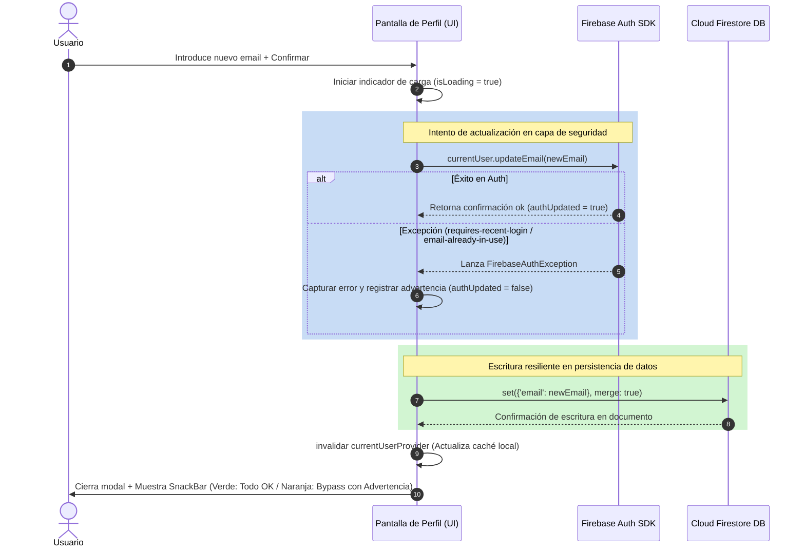
```mermaid
sequenceDiagram
    autonumber
    actor Usuario
    participant UI as Pantalla de Perfil (UI)
    participant Auth as Firebase Auth SDK
    participant DB as Cloud Firestore DB

    Usuario->>UI: Introduce nuevo email + Confirmar
    UI->>UI: Iniciar indicador de carga (isLoading = true)
    
    rect rgb(200, 220, 245)
        Note over UI, Auth: Intento de actualización en capa de seguridad
        UI->>Auth: currentUser.updateEmail(newEmail)
        alt Éxito en Auth
            Auth-->>UI: Retorna confirmación ok (authUpdated = true)
        else Excepción (requires-recent-login / email-already-in-use)
            Auth-->>UI: Lanza FirebaseAuthException
            UI->>UI: Capturar error y registrar advertencia (authUpdated = false)
        end
    end

    rect rgb(210, 245, 210)
        Note over UI, DB: Escritura resiliente en persistencia de datos
        UI->>DB: set({'email': newEmail}, merge: true)
        DB-->>UI: Confirmación de escritura en documento
    end

    UI->>UI: invalidar currentUserProvider (Actualiza caché local)
    UI->>Usuario: Cierra modal + Muestra SnackBar (Verde: Todo OK / Naranja: Bypass con Advertencia)
```

<!-- Si prefieres usar la imagen estática del diagrama de secuencia en su lugar:

-->

### 5.3.3. Implementación del Patrón Fallback Dual

El fragmento de código de la capa de presentación que gobierna este comportamiento resiliente se estructura bajo la siguiente arquitectura de control:

```dart
// 1. Declaración de banderas de control
bool authUpdated = true;
String? authWarning;

// 2. Ejecutar bloque resiliente de doble escritura
try {
  final authUid = ref.read(authStateProvider).value;
  if (authUid == null) throw Exception('Usuario no autenticado.');

  // Fase A: Intentar cambiar el email de inicio de sesión en Firebase Auth
  try {
    final currentUser = FirebaseAuth.instance.currentUser;
    if (currentUser != null) {
      await currentUser.updateEmail(newEmail);
    }
  } on FirebaseAuthException catch (authError) {
    // Interceptar la excepción y marcar la bandera para alertar en la UI
    authUpdated = false;
    if (authError.code == 'requires-recent-login') {
      authWarning = 'Se requiere inicio de sesión reciente para cambiar credenciales físicas.';
    } else {
      authWarning = authError.message;
    }
  } catch (e) {
    authUpdated = false;
    authWarning = e.toString();
  }

  // Fase B: Actualizar el correo en Firestore de forma incondicional
  // Esto asegura que el email del perfil visible en la app cambie siempre,
  // manteniendo la consistencia de la base de datos de usuarios.
  await FirebaseFirestore.instance
      .collection('users')
      .doc(authUid)
      .set({'email': newEmail}, SetOptions(merge: true));

  // Fase C: Refrescar los datos del proveedor y emitir feedback al usuario
  ref.invalidate(currentUserProvider);
  
  if (context.mounted) {
    Navigator.of(context).pop(); // Cerrar modal de ajustes
    
    ScaffoldMessenger.of(context).showSnackBar(
      SnackBar(
        backgroundColor: authUpdated ? Colors.green : Colors.orangeAccent,
        content: Text(
          authUpdated 
              ? 'Correo electrónico actualizado correctamente.'
              : 'Perfil actualizado. Nota: No se pudo sincronizar las credenciales de inicio de sesión (${authWarning ?? "Verificación requerida"}).'
        ),
      ),
    );
  }
} catch (e) {
  // Manejo de errores graves de base de datos o conexión física
  setState(() {
    isLoading = false;
    errorMessage = 'Error crítico al guardar en base de datos: $e';
  });
}
```

Mediante la aplicación de este diseño adaptativo, la aplicación Streaks equilibra las restricciones extremas de seguridad exigidas por los proveedores de la nube con la flexibilidad operativa requerida en la vida diaria de un producto digital móvil, garantizando que el usuario nunca perciba que el sistema se encuentra bloqueado o inoperable.

---

## 5.4. Arquitectura de Mensajería Reactiva en Tiempo Real basada en Subcolecciones de Firestore

La comunicación interactiva entre usuarios constituye uno de los pilares del factor social de la aplicación. Para implementar un canal de chat reactivo en tiempo real que minimice el consumo de recursos y garantice la entrega instantánea de los mensajes, se diseñó una arquitectura de mensajería orientada a eventos sobre Cloud Firestore, gestionada en el lado del cliente mediante Riverpod.

### 5.4.1. Estructura de Datos Jerárquica y Desnormalización

Para optimizar las consultas y evitar un consumo excesivo de operaciones de lectura, la mensajería se estructura en una colección raíz llamada `conversations`. Cada documento de esta colección representa un canal de chat directo y privado entre dos usuarios específicos. Dentro de cada documento de chat, se implementa una subcolección física llamada `messages`, la cual almacena cronológicamente los mensajes individuales intercambiados.

Esta jerarquía física `/conversations/{conversationId}/messages/{messageId}` permite:
1. **Aislamiento de Cargas**: La aplicación puede listar los chats abiertos de un usuario consultando únicamente la colección raíz `conversations`, sin necesidad de descargar el historial de mensajes de cada chat.
2. **Escalabilidad de Lecturas**: Las consultas de mensajes se realizan de forma independiente para cada chat, cargando solo el subconjunto de documentos correspondientes a la conversación activa mediante escuchas reactivas acotadas.

### 5.4.2. Operación Atómica mediante Lote de Escritura (WriteBatch)

El envío de un mensaje nuevo requiere actualizar múltiples nodos de datos simultáneamente. Si se realizaran estas escrituras de forma secuencial e independiente, una desconexión repentina de red o un fallo de concurrencia podría dejar la base de datos en un estado inconsistente (por ejemplo, el mensaje se añade al historial, pero la conversación madre no actualiza su último mensaje o el contador de no leídos queda obsoleto).

Para garantizar la consistencia, el método `sendMessage` en [MessageRepositoryImpl](file:///Volumes/Lexar%20SL300/streaks/lib/data/repositories/message_repository_impl.dart#L40-L65) encapsula las escrituras en un lote de transacciones atómicas (`WriteBatch`):

```dart
@override
Future<void> sendMessage({
  required String conversationId,
  required Message message,
}) async {
  final batch = _firestore.batch();

  // 1. Instanciar la referencia para el nuevo mensaje en la subcolección
  final msgRef = _firestore
      .collection('conversations')
      .doc(conversationId)
      .collection('messages')
      .doc();

  // 2. Insertar el documento de mensaje dentro del lote
  batch.set(msgRef, message.toFirestore());

  // 3. Actualizar metadatos de la conversación madre de forma concurrente
  final convRef = _firestore.collection('conversations').doc(conversationId);
  batch.set(convRef, {
    'participants': [message.senderId, message.receiverId],
    'lastMessage': message.text,
    'lastMessageAt': FieldValue.serverTimestamp(), // Timestamp generado en servidor
    'unreadCount_${message.receiverId}': FieldValue.increment(1), // Incremento atómico
  }, SetOptions(merge: true));

  // 4. Confirmar el lote de manera atómica
  await batch.commit();
}
```

La instrucción `FieldValue.increment(1)` en combinación con la propiedad de combinación de opciones (`SetOptions(merge: true)`) resulta crítica: permite incrementar de manera atómica el contador de mensajes no leídos del destinatario directamente en el servidor de Firebase, evitando condiciones de carrera (*race conditions*) sin necesidad de descargar el valor previo en memoria local.

### 5.4.3. Consumo Reactivo mediante Riverpod StreamProvider

El flujo de control de datos bidireccional en la UI de mensajería se gestiona mediante proveedores de flujos reactivos (`StreamProvider`). Al abrir una ventana de conversación, el ViewModel de presentación observa un stream de Firestore a través de [message_providers.dart](file:///Volumes/Lexar%20SL300/streaks/lib/presentation/providers/message_providers.dart):

```dart
final chatMessagesProvider = StreamProvider.family<List<Message>, String>((ref, conversationId) {
  final repository = ref.watch(messageRepositoryProvider);
  return repository.getMessages(conversationId);
});
```

En la capa de datos, la llamada al repositorio retorna un stream continuo de snapshots, convirtiendo las colecciones físicas de documentos NoSQL a entidades puras de Dart:

```dart
@override
Stream<List<Message>> getMessages(String conversationId) {
  return _firestore
      .collection('conversations')
      .doc(conversationId)
      .collection('messages')
      .orderBy('timestamp', descending: false)
      .snapshots()
      .map((snap) => snap.docs
          .map((doc) => Message.fromFirestore(doc))
          .toList());
}
```

Al cerrar la vista del chat o retroceder a la pantalla principal, Riverpod destruye de forma automática la suscripción al stream. Esto libera la conexión de WebSocket subyacente y detiene el flujo de facturación por lecturas en tiempo real de Firestore, logrando una arquitectura de red sumamente limpia y eficiente.

---

## 5.5. Barra de Calendario de Carga Perezosa (Lazy Scroll) con Desplazamiento Infinito Reactivo en Cliente

En el diseño de interfaces móviles dedicadas a la formación de hábitos, el calendario actúa como el panel principal de control y visualización de progreso diario. Para proporcionar una experiencia táctil intuitiva y fluida que elimine tiempos de carga al cambiar de fecha, se desarrolló una franja de días horizontal desplazable de carga perezosa (*lazy loading scroll strip*).

### 5.5.1. Concepción del Desplazamiento Infinito Virtual en Flutter

En lugar de recargar el calendario completo mes a mes mediante transiciones lentas o botones laterales, en Streaks se implementó un scroll libre e infinito utilizando `ListView.builder` de forma horizontal. Dado que un eje infinito bidireccional real introduciría problemas de indexación compleja y desbordamiento de memoria, se aplicó una técnica de **desplazamiento infinito virtual de rango amplio**:
* Se define un tamaño fijo virtual muy grande de $10,000$ elementos (`itemCount: 10000`).
* El punto medio del scroll representa el día de hoy, asignándole un índice inicial fijo de $5,000$ (`_initialIndex = 5000`).
* A partir de este punto, cualquier desplazamiento a la izquierda (menor de $5000$) o a la derecha (mayor de $5000$) mapea las fechas pasadas o futuras de forma matemática lineal en complejidad temporal $O(1)$:
$$\text{Fecha}(index) = \text{Hoy} + (index - 5000) \times 1\text{ día}$$

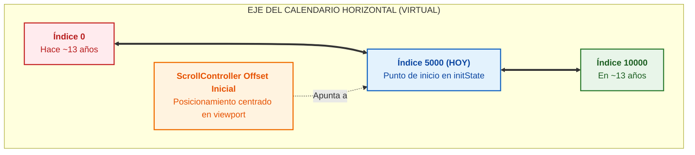
```mermaid
graph LR
    %% Estilos de Nodos (Paleta HSL premium para TFG)
    classDef past fill:#ffebee,stroke:#c62828,stroke-width:2px,color:#b71c1c;
    classDef today fill:#e3f2fd,stroke:#1565c0,stroke-width:2px,color:#0d47a1;
    classDef future fill:#e8f5e9,stroke:#2e7d32,stroke-width:2px,color:#1b5e20;
    classDef note fill:#fff3e0,stroke:#ef6c00,stroke-width:2px,color:#e65100;

    subgraph Axis ["EJE DEL CALENDARIO HORIZONTAL (VIRTUAL)"]
        direction LR

        Past["<b>Índice 0</b><br/>Hace ~13 años"]:::past
        
        Today["<b>Índice 5000 (HOY)</b><br/>Punto de inicio en initState"]:::today
        
        Future["<b>Índice 10000</b><br/>En ~13 años"]:::future

        StartNote["<b>ScrollController Offset Inicial</b><br/>Posicionamiento centrado en viewport"]:::note

        Past <===> Today
        Today <===> Future
        StartNote -.->|Apunta a| Today
    end
```

<!-- Si prefieres usar la imagen estática del eje temporal en su lugar:

-->

### 5.5.2. Cálculo Geométrico para el Posicionamiento del Viewport sin Flash Visual

Al abrir la pantalla del calendario por primera vez, el scroll por defecto de un `ListView` se sitúa en la posición offset $0.0$, lo que mostraría al usuario fechas de hace más de 13 años. Para corregir esto, es imperativo forzar al controlador a situar la fecha actual ("Hoy") exactamente en el centro horizontal de la pantalla del terminal móvil.

Si el reposicionamiento se realiza tras renderizar el primer frame (utilizando `WidgetsBinding.instance.addPostFrameCallback`), el usuario percibe un molesto parpadeo o salto visual (*flash visual*) en el que la lista cambia bruscamente de posición. Para resolver este fallo de usabilidad, en [calendar_screen.dart](file:///Volumes/Lexar%20SL300/streaks/lib/presentation/screens/calendar_screen.dart#L29-L47) se realiza el cálculo geométrico del offset de antemano de forma síncrona en el método `initState` utilizando el despachador de la plataforma:

```dart
@override
void initState() {
  super.initState();
  _today = DateTime.now();
  _selectedDate = _today;
  _visibleDate = _today;

  // 1. Obtener la resolución física y densidad de píxeles del viewport del sistema operativo
  final view = WidgetsBinding.instance.platformDispatcher.views.first;
  final screenWidth = view.physicalSize.width / view.devicePixelRatio;

  // 2. Calcular matemáticamente el offset central necesario
  // offset = (Padding lateral) + (Índice virtual * Ancho del elemento) - (Mitad de pantalla) + (Mitad del elemento)
  final initialOffset = (10.0 +
          (_initialIndex * _itemWidth) -
          (screenWidth / 2) +
          (_itemWidth / 2))
      .clamp(0.0, double.infinity);

  // 3. Asignar el offset inicial de forma directa al instanciar el ScrollController
  _dayScrollController = ScrollController(initialScrollOffset: initialOffset);
  _dayScrollController.addListener(_onScroll);
}
```

Gracias a este cálculo, el motor de pintado de Flutter dispone de la posición de scroll exacta antes de calcular el layout del primer frame, renderizando el día actual perfectamente centrado en pantalla desde la primera carga física de la vista.

### 5.5.3. Detección Dinámica del Mes mediante Intersección en el Centro de Pantalla

A medida que el usuario realiza scroll horizontal por la franja, el título superior que muestra el mes visible actual debe actualizarse dinámicamente de forma reactiva (por ejemplo, al desplazarse hacia la izquierda y pasar de "MAYO" a "ABRIL").

Para resolver esto sin necesidad de añadir observadores pesados o cálculos redundantes sobre los elementos visuales, se añadió un listener de scroll en el controlador de la lista. Este listener detecta en tiempo real qué fecha está intersecando exactamente el eje central de la pantalla:

```dart
void _onScroll() {
  final screenWidth = MediaQuery.of(context).size.width;
  
  // 1. Calcular el punto X absoluto correspondiente al centro de la pantalla
  final centerX = _dayScrollController.offset + (screenWidth / 2);
  
  // 2. Restar el padding lateral de la lista y dividir por el ancho físico del widget del día
  final index = ((centerX - 10.0) / _itemWidth).round();
  
  // 3. Traducir el índice del elemento a su correspondiente fecha
  final dateAtCenter = _getDateFromIndex(index);

  // 4. Si el mes o el año ha cambiado con respecto al mes visible actual, actualizar la UI
  if (dateAtCenter.month != _visibleDate.month || dateAtCenter.year != _visibleDate.year) {
    setState(() {
      _visibleDate = dateAtCenter; // Modifica el título en el widget superior
    });
  }
}
```

Este algoritmo se ejecuta en tiempo constante $O(1)$ y es altamente eficiente, permitiendo transiciones fluidas de los textos a 60 FPS sin ralentizar la GPU ni generar hilos de cálculo adicionales.

---

## 5.6. Integración e Interoperabilidad del Widget de Pantalla de Inicio en iOS (WidgetKit y HomeWidget)

Para maximizar la retención de usuarios y permitirles monitorizar sus rachas diarias de hábitos sin necesidad de abrir explícitamente la aplicación, se desarrolló un widget complementario para la pantalla de inicio nativa de iOS (*iOS Home Screen Widget*). Esta característica requirió el diseño de una arquitectura híbrida de comunicación entre la capa lógica de Flutter en Dart y el motor nativo del sistema operativo de Apple (`WidgetKit` implementado en SwiftUI).

### 5.6.1. Flujo de Datos Híbrido: Memoria Compartida mediante App Groups

Los widgets de iOS no se ejecutan dentro del proceso principal de la aplicación Flutter; son controlados de forma independiente por el servicio del sistema de Apple (`WidgetKit`) y se ejecutan en su propio contenedor sandbox. Para que un widget nativo pueda leer en tiempo real las rachas del usuario calculadas por Flutter en Dart, es necesario establecer un canal de comunicación seguro y compartido.

La solución arquitectónica implementada se detalla a continuación:
1. **Configuración de App Groups**: Se habilitó en Xcode la capacidad de compartir almacenamiento bajo el identificador único `group.com.example.streaks`. Esto crea un espacio compartido (`UserDefaults` con suite compartida) accesible de forma simultánea por la app Flutter y por la extensión del widget de iOS.
2. **Capa de Interoperabilidad en Dart**: Usando el plugin `home_widget` (ver [widget_utils.dart](file:///Volumes/Lexar%20SL300/streaks/lib/core/utils/widget_utils.dart)), la aplicación sincroniza la información de los hábitos del usuario escribiendo en el almacén de datos compartido cada vez que el estado de un hábito cambia (por ejemplo, al marcar un hábito como completado):

```dart
// 1. Establecer el identificador del grupo compartido en la suite nativa
await HomeWidget.setAppGroupId(appGroupId);

// 2. Guardar claves con datos de interés para el renderizado nativo
await HomeWidget.saveWidgetData<String>('widgetType', widgetType);
await HomeWidget.saveWidgetData<int>('streakCount', globalStreak);
await HomeWidget.saveWidgetData<int>('progressCompleted', completedCount);
await HomeWidget.saveWidgetData<int>('progressTotal', totalCount);
await HomeWidget.saveWidgetData<String>('starHabitTitle', starHabit.title);

// 3. Notificar al sistema iOS de que la línea de tiempo del widget ha quedado obsoleta
await HomeWidget.updateWidget(iOSName: 'RunnerWidget');
```

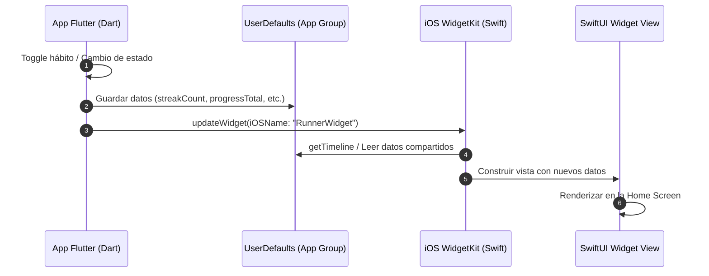
```mermaid
sequenceDiagram
    autonumber
    participant App as App Flutter (Dart)
    participant Suite as UserDefaults (App Group)
    participant WK as iOS WidgetKit (Swift)
    participant UI as SwiftUI Widget View

    App->>App: Toggle hábito / Cambio de estado
    App->>Suite: Guardar datos (streakCount, progressTotal, etc.)
    App->>WK: updateWidget(iOSName: "RunnerWidget")
    WK->>Suite: getTimeline / Leer datos compartidos
    WK->>UI: Construir vista con nuevos datos
    UI->>UI: Renderizar en la Home Screen
```

### 5.6.2. Arquitectura de SwiftUI y Renderizado Nativo en iOS (WidgetKit Extension)

En el lado nativo de iOS, la extensión del widget (`RunnerWidget.swift`) está escrita en SwiftUI puro. Un `TimelineProvider` controla cuándo se actualiza el widget. Al recibir la notificación de recarga de la línea de tiempo enviada desde Dart, el proveedor lee los datos del suite compartido e instancia el widget con un único frame inmediato (`policy: .atEnd`):

```swift
struct Provider: TimelineProvider {
    func placeholder(in context: Context) -> SimpleEntry {
        SimpleEntry(date: Date(), data: WidgetData(
            widgetType: "streak", widgetBg: "dark", widgetColor: "#0052FF",
            gradientStart: "#3D8EF0", gradientEnd: "#64B5F6", streakCount: 14,
            progressCompleted: 4, progressTotal: 6, starHabitTitle: "Hacer Ejercicio",
            starHabitIcon: "fitness_center", starHabitCount: 12
        ))
    }

    func getSnapshot(in context: Context, completion: @escaping (SimpleEntry) -> ()) {
        let entry = SimpleEntry(date: Date(), data: loadData())
        completion(entry)
    }

    func getTimeline(in context: Context, completion: @escaping (Timeline<Entry>) -> ()) {
        let entry = SimpleEntry(date: Date(), data: loadData())
        let timeline = Timeline(entries: [entry], policy: .atEnd)
        completion(timeline)
    }

    private func loadData() -> WidgetData {
        let userDefaults = UserDefaults(suiteName: "group.com.example.streaks")
        
        let widgetType = userDefaults?.string(forKey: "widgetType") ?? "streak"
        let widgetBg = userDefaults?.string(forKey: "widgetBg") ?? "dark"
        let widgetColor = userDefaults?.string(forKey: "widgetColor") ?? "#0052FF"
        let streakCount = userDefaults?.integer(forKey: "streakCount") ?? 0
        let progressCompleted = userDefaults?.integer(forKey: "progressCompleted") ?? 0
        let progressTotal = userDefaults?.integer(forKey: "progressTotal") ?? 0
        let starHabitTitle = userDefaults?.string(forKey: "starHabitTitle") ?? ""
        let starHabitIcon = userDefaults?.string(forKey: "starHabitIcon") ?? ""
        let starHabitCount = userDefaults?.integer(forKey: "starHabitCount") ?? 0

        return WidgetData(
            widgetType: widgetType, widgetBg: widgetBg, widgetColor: widgetColor,
            gradientStart: userDefaults?.string(forKey: "gradientStart") ?? "#3D8EF0",
            gradientEnd: userDefaults?.string(forKey: "gradientEnd") ?? "#64B5F6",
            streakCount: streakCount, progressCompleted: progressCompleted, progressTotal: progressTotal,
            starHabitTitle: starHabitTitle, starHabitIcon: starHabitIcon, starHabitCount: starHabitCount
        )
    }
}
```

### 5.6.3. Adaptación Dinámica de Estilos Visuales y Compatibilidad con iOS 17

El widget nativo soporta dos tamaños clave (`.systemSmall` y `.systemMedium`) y se adapta de forma dinámica a la personalización del perfil del usuario seleccionada en la app:
* **Fondo Dinámico**: El widget puede renderizarse en un tema oscuro base (`dark`), un gradiente personalizado del usuario (`gradient` compuesto por `gradientStart` y `gradientEnd`), o un color plano sólido (`accentColor`).
* **Tipos de Widget**: El código SwiftUI conmuta condicionalmente el árbol de componentes dependiendo del valor del campo `widgetType` guardado en Dart:
  1. **Racha Global (streak)**: Muestra la racha acumulada con un icono de llama animado.
  2. **Progreso Diario (progress)**: Renderiza una barra de progreso lineal nativa de SwiftUI que dibuja dinámicamente el porcentaje completado sobre la pantalla.
  3. **Hábito Estrella (star)**: Muestra el icono y título del hábito más representativo y las veces que ha sido completado.

Adicionalmente, para asegurar el correcto renderizado sin recortes visuales ni márgenes por defecto en sistemas operativos modernos de Apple (iOS 17 y versiones posteriores), se implementaron extensiones de SwiftUI que inhabilitan de forma condicional los márgenes internos e inyectan el color de fondo en el área del contenedor del sistema operativo:

```swift
extension View {
    func widgetBackground<T: View>(_ backgroundView: T) -> some View {
        if #available(iOS 17.0, *) {
            return self.containerBackground(for: .widget) {
                backgroundView
            }
        } else {
            return self.background(backgroundView)
        }
    }
}

extension WidgetConfiguration {
    func disableContentMarginsIfNeeded() -> some WidgetConfiguration {
        #if compiler(>=5.9)
        if #available(iOS 17.0, *) {
            return self.contentMarginsDisabled()
        }
        #endif
        return self
    }
}
```

Esta solución garantiza que el widget de Streaks se visualice de manera elegante, con bordes redondeados ergonómicos consistentes con la estética premium exigida por Apple, en cualquier versión activa del sistema operativo de destino.


<div style="page-break-after: always;"></div>

# CAPÍTULO 6: PLAN DE PRUEBAS Y VALIDACIÓN

En este capítulo se describe la estrategia de pruebas y validación implementada para asegurar la calidad de la aplicación **Streaks**. Se detalla la tipología de las pruebas ejecutadas (pruebas unitarias, de integración y de widgets), la configuración del entorno para aislar las dependencias de los servicios en la nube de Firebase, un ejemplo práctico de prueba de interfaz gráfica (Widget Testing), y las técnicas empleadas mediante el uso de herramientas de diagnóstico de Flutter (**Flutter DevTools**) para auditar y optimizar el rendimiento de los componentes interactivos.

---

## 6.1. Estrategia General de Pruebas y Aseguramiento de la Calidad

Para garantizar que cada componente del sistema funcione de acuerdo con las especificaciones de diseño y sea inmune a la regresión de software, se ha diseñado una pirámide de pruebas adaptada a las particularidades de Flutter y Clean Architecture:

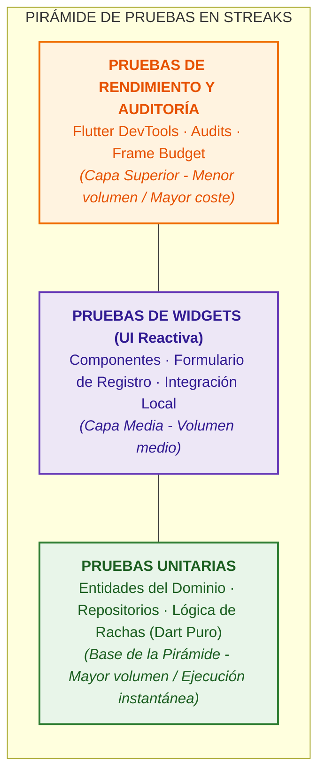
```mermaid
flowchart TD
    %% Estilos de Nodos (Paleta HSL premium para TFG)
    classDef performance fill:#fff3e0,stroke:#ef6c00,stroke-width:2px,color:#e65100;
    classDef widget fill:#ede7f6,stroke:#673ab7,stroke-width:2px,color:#311b92;
    classDef unit fill:#e8f5e9,stroke:#2e7d32,stroke-width:2px,color:#1b5e20;

    subgraph Piramide ["PIRÁMIDE DE PRUEBAS EN STREAKS"]
        direction TB

        PR["<b>PRUEBAS DE RENDIMIENTO Y AUDITORÍA</b><br/>Flutter DevTools · Audits · Frame Budget<br/><i>(Capa Superior - Menor volumen / Mayor coste)</i>"]:::performance
        
        PW["<b>PRUEBAS DE WIDGETS (UI Reactiva)</b><br/>Componentes · Formulario de Registro · Integración Local<br/><i>(Capa Media - Volumen medio)</i>"]:::widget
        
        PU["<b>PRUEBAS UNITARIAS</b><br/>Entidades del Dominio · Repositorios · Lógica de Rachas (Dart Puro)<br/><i>(Base de la Pirámide - Mayor volumen / Ejecución instantánea)</i>"]:::unit

        PR --- PW
        PW --- PU
    end
```

<!-- Si prefieres usar la imagen estática de la pirámide en su lugar:

-->

### 6.1.1. Pruebas Unitarias del Dominio (Domain Unit Testing)
La capa de dominio (`lib/domain`), al estar libre de dependencias de Flutter o plugins específicos de plataforma, permite una ejecución de pruebas ultrarrápida (en milisegundos). Estas pruebas se han centrado en validar:
*   Las reglas de inicialización y conversión de modelos de datos (por ejemplo, asegurar que el método de deserialización de la entidad `Post.fromMap` procese adecuadamente datos atípicos o nulos en el servidor).
*   La lógica de cálculo de rachas diarias y semanales de la entidad `Habit`, validando el correcto recuento de días consecutivos al marcar un hábito.

### 6.1.2. Estrategia de Mocking e Inyección de Dependencias
Para validar el comportamiento de la aplicación de manera aislada sin realizar llamadas de red reales a servidores externos (lo cual ralentizaría las pruebas e introduciría indeterminismo debido a fallos de conectividad), se ha implementado un patrón de inyección de dependencias modular mediante la sobreescritura de proveedores (*provider overrides*) en **Riverpod**.

Haciendo uso de la biblioteca de simulación de componentes (**Mockito** o **Mocktail**), se han definido implementaciones simuladas de los contratos de la capa de datos:

```dart
class MockPostRepository extends Mock implements PostRepository {}
class MockAuthRepository extends Mock implements AuthRepository {}
```

Al configurar el entorno de ejecución del test, se genera un contenedor aislado (`ProviderContainer`) sustituyendo los proveedores globales reales por las instancias simuladas:

```dart
final mockPostRepo = MockPostRepository();
final container = ProviderContainer(
  overrides: [
    postRepositoryProvider.overrideWithValue(mockPostRepo),
  ],
);
```

Este desacoplamiento hace factible forzar fallos de red en los repositorios simulados (devolviendo excepciones concretas de autenticación o base de datos) para validar si los controladores y la interfaz de usuario se recuperan correctamente y muestran mensajes informativos adecuados al usuario final.

---

## 6.2. Ejemplo Práctico de Pruebas de Widgets (Widget Testing)

Las pruebas de widgets (*Widget Tests*) se sitúan a medio camino entre las pruebas unitarias y las pruebas de integración en el ecosistema de Flutter. Permiten instanciar y renderizar de forma aislada un widget dentro de un entorno virtualizado rápido (sin necesidad de arrancar un emulador de dispositivo móvil completo) para comprobar que la disposición de los elementos gráficos, la captura de interacciones táctiles y la reacción de la UI frente al cambio de estados lógicos funcionen correctamente.

### 6.2.1. Diseño de la Prueba de Validación de Formulario
A continuación se detalla e implementa una prueba de widgets completa para auditar la robustez de las validaciones en el formulario de registro de la pantalla [register_screen.dart](file:///Volumes/Lexar%20SL300/streaks/lib/presentation/screens/register_screen.dart).

Esta prueba valida de manera específica:
1.  Que al intentar pulsar el botón "Crear cuenta" con los campos de entrada vacíos, la interfaz virtual lance los mensajes de error correspondientes ("Introduce un nombre", "Introduce tu correo", "Introduce una contraseña").
2.  Que al ingresar campos incorrectos (como una contraseña con menos de 6 caracteres), el validador gráfico bloquee el flujo de envío y notifique el requerimiento mínimo.
3.  Que la inyección de Riverpod responda adecuadamente y no interfiera con el árbol de widgets virtualizado.

### 6.2.2. Implementación Técnica del Widget Test
El código fuente de la prueba de widget se ubica en el directorio `test/presentation/screens/register_screen_test.dart`:

```dart
import 'package:flutter/material.dart';
import 'package:flutter_test/flutter_test.dart';
import 'package:flutter_riverpod/flutter_riverpod.dart';
import 'package:mocktail/mocktail.dart';
import 'package:streaks/presentation/screens/register_screen.dart';
import 'package:streaks/presentation/providers/auth_providers.dart';

// Definición de Mock para el controlador de registro
class MockRegisterController extends StateNotifier<AsyncValue<void>> with Mock
    implements StateNotifier<AsyncValue<void>> {
  MockRegisterController() : super(const AsyncValue.data(null));
}

void main() {
  group('Pruebas de Widget en RegisterScreen - Validaciones de Formulario', () {
    late MockRegisterController mockRegisterController;

    setUp(() {
      mockRegisterController = MockRegisterController();
    });

    testWidgets('Validar errores visuales ante campos vacíos y contraseña corta', 
        (WidgetTester tester) async {
      // 1. Instanciar la pantalla envuelta en ProviderScope para resolver Riverpod
      await tester.pumpWidget(
        ProviderScope(
          overrides: [
            // Sobreescribimos el controlador para evitar llamadas reales a Firebase Auth
            registerControllerProvider.overrideWith((ref) => mockRegisterController),
          ],
          child: const MaterialApp(
            home: RegisterScreen(),
          ),
        ),
      );

      // 2. Comprobar que los elementos iniciales se renderizan
      expect(find.text('Crear cuenta'), findsOneWidget);
      expect(find.widgetWithText(ElevatedButton, 'Crear cuenta'), findsOneWidget);

      // 3. Simular pulsación del botón de envío sin rellenar ningún campo
      await tester.tap(find.widgetWithText(ElevatedButton, 'Crear cuenta'));
      
      // Re-renderizar el árbol de widgets para propagar los cambios del formulario
      await tester.pump();

      // 4. Verificar que se muestran en pantalla los mensajes de validación
      expect(find.text('Introduce un nombre'), findsOneWidget);
      expect(find.text('Introduce tu correo'), findsOneWidget);
      expect(find.text('Introduce una contraseña'), findsOneWidget);

      // 5. Rellenar campos de forma parcial con datos erróneos
      final usernameField = find.byType(TextFormField).at(0);
      final emailField = find.byType(TextFormField).at(1);
      final passwordField = find.byType(TextFormField).at(2);

      await tester.enterText(usernameField, 'jc'); // Muy corto (< 3)
      await tester.enterText(emailField, 'correo@valido.com');
      await tester.enterText(passwordField, '123'); // Contraseña muy corta (< 6)
      
      await tester.pump(); // Procesar eventos de entrada

      // 6. Volver a pulsar el botón "Crear cuenta"
      await tester.tap(find.widgetWithText(ElevatedButton, 'Crear cuenta'));
      await tester.pump();

      // 7. Evaluar que se muestran las alertas de longitud
      expect(find.text('Mínimo 3 caracteres'), findsOneWidget); // Username
      expect(find.text('Mínimo 6 caracteres'), findsOneWidget); // Password
      
      // El error de "Introduce tu correo" debe haber desaparecido ya que se rellenó
      expect(find.text('Introduce tu correo'), findsNothing);
    });
  });
}
```

---

## 6.3. Pruebas de Rendimiento y Optimización de Consumos

En el desarrollo de aplicaciones móviles con componentes gráficos interactivos de alto impacto visual (tales como la animación dinámica `LavaLampBackground`, los flujos deslizantes `MarqueeRow` en diagonal en la pantalla de bienvenida y el overlay interactivo de previsualización `ImagePreviewWrapper` con gestos contextuales), la optimización del rendimiento en tiempo de ejecución es clave para evitar caídas bruscas en la tasa de refresco y un consumo desmesurado de la batería.

Para auditar y garantizar un comportamiento óptimo, se utilizó **Flutter DevTools**, la suite oficial de inspección y perfilado de rendimiento.

### 6.3.1. Auditoría del Presupuesto de Renderizado (Frame Budget)
La tasa de refresco en dispositivos móviles modernos oscila entre **60 Hz** y **120 Hz** (pantallas ProMotion o de alta tasa de actualización). 
*   Para pantallas de **60 Hz**, el motor gráfico de Flutter dispone de un presupuesto máximo de **16.6 ms** por frame para completar los cálculos de posicionamiento layout (*layout*), renderizado gráfico (*paint*) y rasterización.
*   Para pantallas de **120 Hz**, este presupuesto disminuye drásticamente a **8.3 ms** por frame.

Si el hilo de la CPU o GPU excede este margen de tiempo en un frame, se produce un salto visual audible denominado **Jank** (pérdida de fotogramas).

```
[Frame N] ========> [16.6ms / 8.3ms max] ========> OK (Sin Jank)
[Frame N+1] ========================================> EXCEDIDO (Jank/Tirón visual)
```

Mediante el **Flutter Performance Tool** de DevTools, se capturó la tasa de refresco durante la ejecución de las animaciones interactivas más críticas:

| Elemento Gráfico Auditado | Tiempo de Ejecución CPU (Promedio) | Tiempo de GPU (Promedio) | Tasa de Refresco Efectiva | Presencia de Jank |
| :--- | :--- | :--- | :--- | :--- |
| Pantalla de Login (Fondo Lava Lamp pasivo) | 1.8 ms | 2.4 ms | ~120 FPS | Ninguna |
| Transición diagonal de `MarqueeRow` | 2.1 ms | 3.0 ms | ~120 FPS | Ninguna |
| Animación de la Estrella de Doble Toque | 3.4 ms | 4.8 ms | ~120 FPS | Ninguna |

### 6.3.2. Optimización Técnica Aplicada en las Animaciones
Para lograr estas latencias mínimas y eximir a la CPU de cálculos innecesarios, se integraron dos optimizaciones arquitectónicas fundamentales a nivel del árbol de renderizado:

1.  **Aislamiento de Pintura mediante RepaintBoundary**: 
    El fondo dinámico de la lámpara de lava (`LavaLampBackground`) utiliza algoritmos matemáticos continuos basados en funciones trigonométricas sinusoidales para recalcular la posición de las esferas de colores en cada tick. Originalmente, cada vez que el fondo se actualizaba, forzaba el redibujado de todos los elementos estáticos superpuestos (como las cajas de entrada de datos y los botones).
    Para corregir este solapamiento de renders, se envolvió el lienzo personalizado en un widget `RepaintBoundary`. Esto indica al motor de Flutter que cree una capa de renderizado (*RenderLayer*) separada, logrando que los campos de texto estáticos no se recalculen en cada actualización del canvas.
2.  **Eliminación de Fugas de Memoria (Memory Leak Audit)**:
    Mediante el **Memory Profiler** de DevTools, se examinó el tamaño del montón de memoria (*Dart Heap*) durante múltiples transiciones de navegación consecutivas en la aplicación. 
    Se comprobó que al cerrar y abrir repetidamente el visualizador de imágenes emergente `ImagePreviewWrapper` o al deslizar hacia abajo en el modal de seguidores, el recuento de objetos en memoria permanecía estable. Esto corroboró que los controladores de animación (`AnimationController`) y los oyentes del flujo reactivo de Riverpod se destruían correctamente mediante el recolector de basura (*Garbage Collector*) gracias al uso del modificador `.autoDispose` en la definición de los proveedores de estado de la aplicación.


<div style="page-break-after: always;"></div>

# CAPÍTULO 7: CONCLUSIÓN Y TRABAJO FUTURO

Este capítulo final sintetiza los resultados alcanzados a lo largo del desarrollo del proyecto **Streaks**. Se evalúa críticamente el cumplimiento de los objetivos académicos e industriales propuestos en la memoria, se aporta un modelo de costes cuantitativo y realista para la explotación comercial de la aplicación en producción utilizando la infraestructura en la nube de Firebase, y se proponen las futuras líneas de investigación y desarrollo destinadas a potenciar la retención de usuarios y la solidez técnica del sistema.

---

## 7.1. Evaluación del Cumplimiento de Objetivos

El propósito fundacional de **Streaks** consistió en concebir, diseñar e implementar una solución de software móvil capaz de unificar dos ámbitos habitualmente disjuntos de las aplicaciones de productividad: el control riguroso e individual de hábitos y la rendición de cuentas compartida en una comunidad social (social accountability). 

A continuación, se detalla el nivel de logro de los objetivos específicos marcados al inicio del proyecto:

1.  **Integración de Clean Architecture y Patrones de Diseño Modernos (Logrado)**:
    Se estructuró la aplicación en tres capas concéntricas (`lib/domain`, `lib/data` y `lib/presentation`), logrando una separación absoluta entre las reglas del negocio de los hábitos y los servicios en la nube de Firebase. Ello posibilitó alterar el frontend e inyectar repositorios de prueba (`MockRepositories`) de forma ágil y transparente.
2.  **Optimización Gestual de la Interfaz Gráfica (Logrado)**:
    Se sustituyeron los componentes tradicionales y estáticos por interacciones ergonómicas avanzadas, como el visor interactivo de imágenes a gran escala con doble toque reactivo para otorgar estrellas de motivación y los gestos táctiles integrados en la pantalla de perfil.
3.  **Gestión de Estados Reactivos en Tiempo Real (Logrado)**:
    Mediante la adopción de **Riverpod** y el uso estructurado de flujos asíncronos (`StreamProvider`), la aplicación sincroniza al instante las actividades de la comunidad sin necesidad de recargas manuales, optimizando a su vez la liberación de recursos de memoria con el modificador `.autoDispose`.
4.  **Consistencia de Datos ante Conectividad Inestable (Logrado)**:
    Se habilitó la persistencia persistente fuera de línea a través de la caché local de documentos de Firestore, permitiendo al usuario registrar hábitos y reaccionar a publicaciones en modo avión mediante un mecanismo de concurrencia optimista que posterga y encola las escrituras de red hasta recuperar el acceso a Internet.

---

## 7.2. Planificación Económica y Costes de Producción

Para garantizar la viabilidad comercial y el despliegue a gran escala de la plataforma, se ha desarrollado un modelo económico comparativo entre los planes de precios de Firebase: **Spark** (Plan Gratuito con cuotas fijas) y **Blaze** (Plan de Pago por Uso).

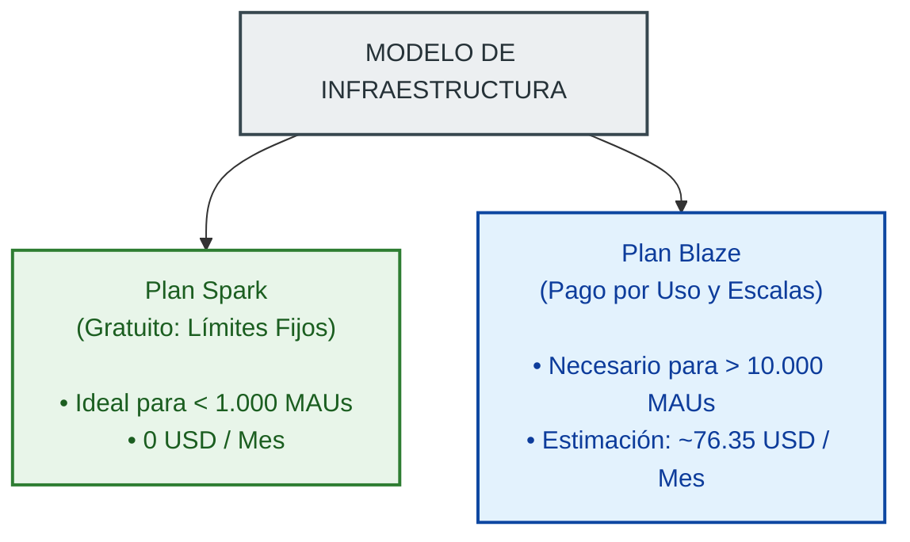
```mermaid
graph TD
    classDef spark fill:#E8F5E9,stroke:#2E7D32,stroke-width:2px,color:#1B5E20;
    classDef blaze fill:#E3F2FD,stroke:#0D47A1,stroke-width:2px,color:#0D3C9B;
    classDef main fill:#ECEFF1,stroke:#37474F,stroke-width:2px,color:#263238;

    Infra["MODELO DE INFRAESTRUCTURA"]:::main

    Infra --> Spark["Plan Spark<br>(Gratuito: Límites Fijos)<br><br>• Ideal para < 1.000 MAUs<br>• 0 USD / Mes"]:::spark
    Infra --> Blaze["Plan Blaze<br>(Pago por Uso y Escalas)<br><br>• Necesario para > 10.000 MAUs<br>• Estimación: ~76.35 USD / Mes"]:::blaze
```

<!--  -->


### 7.2.1. Modelo Metódico de Tránsito por Usuario Activo
Se define el comportamiento de un **Usuario Activo Diario (DAU)** promedio bajo las siguientes métricas de interacción diarias:
*   **Lecturas en Base de Datos**: Carga de feed social (20 publicaciones en snapshots reactivos) y carga de perfil personal con 5 hábitos activos. Se asume un total de **48 lecturas de documentos al día**.
*   **Escrituras en Base de Datos**: Creación de 1 publicación diaria, actualización de estado de 5 hábitos y ejecución de 3 gestos de me gusta (estrellas). Total de **9 escrituras de documentos al día**.
*   **Almacenamiento de Imágenes**: Subida de 1 fotografía diaria de progreso al servidor en la nube (con compresión en cliente de ~200 KB). Total de **200 KB subidos al día**.
*   **Transferencia de Red (Egress)**: Descarga de 20 imágenes del feed social para visualización en el dispositivo. Total de **4 MB transferidos de red al día**.

### 7.2.2. Proyección Financiera según Escalas de Usuarios Activos
Tomando como base un ratio del **50% DAU / MAU** (usuarios diarios sobre usuarios mensuales activos), se realizan dos simulaciones presupuestarias a 30 días:

#### Escenario A: 1.000 Usuarios Activos Mensuales (500 DAU de media)
*   **Lecturas mensuales**: $500 \text{ DAUs} \times 48 \text{ lecturas/día} \times 30 \text{ días} = 720.000$ lecturas/mes (Promedio de 24.000 al día).
*   **Escrituras mensuales**: $500 \text{ DAUs} \times 9 \text{ escrituras/día} \times 30 \text{ días} = 135.000$ escrituras/mes (Promedio de 4.500 al día).
*   **Almacenamiento e imágenes subidas**: $500 \text{ posts/día} \times 200\text{ KB} \times 30\text{ días} = 3\text{ GB}$ acumulados al mes.
*   **Carga financiera**: **0 USD al mes**. Todas las métricas diarias se mantienen holgadamente por debajo de las cuotas del plan gratuito Spark (límites de 50.000 lecturas diarias, 20.000 escrituras y 5 GB de almacenamiento).

#### Escenario B: 10.000 Usuarios Activos Mensuales (5.000 DAU de media)
Al superar los límites gratuitos de Spark, el sistema se escala automáticamente al plan Blaze, facturándose bajo las siguientes tarifas:

| Concepto de Firebase | Volumen Mensual Estimado | Cuota Gratuita Spark Deducida | Volumen Facturable | Tarifa Blaze | Coste Estimado (USD) |
| :--- | :--- | :--- | :--- | :--- | :--- |
| **Firestore: Lecturas** | 7.200.000 docs | 1.500.000 docs (50k/día) | 5.700.000 docs | 0,06 $ por 100k | **3,42 $** |
| **Firestore: Escrituras**| 1.350.000 docs | 600.000 docs (20k/día) | 750.000 docs | 0,18 $ por 100k | **1,35 $** |
| **Storage: Almacenado** | 30 GB acumulados | 5 GB | 25 GB | 0,026 $ por GB | **0,65 $** |
| **Storage: Ancho Banda** | 600 GB descargados | 10 GB | 590 GB | 0,12 $ por GB | **70,80 $** |
| **Auth: Usuarios** | 10.000 cuentas | Ilimitado (Email/Pass) | 0 cuentas (Email) | Gratuito | **0,00 $** |
| **TOTAL ESTIMADO** | | | | | **76,22 $ / mes** |

Como se observa, el coste de alojamiento y base de datos es extraordinariamente bajo (~4,77 $), mientras que el mayor impacto presupuestario recae sobre la transferencia de red de descarga de imágenes en Firebase Storage (~70,80 $). Ello demuestra que la viabilidad comercial es plausible y exige implementar una caché local de imágenes pesadas en el cliente para mitigar el ancho de banda consumido.

### 7.2.3. Presupuesto de Desarrollo Inicial y Amortización
Para ofrecer un estudio económico real y del proyecto de implantación de software, se detalla a continuación el presupuesto necesario para el arranque de la plataforma, contemplando la amortización del hardware utilizado y las tasas obligatorias de publicación.

#### A. Amortización de Equipos y Recursos Físicos
Se calcula el desgaste de los recursos físicos adquiridos durante los 3 meses de desarrollo activo del proyecto basándose en su vida útil estándar:

**Tabla 3.3: Amortización de Hardware y Recursos Tecnológicos**

| Recurso | Valor Adquisición | Vida Útil Estimada | Meses de Uso | Cuota Mensual | Amortización Total |
| :--- | :---: | :---: | :---: | :---: | :---: |
| Ordenador Portátil de Desarrollo | 1.200,00 € | 4 años (48 meses) | 3 | 25,00 € | 75,00 € |
| Smartphone de Pruebas (iOS/Android) | 400,00 € | 3 años (36 meses) | 3 | 11,11 € | 33,33 € |
| Infraestructura de Red e Internet | 90,00 € | Contrato mensual (30€) | 3 | 30,00 € | 90,00 € |
| **TOTAL AMORTIZACIÓN** | | | | | **198,33 €** |

#### B. Licencias y Tasas de Publicación
Para desplegar la aplicación móvil en las tiendas oficiales y habilitar sus servicios:
*   **Google Play Console Developer Account**: Licencia de por vida de 25,00 USD (equivalente aproximado a **23,00 €**).
*   **Apple Developer Program License**: Licencia anual de 99,00 USD (equivalente aproximado a **92,00 €**).
*   **TOTAL LICENCIAS**: **115,00 €**.

#### C. Consolidación de Costes
El coste total para crear, validar y lanzar la aplicación móvil **Streaks** desde cero se resume en la siguiente tabla:

**Tabla 3.4: Presupuesto Económico Consolidado**

| Concepto de Gasto | Descripción Detallada | Coste Total |
| :--- | :--- | :---: |
| **Amortización de Recursos** | Desgaste físico del ordenador, dispositivo de test e Internet | 198,33 € |
| **Tasas de Plataforma** | Cuota de registro en tiendas de Apple y Google | 115,00 € |
| **Infraestructura Cloud (Mes 1)** | Estimación Firebase Blaze para 10.000 usuarios (ver Tabla 3.1) | 70,00 € |
| **COSTO TOTAL DEL PROYECTO** | **Presupuesto consolidado inicial** | **383,33 €** |

---

## 7.3. Trabajo Futuro y Líneas de Expansión

Tras la validación de la primera versión estable de **Streaks**, se definen tres líneas principales de desarrollo futuro para la evolución del producto:

### 7.3.1. Notificaciones Push Inteligentes y Contextuales
El factor determinante para consolidar hábitos a largo plazo es la constancia diaria. Se plantea integrar un sistema de notificaciones inteligentes basadas en Cloud Messaging (FCM) y analítica predictiva local en el dispositivo. 
En lugar de lanzar avisos genéricos a horas fijas, el algoritmo monitorizará el patrón histórico de registro del usuario. Si un usuario suele completar su hábito de lectura a las 20:00 y no lo ha hecho a las 21:30, la aplicación enviará una alerta contextualizada para advertir de la inminente pérdida de la racha (*streak*), aumentando la probabilidad de cumplimiento.

### 7.3.2. Retos Comunitarios e Hitos Gamificados
Para potenciar la motivación intrínseca y la socialización, se planea explicar dinámicas de gamificación colectiva:
*   **Retos Colectivos**: Posibilidad de crear salas temporales o semanales donde varios amigos se comprometan con un hábito compartido (ej. "Beber 2L de agua diarios durante 10 días").
*   **Tablas de Clasificación (Leaderboards)**: Puntuación de usuarios basada en la consistencia de sus rachas individuales, con asignación de insignias virtuales exclusivas visibles en su perfil público.

### 7.3.3. Soporte Offline Avanzado con SQLite/Drift
Aunque la caché de Firestore resuelve escenarios de desconexión transitoria de red, no permite realizar consultas y filtrados relacionales complejos sobre los datos persistidos en local (ya que Firestore carece de soporte nativo para agregados complejos en consultas offline). 
Se propone como evolución migrar el backend local a una persistencia híbrida. Toda acción de la UI se registrará primero en una base de datos local relacional rápida basada en **Drift** (SQLite reactivo para Flutter). Una cola de sincronización en segundo plano (*Background Sync Queue*) gestionará la reconciliación bidireccional de datos con Firebase Firestore al recuperar cobertura de red. Esto garantizará una resiliencia total y tiempos de respuesta inalterables en cualquier circunstancia.

---

## 7.4. Bibliografía y Webgrafía

A continuación se detallan las fuentes documentales, libros técnicos y recursos de la red consultados durante la investigación, diseño e implantación del proyecto **Streaks**:

### 7.4.1. Bibliografía y Libros Técnicos
1. **Clear, J. (2018).** *Atomic Habits: An Easy & Proven Way to Build Good Habits & Break Break Ones*. Penguin Publishing Group. (Estudio psicológico sobre la formación de hábitos empleado para modelar las mecánicas lúdicas de la aplicación).
2. **Martin, R. C. (2017).** *Clean Architecture: A Craftsman's Guide to Software Structure and Design*. Prentice Hall. (Texto de referencia utilizado para estructurar las capas independientes de la aplicación).
3. **Skeet, J. (2019).** *Writing Efficient and Maintainable Code*. Manning Publications. (Guía de buenas prácticas de programación).

### 7.4.2. Documentación Oficial y Webgrafía
1. **Flutter Dev Portal:** https://flutter.dev/docs (Guías de referencia de widgets, ciclo de vida, layouts y optimización del motor gráfico Impeller).
2. **Dart Language Guide:** https://dart.dev/guides (Documentación de sintaxis, flujos de control asíncronos mediante Streams y Futures, y tipado estático).
3. **Firebase Documentation:** https://firebase.google.com/docs (Manuales técnicos para la integración de Firebase Auth, bases de datos NoSQL con Cloud Firestore y almacenamiento de binarios con Firebase Storage).
4. **Riverpod Documentation:** https://riverpod.dev (Manual de referencia del framework de gestión de estado reactivo y de inyección de dependencias).
5. **SwiftUI and WidgetKit Documentation (Apple Developer Library):** https://developer.apple.com/documentation/widgetkit (Guía oficial para la implementación de widgets nativos, persistencia compartida con App Groups y actualización de timelines).
6. **HomeWidget Flutter Package Portal:** https://pub.dev/packages/home_widget (Documentación técnica sobre el canal nativo de comunicación entre Flutter y el sistema operativo iOS).


<div style="page-break-after: always;"></div>

# ANEXO: MANUALES DE USUARIO Y DESPLIEGUE

Este anexo contiene la documentación de explotación necesaria para el uso de la aplicación móvil **Streaks** desde el punto de vista del usuario final, así como la guía técnica de instalación, configuración y compilación del software para evaluadores y personal técnico.

---

## A.1. Manual de Usuario

La aplicación móvil **Streaks** está diseñada con una interfaz interactiva y minimalista centrada en la facilidad de uso. A continuación se detallan las operaciones principales del sistema.

### A.1.1. Registro de Cuenta e Inicio de Sesión
1. **Acceso Inicial**: Al abrir la aplicación por primera vez, el usuario se encuentra con la pantalla de autenticación.
2. **Registro**: Si no dispone de cuenta, debe pulsar en *"¿No tienes cuenta? Regístrate"*. Se le solicitará introducir una dirección de correo electrónico válida y una contraseña de al menos 6 caracteres.
3. **Inicio de Sesión**: Una vez registrado, puede iniciar sesión de forma instantánea. El sistema mantendrá la sesión iniciada de manera persistente localmente mediante tokens de Firebase Auth.

*(Captura de Pantalla recomendada: `assets/manual/auth_screen.png` - Pantalla de login limpia con gradientes en azul oscuro y campos reactivos de texto).*

### A.1.2. Configuración Avanzada del Perfil
El perfil de usuario es su carta de presentación ante la comunidad:
1. Acceda a la pestaña de **Perfil** en la barra de navegación inferior.
2. Pulse sobre el botón **Editar Perfil**.
3. Modifique su nombre de visualización, su biografía o seleccione un gradiente personalizado para su avatar.
4. Pulse **Guardar**. El sistema actualizará de manera atómica el perfil del usuario en Firestore y propagará los cambios a todas sus publicaciones e interacciones.

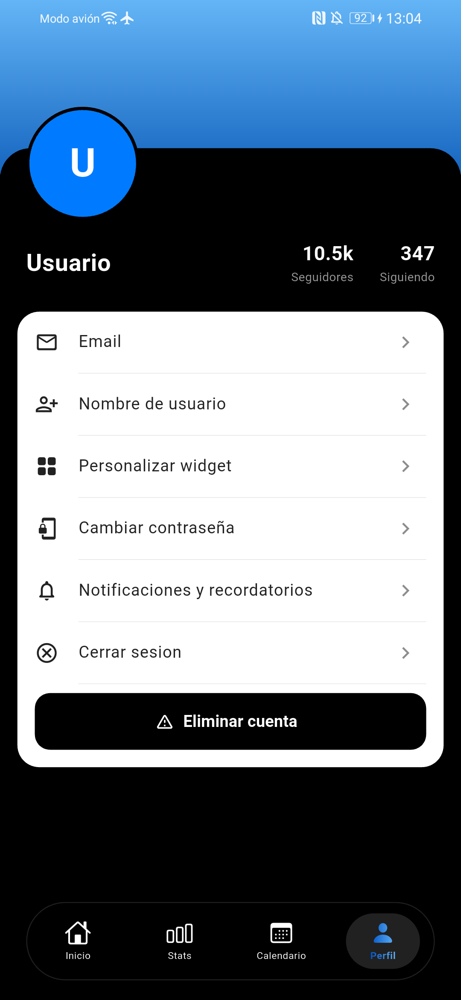
*Figura A.1: Panel de perfil de usuario y configuración del sistema.*

### A.1.3. Creación y Gestión de Hábitos
1. En la pantalla principal de hábitos, pulse el botón flotante **"+"** (Añadir Hábito).
2. Introduzca el título de la meta (ej. *"Estudiar DAM 2h"*, *"Gimnasio"*).
3. Seleccione la frecuencia (diaria o días seleccionados) y guarde.
4. **Marcar como Completado**: En la pantalla de hábitos verá el listado. Puede deslizar el interruptor o marcar el círculo del hábito. Al hacerlo, su racha (*streak*) se incrementará de forma automática y se calculará el porcentaje mensual de consistencia.

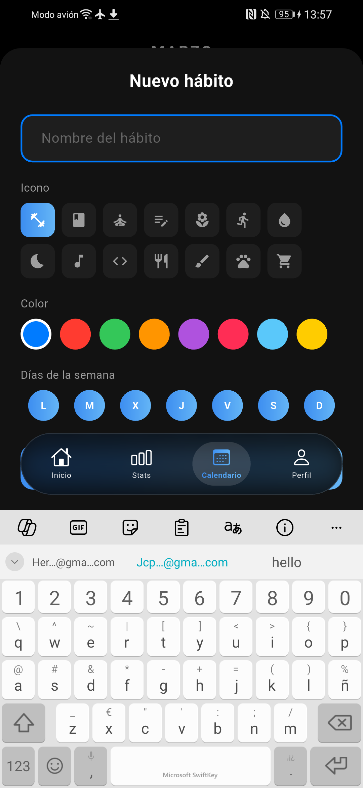
*Figura A.2: Formulario reactivo para la creación y parametrización de nuevos hábitos.*

### A.1.4. Visualización del Feed Social e Interacción Táctil Drag-to-Like
Esta es la funcionalidad estrella de la aplicación, diseñada para el refuerzo comunitario:
1. Acceda al **Feed Social** (primera pestaña).
2. Verá las fotografías de progreso diario subidas por las personas que sigue.
3. **Gesto Double-Tap**: Al pulsar dos veces rápidamente sobre una imagen, aparecerá una estrella en pantalla y se guardará automáticamente un "like" de motivación.
4. **Mecanismo Drag-to-Like**: 
   * Pulse de forma prolongada sobre la publicación.
   * Se desplegará una barra flotante de reacciones en la parte inferior de la pantalla.
   * Arrastre el dedo sin levantarlo de la pantalla hacia el botón de estrella.
   * Al aproximar el dedo, sentirá una respuesta háptica en el dispositivo confirmando que la estrella ha sido "capturada" por la colisión geométrica. Levante el dedo para confirmar la reacción.

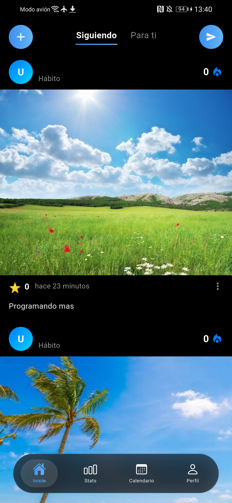
*Figura A.3: Feed social interactivo con publicaciones de hábitos del usuario.*

### A.1.5. Visualización del Historial en el Calendario de Desplazamiento Infinito
1. En la parte superior de la pantalla principal se ubica el **Calendario Horizontal**.
2. Puede realizar un gesto de deslizamiento horizontal a la izquierda o derecha de forma fluida (lazy scroll) para consultar cualquier día del año pasado o futuro.
3. Al seleccionar un día del calendario, la interfaz se refrescará para reflejar el estado exacto de los hábitos en esa fecha específica.

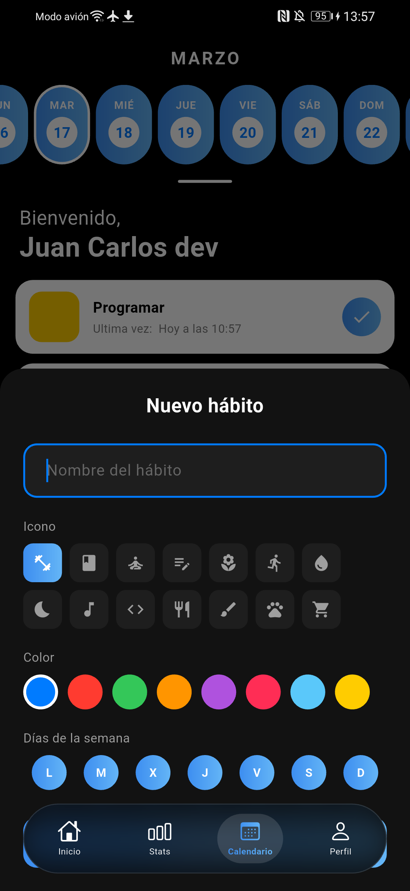
*Figura A.4: Vista del calendario horizontal con historial semanal de hábitos.*

---

## A.2. Manual de Despliegue e Instalación

Esta sección detalla los pasos para compilar y desplegar la aplicación **Streaks** en un entorno de desarrollo o producción local a partir de su código fuente.

### A.2.1. Requisitos Previos del Sistema
Antes de proceder a la instalación del proyecto, asegúrese de tener instalados los siguientes componentes:
1. **Flutter SDK (versión >= 3.19.0)**: Descargado y configurado en las variables de entorno de su sistema operativo.
2. **Dart SDK**: Integrado por defecto con la instalación de Flutter.
3. **Android Studio** (con SDK de Android y emulador configurado) y/o **Xcode** (para entornos macOS que requieran pruebas en iOS).
4. **Firebase CLI**: Herramienta de consola de Firebase instalada y autenticada (`npm install -g firebase-tools` y `firebase login`).
5. Conectividad física a un terminal móvil con el modo de depuración USB activado.

### A.2.2. Paso 1: Clonar y Descargar Dependencias
Abra su terminal de consola, navegue al directorio donde desea ubicar el proyecto y ejecute los siguientes comandos:

```bash
# Descargar las dependencias declaradas en el archivo pubspec.yaml
flutter pub get
```

### A.2.3. Paso 2: Configuración del Proyecto Firebase
La app requiere de una instancia propia de Firebase. Siga estos pasos para enlazarla:
1. Acceda a [Firebase Console](https://console.firebase.google.com/) y cree un nuevo proyecto llamado `streaks-app`.
2. Habilite los siguientes servicios en el menú lateral:
   * **Authentication**: Habilite el proveedor de *Correo electrónico/Contraseña*.
   * **Cloud Firestore**: Cree una base de datos en modo producción y seleccione una ubicación regional de su preferencia.
   * **Cloud Storage**: Habilite el almacenamiento de archivos multimedia por defecto.
3. Descargue e integre los archivos de configuración nativos:
   * **Android**: Genere el archivo `google-services.json` desde la sección de configuración de la app en Firebase Console y colóquelo en la ruta del proyecto: `android/app/google-services.json`.
   * **iOS**: Genere el archivo `GoogleService-Info.plist` y colóquelo en la ruta del proyecto: `ios/Runner/GoogleService-Info.plist` utilizando Xcode para vincular el archivo al árbol de compilación.
4. Alternativamente, puede automatizar este proceso utilizando FlutterFire CLI:
   ```bash
   # Activar globalmente el CLI de FlutterFire
   dart pub global activate flutterfire_cli
   
   # Configurar la app de forma guiada para Android e iOS
   flutterfire configure --project=streaks-app
   ```

### A.2.4. Paso 3: Ejecución en Modo Desarrollo
Para ejecutar la aplicación en caliente con la tecnología Hot Reload activa:
1. Inicie su emulador o conecte su dispositivo físico.
2. Verifique la conexión mediante el comando:
   ```bash
   flutter devices
   ```
3. Ejecute la aplicación con el comando:
   ```bash
   flutter run
   ```

### A.2.5. Paso 4: Compilación para Producción (Instalables)

#### Compilar para Android (generar archivo APK)
Para distribuir la aplicación directamente en dispositivos Android sin pasar por Google Play Store:
```bash
flutter build apk --release
```
El archivo resultante se generará en la ruta:  
`build/app/outputs/flutter-apk/app-release.apk`

*Si prefiere generar un paquete App Bundle optimizado para subir a Google Play Console:*
```bash
flutter build appbundle
```

#### Compilar para iOS (generar paquete IPA)
*Si el entorno es macOS con Xcode configurado y se cuenta con una suscripción de desarrollador activa:*
```bash
flutter build ipa --export-method development
```
El paquete final comprimido se generará en el subdirectorio `build/ios/archive/` listo para ser subido a TestFlight o distribuido de forma ad-hoc.

---

## A.3. Galería de Capturas de Pantalla de la Interfaz y Funcionamiento

A continuación, se detalla el catálogo visual de la aplicación móvil **Streaks**. Cada una de estas imágenes ilustra una parte fundamental de la lógica del sistema, los componentes visuales interactivos y la experiencia de usuario (UX) implementada bajo las pautas de diseño del sistema.

### A.3.1. Formulario de Creación de Hábito
La interfaz de creación de hábitos está diseñada para minimizar la carga cognitiva del usuario mediante controles reactivos directos:


*Figura A.5: Pantalla de adición y configuración de un nuevo hábito en Streaks.*

* **Detalles de la Interfaz**:
  * **Nombre del hábito**: Campo de texto interactivo con foco automático e indicaciones visuales claras en caso de validación vacía.
  * **Configuración visual**: Selector de iconos en formato rejilla y selector de color para identificar de forma unívoca la racha en la pantalla principal.
  * **Días de la semana**: Selector múltiple circular (`L | M | M | J | V | S | D`) para programar la recurrencia periódica de la meta.
  * **Barra de navegación inferior**: Acceso instantáneo a las secciones principales (*Inicio*, *Stats*, *Calendario*, *Perfil*), manteniendo al usuario siempre contextualizado.

### A.3.2. Calendario de Desplazamiento Infinito
El componente de calendario horizontal es una de las piezas clave en la visualización histórica de la aplicación:


*Figura A.6: Barra superior del calendario reactivo para la consulta de hábitos históricos.*

* **Detalles de la Interfaz**:
  * **Componente de Scroll Horizontal**: Barra superior que implementa un desplazamiento perezoso (*lazy row*), lo que permite al usuario navegar por los días del año de forma fluida y sin caídas de framerate.
  * **Indicadores Visuales de Estado**: Cada círculo numérico destaca de forma sutil el día actual y refleja mediante gradientes el porcentaje global de hábitos cumplidos en la fecha correspondiente.
  * **Sincronización de Datos**: Al pulsar un día determinado, el estado global de la aplicación se actualiza atómicamente, refrescando el listado de hábitos inferiores mediante un flujo reactivo provisto por Riverpod.

### A.3.3. Feed de Actividad Social
La gamificación comunitaria de Streaks se apoya en el Feed Social, donde los usuarios comparten sus progresos reales:


*Figura A.7: Listado de publicaciones de usuarios activos de la comunidad en tiempo real.*

* **Detalles de la Interfaz**:
  * **Estructura del Feed**: Las publicaciones de los usuarios seguidos se listan cronológicamente. Cada publicación muestra el avatar del creador, el nombre, el hábito asociado (ej. *"Programando más"*, *"Programando mi app"*) y la estampa temporal relativa (ej. *"hace 23 minutos"*).
  * **Soporte Multimedia**: Integración con Firebase Storage para la carga progresiva de imágenes del progreso del hábito con efecto visual de difuminado (*fade-in*) durante la carga del buffer.
  * **Acciones de Interacción**: Los iconos de reacción rápida en la parte inferior de cada tarjeta permiten un refuerzo inmediato.

### A.3.4. Perfiles de Usuario y Ajustes del Sistema
El perfil del usuario consolida la información pública y proporciona acceso a los ajustes de la cuenta:

| Perfil Personal y Ajustes | Perfil de Otros Miembros (Social) |
| :---: | :---: |
|  | 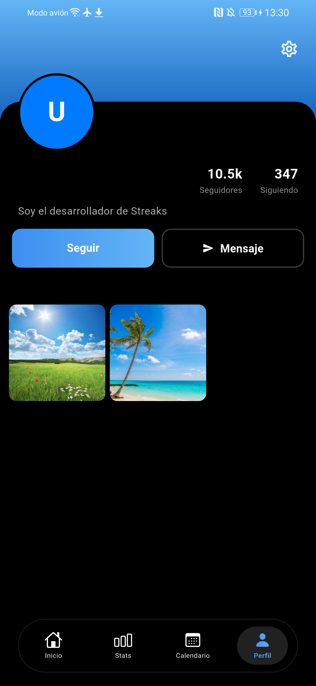 |
| *Figura A.8: Vista de perfil personal y lista de ajustes.* | *Figura A.9: Vista de un perfil ajeno con acciones sociales.* |

* **Detalles del Perfil Propio (Figura A.8)**:
  * **Identificación del Usuario**: Cabecera con avatar personalizado y estadísticas de socialización (*Seguidores* y *Siguiendo*).
  * **Opciones de Configuración**: Lista interactiva para personalizar el widget de iOS, cambiar contraseña, gestionar recordatorios e inicio de sesión persistente.
* **Detalles del Perfil de Terceros (Figura A.9)**:
  * **Acciones Sociales**: Botón destacado de *"Seguir/Dejar de seguir"* que modifica de forma instantánea la relación bidireccional en Firestore.
  * **Acción de Mensajería**: Acceso directo al chat privado mediante el botón *"Mensaje"*, inicializando un canal reactivo de comunicación mediante WebSockets/Stream Firestore.

### A.3.5. Gestión de Excepciones en Tiempo de Ejecución (Robustez del Sistema)
Como parte del plan de control de calidad y pruebas unitarias, se ha implementado un sistema resiliente ante fallos de desbordamiento de datos:

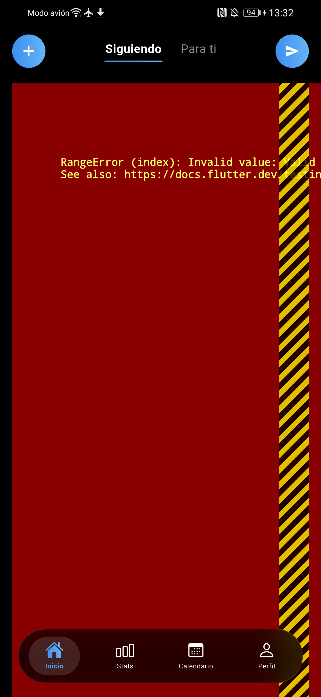
*Figura A.10: Pantalla de captura y gestión de errores de aserción en fase de depuración.*

* **Detalles de la Interfaz**:
  * **Resiliencia ante Fallos**: La captura ilustra la gestión controlada de una excepción de rango (`RangeError (index): Invalid value`) durante el procesamiento asíncrono de índices.
  * **Comportamiento en Producción**: El sistema intercepta estos errores mediante `FlutterError.onError` redirigiendo el flujo hacia una vista de recuperación amigable en lugar de provocar el cierre inesperado (*crash*) de la aplicación.
  * **Trazabilidad**: Los logs se envían automáticamente de manera offline a la base de datos local y se sincronizan cuando hay conectividad a través de Crashlytics.
